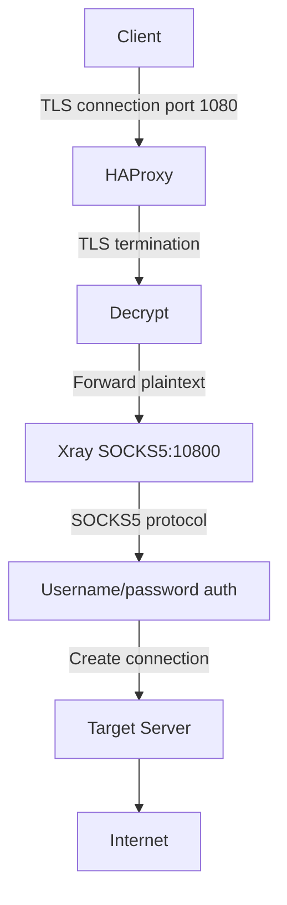

# Generate Mermaid Diagram v1.0

Генерация Mermaid диаграмм из YAML структур.

## Когда использовать

- Визуализация нового data flow
- Создание sequence diagram для workflow
- Обновление deployment diagrams
- Объяснение архитектуры

## Workflow

### Phase 1: Load YAML Source

Спроси: "Какой тип диаграммы создать?"

1. **Flowchart** (data flow) → Read data-flows.yaml
2. **Sequence** (workflow) → Read cli.yaml или custom input
3. **Deployment** (topology) → Read docker.yaml
4. **Dependency Graph** → Read dependencies.yaml

### Phase 2: Generate Mermaid Code

**Example (Flowchart for SOCKS5):**



**Example (Sequence for user add):**

```mermaid
sequenceDiagram
    User->>+vless CLI: vless add-user alice
    vless CLI->>+user_management.sh: add_user_to_json()
    user_management.sh->>+users.json: Lock file (flock)
    user_management.sh->>users.json: Append user
    user_management.sh->>-users.json: Unlock
    user_management.sh->>+orchestrator.sh: generate_xray_config()
    orchestrator.sh->>xray_config.json: Write new config
    orchestrator.sh->>+Xray: reload (SIGHUP)
    Xray-->>-orchestrator.sh: Reloaded
    orchestrator.sh-->>-user_management.sh: Success
    user_management.sh-->>-vless CLI: User added
    vless CLI-->>-User: ✓ User alice created
```

### Phase 3: Save Diagram

```bash
# Save to docs/architecture/diagrams/
Write: docs/architecture/diagrams/{category}/{name}.md
```

### Phase 4: Validate

Test Mermaid syntax на GitHub или mermaid.live

## Diagram Templates

См. `./templates/` для шаблонов каждого типа.

## Safety Rules

```yaml
ALWAYS:
  - Validate Mermaid syntax
  - Follow naming convention: {category}/{descriptive-name}.md
  - Include title and description
```
