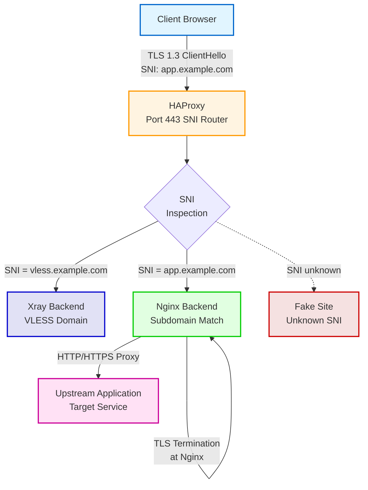
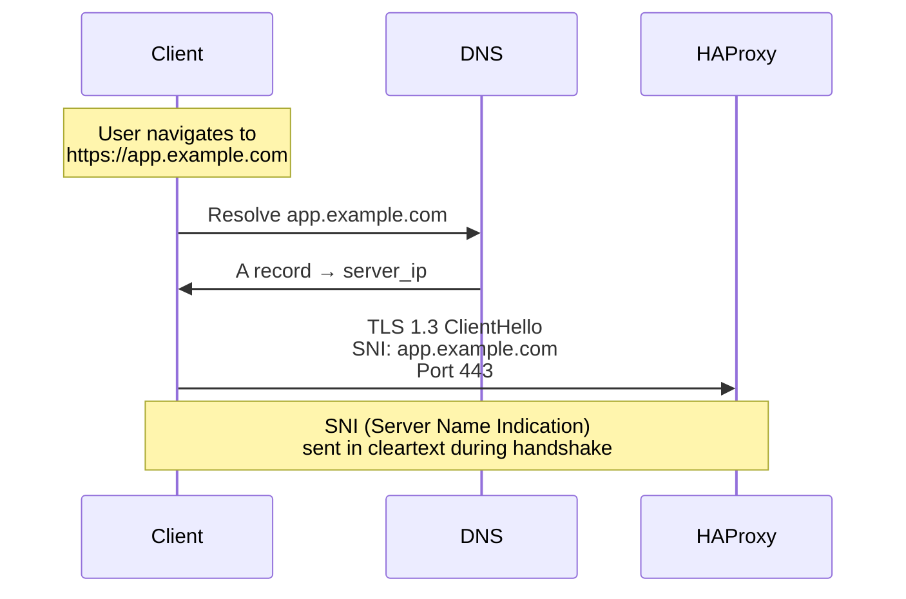
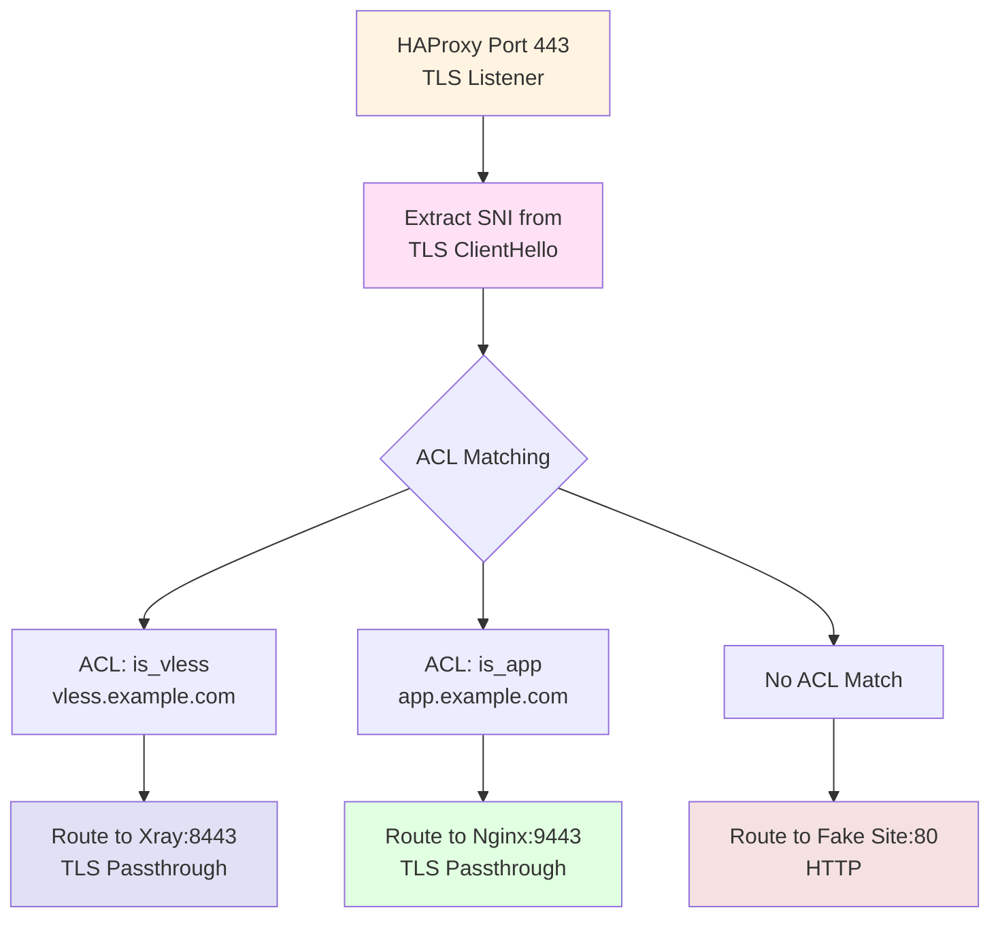
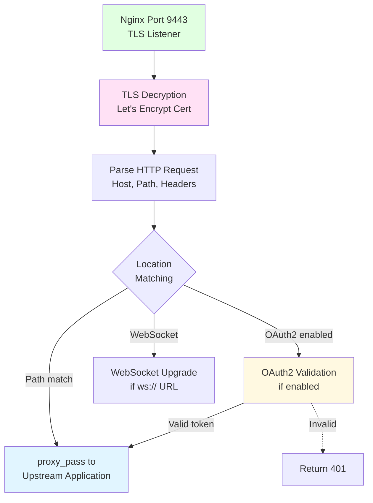
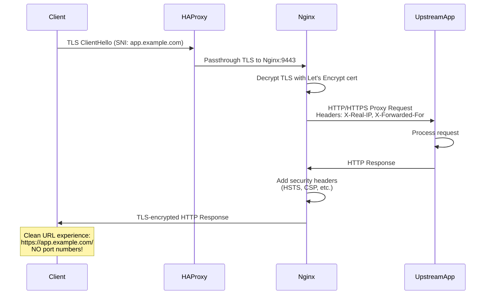
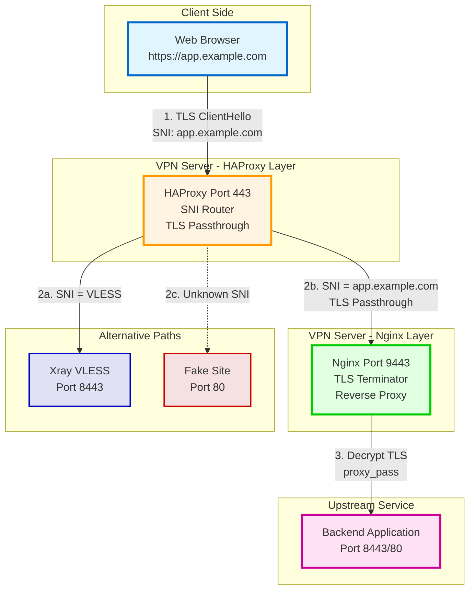
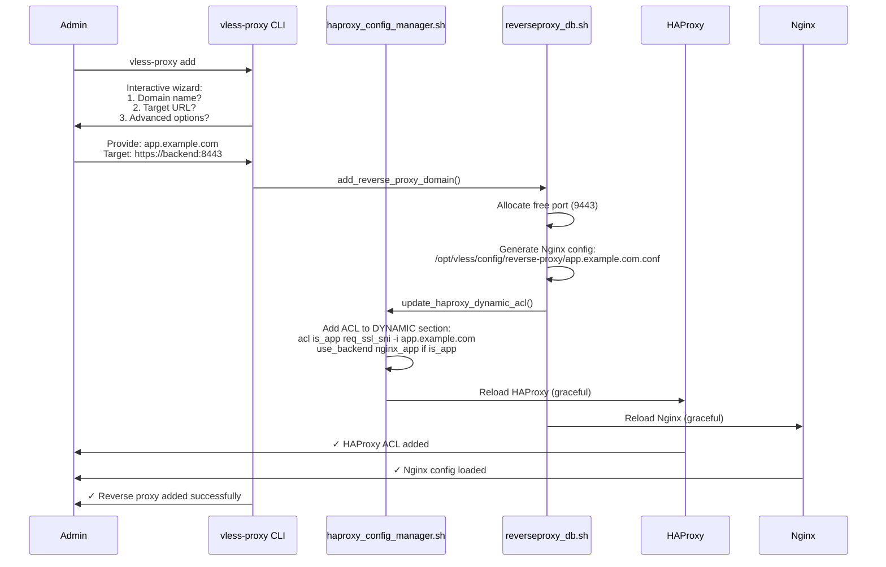

# Subdomain-Based Reverse Proxy Traffic Flow

**Purpose:** Visualize the complete reverse proxy flow for subdomain-based routing without port numbers

**Protocol:** HTTPS (TLS 1.3) with SNI-based routing

**Features:**
- SNI-based routing at HAProxy (NO TLS decryption)
- Subdomain-based access (https://subdomain.domain.com)
- NO port numbers required (clean URLs)
- TLS passthrough to Nginx reverse proxy backends
- Support for 10 concurrent subdomains (ports 9443-9452)
- Advanced features: OAuth2, WebSocket, CSP, custom headers

---

## Main Flow Diagram



---

## Detailed Step-by-Step Flow

### Step 1: Client HTTPS Request



**Key Concept:** SNI allows HAProxy to route based on domain name **without decrypting TLS**.

### Step 2: HAProxy SNI Inspection & Routing



**HAProxy Configuration Snippet:**
```haproxy
frontend https_sni_router
    bind *:443
    mode tcp
    tcp-request inspect-delay 5s
    tcp-request content accept if { req_ssl_hello_type 1 }

    # Static ACL for VLESS
    acl is_vless req_ssl_sni -i vless.example.com
    use_backend xray_vless if is_vless

    # Dynamic ACLs for reverse proxy subdomains
    # DYNAMIC_REVERSE_PROXY_ROUTES
    acl is_app req_ssl_sni -i app.example.com
    use_backend nginx_app if is_app
    # END_DYNAMIC_REVERSE_PROXY_ROUTES

    default_backend fake_site_fallback
```

**Important:** HAProxy uses `mode tcp` (TLS passthrough), NOT `mode http` (TLS termination).

### Step 3: Nginx TLS Termination & Backend Routing



**Nginx Configuration Example** (`/opt/vless/config/reverse-proxy/app.example.com.conf`):
```nginx
server {
    listen 9443 ssl http2;
    server_name app.example.com;

    ssl_certificate /etc/letsencrypt/live/example.com/fullchain.pem;
    ssl_certificate_key /etc/letsencrypt/live/example.com/privkey.pem;

    # Security headers
    add_header Strict-Transport-Security "max-age=31536000; includeSubDomains" always;
    add_header Content-Security-Policy "default-src 'self';" always;

    # Rate limiting
    limit_req zone=reverseproxy_app_example_com burst=200 nodelay;

    location / {
        proxy_pass https://backend.internal:8443;
        proxy_set_header Host $host;
        proxy_set_header X-Real-IP $remote_addr;
        proxy_set_header X-Forwarded-For $proxy_add_x_forwarded_for;
        proxy_set_header X-Forwarded-Proto $scheme;

        # WebSocket support
        proxy_http_version 1.1;
        proxy_set_header Upgrade $http_upgrade;
        proxy_set_header Connection $connection_upgrade;

        # OAuth2 validation (optional)
        # auth_request /oauth2/auth;
    }

    # OAuth2 endpoint (optional)
    # location = /oauth2/auth {
    #     internal;
    #     proxy_pass https://oauth2-proxy.internal/oauth2/auth;
    # }
}
```

### Step 4: Upstream Application Processing



---

## Complete End-to-End Flow



---

## Port Allocation Strategy

### HAProxy Frontend (Public)
- **Port 443:** Unified HTTPS endpoint for ALL subdomains

### Nginx Backends (Internal, Docker network only)
- **9443-9452:** 10 backend slots for reverse proxy subdomains
- Each subdomain gets a unique Nginx server block on one of these ports
- HAProxy routes based on SNI to the corresponding port

**Example Allocation:**
| Subdomain | HAProxy ACL | Nginx Port | Backend |
|-----------|-------------|------------|---------|
| vless.example.com | is_vless | 8443 (Xray) | VLESS Reality |
| app.example.com | is_app | 9443 | Nginx → https://backend:8443 |
| api.example.com | is_api | 9444 | Nginx → http://api-server:80 |
| chat.example.com | is_chat | 9445 | Nginx → ws://chat-server:3000 |

**Why 10 slots?**
- Reasonable limit for small-to-medium deployments
- Each slot requires: DNS A record, Let's Encrypt cert, Nginx config, HAProxy ACL
- Can be expanded by adding more ports (9453-9462, etc.)

---

## Dynamic ACL Management

### Adding a New Subdomain

**Workflow:**


**HAProxy Dynamic ACL Section:**
```haproxy
# DYNAMIC_REVERSE_PROXY_ROUTES
acl is_app req_ssl_sni -i app.example.com
use_backend nginx_app if is_app

acl is_api req_ssl_sni -i api.example.com
use_backend nginx_api if is_api

acl is_chat req_ssl_sni -i chat.example.com
use_backend nginx_chat if is_chat
# END_DYNAMIC_REVERSE_PROXY_ROUTES
```

**Important:** This section is between markers, allowing automated updates without breaking static rules.

---

## Advanced Features

### Feature 1: OAuth2 Integration

```nginx
server {
    listen 9443 ssl http2;
    server_name app.example.com;

    # OAuth2 validation
    location / {
        auth_request /oauth2/auth;
        auth_request_set $user $upstream_http_x_auth_request_user;
        auth_request_set $email $upstream_http_x_auth_request_email;

        proxy_pass https://backend:8443;
        proxy_set_header X-User $user;
        proxy_set_header X-Email $email;
    }

    # OAuth2 proxy endpoint
    location = /oauth2/auth {
        internal;
        proxy_pass https://oauth2-proxy.internal:4180/oauth2/auth;
        proxy_set_header X-Original-URI $request_uri;
    }

    # OAuth2 callback
    location /oauth2/callback {
        proxy_pass https://oauth2-proxy.internal:4180/oauth2/callback;
    }
}
```

**Flow with OAuth2:**
1. Client requests `https://app.example.com/`
2. Nginx checks auth via `/oauth2/auth` (internal sub-request)
3. If not authenticated, redirect to OAuth2 provider (Google, GitHub, etc.)
4. User logs in, OAuth2 proxy validates token
5. Nginx adds `X-User` and `X-Email` headers to backend request

### Feature 2: WebSocket Support

```nginx
# WebSocket connection upgrade
map $http_upgrade $connection_upgrade {
    default upgrade;
    '' close;
}

server {
    listen 9445 ssl http2;
    server_name chat.example.com;

    location / {
        proxy_pass http://chat-server:3000;

        # WebSocket-specific headers
        proxy_http_version 1.1;
        proxy_set_header Upgrade $http_upgrade;
        proxy_set_header Connection $connection_upgrade;

        # Prevent timeouts for long-lived connections
        proxy_read_timeout 86400s;
        proxy_send_timeout 86400s;
    }
}
```

**WebSocket Flow:**
1. Client sends WebSocket upgrade request
2. Nginx detects `Upgrade: websocket` header
3. Nginx forwards upgrade to backend
4. Backend accepts, connection becomes bidirectional WebSocket

### Feature 3: Custom Security Headers

```nginx
server {
    listen 9443 ssl http2;
    server_name app.example.com;

    # Security headers
    add_header Strict-Transport-Security "max-age=31536000; includeSubDomains; preload" always;
    add_header X-Frame-Options "DENY" always;
    add_header X-Content-Type-Options "nosniff" always;
    add_header X-XSS-Protection "1; mode=block" always;
    add_header Referrer-Policy "no-referrer-when-downgrade" always;
    add_header Content-Security-Policy "default-src 'self'; script-src 'self' 'unsafe-inline'; style-src 'self' 'unsafe-inline';" always;

    location / {
        proxy_pass https://backend:8443;
    }
}
```

### Feature 4: Rate Limiting

```nginx
# Define rate limit zone in http_context.conf
limit_req_zone $binary_remote_addr zone=reverseproxy_app_example_com:10m rate=100r/s;

server {
    listen 9443 ssl http2;
    server_name app.example.com;

    # Apply rate limiting
    limit_req zone=reverseproxy_app_example_com burst=200 nodelay;
    limit_req_status 429;

    location / {
        proxy_pass https://backend:8443;
    }
}
```

**Rate Limiting Behavior:**
- **rate=100r/s:** Average rate limit (100 requests per second)
- **burst=200:** Allow bursts up to 200 requests
- **nodelay:** Process burst requests immediately (no queueing)
- **429 status:** Return HTTP 429 Too Many Requests when limit exceeded

---

## DNS Configuration Requirements

**For each subdomain, configure DNS A record:**

```dns
; Main domain
example.com.           IN  A  203.0.113.10

; VLESS subdomain
vless.example.com.     IN  A  203.0.113.10

; Reverse proxy subdomains
app.example.com.       IN  A  203.0.113.10
api.example.com.       IN  A  203.0.113.10
chat.example.com.      IN  A  203.0.113.10
```

**Important:** All subdomains must point to the same server IP (HAProxy handles routing).

---

## Let's Encrypt Certificate Management

### Wildcard Certificate (Recommended)

**Advantages:**
- Single certificate for all subdomains (`*.example.com`)
- Simpler management (one renewal process)
- No need to re-issue when adding new subdomains

**Obtaining:**
```bash
sudo certbot certonly --dns-<provider> \
  -d example.com \
  -d *.example.com \
  --email admin@example.com \
  --agree-tos
```

**Requires:** DNS API access for DNS-01 challenge (Cloudflare, Route53, etc.)

### Individual Certificates (Alternative)

**Obtaining:**
```bash
sudo certbot certonly --standalone \
  -d app.example.com \
  --email admin@example.com \
  --agree-tos
```

**Disadvantages:**
- Separate certificate for each subdomain
- More renewal processes
- More complex HAProxy/Nginx configuration

---

## Performance Characteristics

**Latency Overhead:**
- HAProxy SNI inspection: < 1ms (no TLS decryption)
- Nginx TLS termination: ~2-3ms
- Nginx proxy_pass: ~1-2ms
- **Total:** ~4-6ms (minimal overhead)

**Throughput:**
- HAProxy: 10 Gbps+ (TLS passthrough is very efficient)
- Nginx: 1-5 Gbps (depends on backend response time)
- Bottleneck: Typically upstream application, not reverse proxy

**Scalability:**
- **Current:** 10 concurrent subdomains (ports 9443-9452)
- **Expandable:** Add more ports (9453-9962 = 100 slots total)
- **Horizontal Scaling:** Deploy multiple Nginx containers with load balancing

---

## Security Considerations

**TLS Security:**
- ✅ TLS 1.3 enforced (HAProxy passthrough + Nginx termination)
- ✅ Let's Encrypt trusted certificates
- ✅ HSTS headers for all subdomains
- ✅ Perfect Forward Secrecy (PFS)

**SNI Inspection Privacy:**
- ⚠️ SNI is sent in **cleartext** during TLS handshake
- ⚠️ Passive observers can see domain names (app.example.com)
- ⚠️ NOT DPI-resistant (unlike VLESS Reality)
- ✅ Encrypted SNI (ESNI) support planned (future TLS 1.4)

**Attack Surface:**
- ✅ HAProxy does NOT decrypt TLS (cannot inspect content)
- ✅ Nginx terminates TLS (can add security headers)
- ⚠️ Upstream application must be trusted (Nginx forwards all traffic)

---

## Comparison: Reverse Proxy vs VLESS

| Feature | Reverse Proxy (Subdomains) | VLESS Reality (Port 443) |
|---------|---------------------------|-------------------------|
| **URL Format** | https://app.example.com | vless://uuid@vless.example.com:443 |
| **Port Visibility** | NO port (clean URLs) | NO port (standard HTTPS) |
| **TLS Decryption** | Yes (at Nginx) | No (passthrough) |
| **Use Case** | Web apps, APIs, services | VPN tunnel |
| **DPI Resistance** | Low (SNI visible) | High (Reality masquerading) |
| **Client Support** | Any web browser | VLESS clients only |
| **Authentication** | OAuth2, HTTP Basic, etc. | UUID only |

---

## Troubleshooting

### Common Issues

**Issue 1: 503 Service Unavailable**
- **Cause:** Nginx backend not responding, or HAProxy cannot route
- **Debug:**
  ```bash
  # Check Nginx backend status
  docker logs vless_nginx_reverseproxy --tail 50

  # Check HAProxy stats
  curl http://127.0.0.1:9000/stats | grep nginx_app

  # Test Nginx config
  docker exec vless_nginx_reverseproxy nginx -t
  ```

**Issue 2: SNI routing not working**
- **Cause:** HAProxy dynamic ACL section missing or malformed
- **Debug:**
  ```bash
  # Check HAProxy config for dynamic section
  grep -A 10 "DYNAMIC_REVERSE_PROXY_ROUTES" /opt/vless/config/haproxy.cfg

  # Test HAProxy config
  haproxy -c -f /opt/vless/config/haproxy.cfg
  ```

**Issue 3: Certificate errors (NET::ERR_CERT_COMMON_NAME_INVALID)**
- **Cause:** Nginx using wrong certificate, or certificate missing subdomain
- **Debug:**
  ```bash
  # Check certificate subject
  openssl x509 -in /etc/letsencrypt/live/example.com/fullchain.pem -text | grep "Subject Alternative Name"

  # Verify Nginx SSL config
  docker exec vless_nginx_reverseproxy nginx -T | grep ssl_certificate
  ```

**Issue 4: WebSocket connection fails**
- **Cause:** Missing `Upgrade` and `Connection` headers in Nginx config
- **Fix:** Add WebSocket headers to `proxy_set_header` directives (see Feature 2 above)

---

## Related Documentation

- [data-flows.yaml](../../yaml/data-flows.yaml) - Complete reverse proxy flow specification
- [docker.yaml](../../yaml/docker.yaml) - HAProxy and Nginx container configurations
- [config.yaml](../../yaml/config.yaml) - HAProxy ACL and Nginx config relationships
- [cli.yaml](../../yaml/cli.yaml) - vless-proxy CLI commands
- [VLESS Reality Flow](vless-reality-flow.md) - VPN protocol flow
- [SOCKS5 Proxy Flow](socks5-proxy-flow.md) - SOCKS5 proxy flow
- [HTTP Proxy Flow](http-proxy-flow.md) - HTTP proxy flow

---

**Created:** 2026-01-07
**Version:** v5.26
**Status:** ✅ CURRENT (v4.3+ HAProxy unified architecture)
