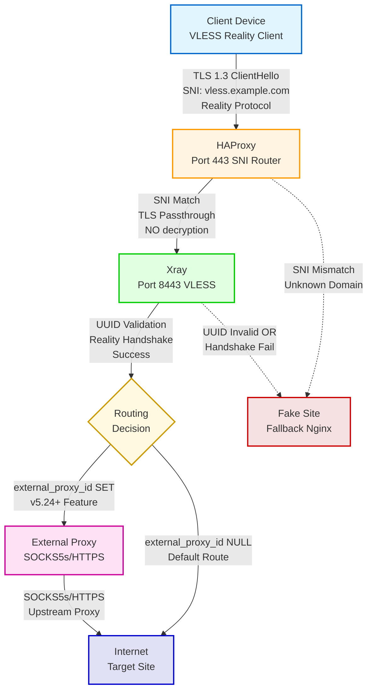
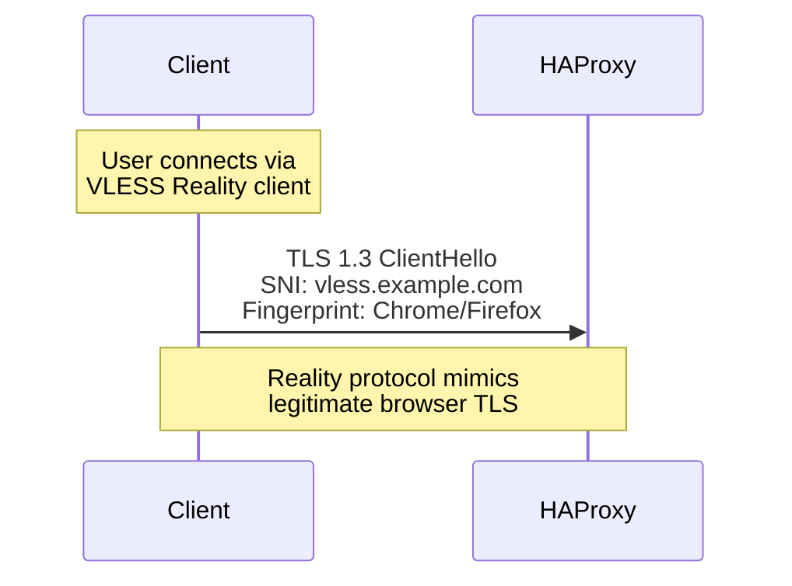
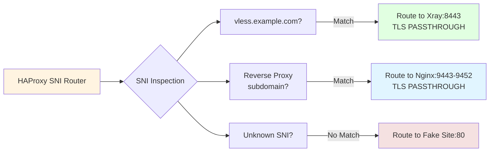
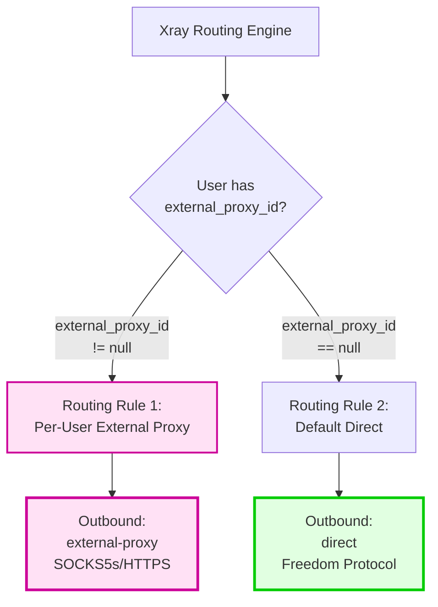
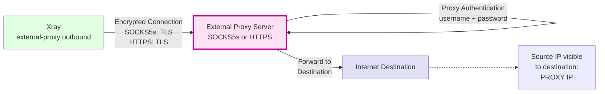
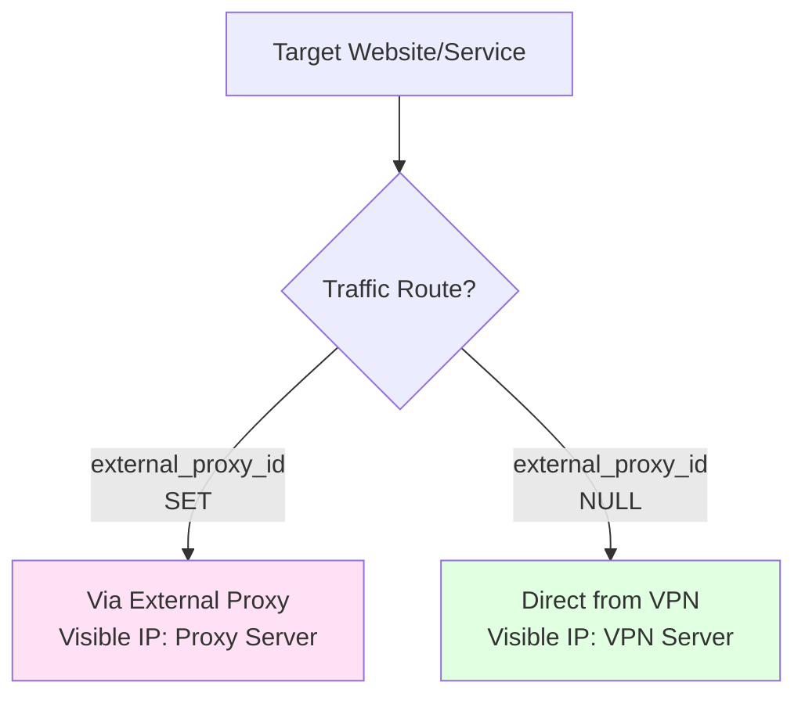
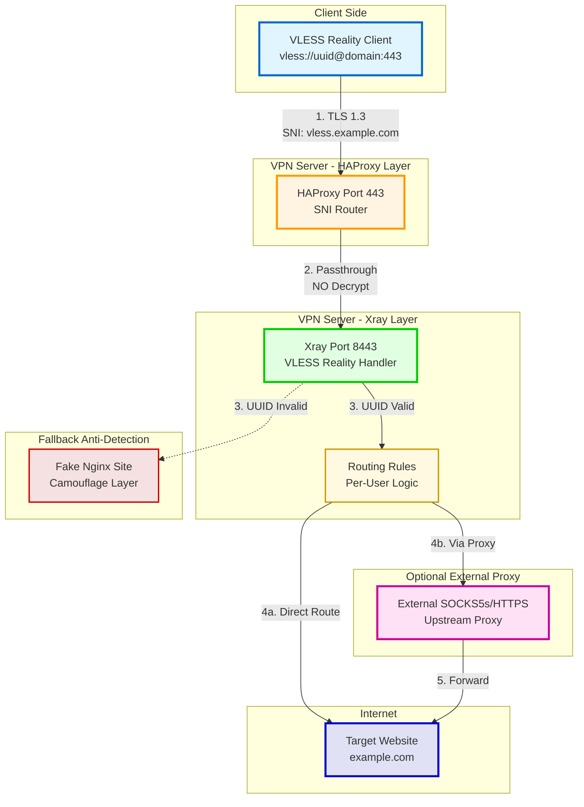

# VLESS Reality Protocol Traffic Flow

**Purpose:** Visualize the complete VLESS Reality connection flow from client to internet destination

**Protocol:** VLESS over Reality (TLS 1.3 masquerading)

**Features:**
- DPI-resistant (mimics legitimate HTTPS traffic)
- TLS 1.3 passthrough at HAProxy (no decryption)
- UUID-based authentication
- Optional external proxy routing (v5.24+)

---

## Main Flow Diagram



---

## Detailed Step-by-Step Flow

### Step 1: Client Initiation


### Step 2: HAProxy SNI Inspection (NO TLS Decryption)


### Step 3: Xray Reality Processing & Authentication
```mermaid
graph TB
    XrayIn[Xray Port 8443<br/>127.0.0.1]
    RealityHandshake{Reality Protocol<br/>Handshake}
    UUIDCheck{UUID<br/>Validation}

    Success[Authentication<br/>SUCCESS]
    Failure[Authentication<br/>FAILURE]
    Fallback[Fallback to<br/>Fake Site:80]

    XrayIn --> RealityHandshake
    RealityHandshake -->|TLS Fingerprint<br/>Valid| UUIDCheck
    RealityHandshake -.->|Fingerprint<br/>Invalid| Failure

    UUIDCheck -->|UUID in<br/>clients[] list| Success
    UUIDCheck -.->|UUID NOT<br/>in list| Failure

    Failure --> Fallback

    style Success fill:#e1ffe1,stroke:#00cc00,stroke-width:3px
    style Failure fill:#f5e1e1,stroke:#cc0000,stroke-width:3px
```

**Reality Protocol Details:**
- Mimics TLS connection to `www.microsoft.com:443`
- Server Name: `www.microsoft.com`
- Validates client TLS fingerprint (browser-like)
- On success: Decrypts inner VLESS payload
- On failure: Appears as failed HTTPS connection, redirects to fake site

### Step 4: Routing Decision (v5.24+ Per-User External Proxy)


**Routing Logic (from `xray_config.json`):**
```json
{
  "routing": {
    "rules": [
      {
        "type": "field",
        "inboundTag": ["vless-in", "socks-in", "http-in"],
        "user": ["alice@vless.local", "bob@vless.local"],
        "outboundTag": "external-proxy"
      },
      {
        "type": "field",
        "outboundTag": "direct"
      }
    ]
  }
}
```

### Step 5: External Proxy Chain (Optional, v5.24+)


**Retry Logic:**
- Max attempts: 3
- Backoff: Exponential (1s, 2s, 4s)
- On all failures: Fallback to `direct` outbound (warn user)

### Step 6: Internet Destination


---

## Complete End-to-End Flow



---

## Performance Characteristics

**Latency Overhead:**
- HAProxy SNI routing: < 1ms
- Xray Reality handshake: 3-5ms
- Xray routing decision: < 1ms
- External proxy connection: 0ms (direct) or 50-200ms (with proxy)
- **Total:** < 10ms (direct) or 50-210ms (with external proxy)

**Throughput:**
- Limited by: VPN server bandwidth, external proxy bandwidth (if used)
- HAProxy: Hardware TLS acceleration (minimal overhead)
- Xray: Efficient protocol (minimal overhead)

---

## Security Features

**DPI Resistance:**
- ✅ Reality protocol mimics legitimate TLS to `www.microsoft.com`
- ✅ TLS 1.3 fingerprint matches real browsers (Chrome/Firefox)
- ✅ Traffic analysis shows HTTPS to Microsoft (not VPN)

**Authentication:**
- ✅ UUID-based (strong, unique per user)
- ✅ No password transmission (UUID embedded in protocol)
- ✅ Invalid UUID → Fallback to fake site (anti-probing)

**Encryption:**
- ✅ TLS 1.3 end-to-end
- ✅ No TLS decryption at HAProxy (preserves Reality protocol)
- ✅ Optional additional layer with external proxy TLS

---

## Key Configuration Files

**users.json** (User Database):
```json
{
  "users": [
    {
      "username": "alice",
      "uuid": "a1b2c3d4-e5f6-7890-1234-567890abcdef",
      "email": "alice@vless.local",
      "flow": "xtls-rprx-vision",
      "external_proxy_id": null
    }
  ]
}
```

**xray_config.json** (VLESS Inbound):
```json
{
  "inbounds": [
    {
      "protocol": "vless",
      "port": 8443,
      "listen": "127.0.0.1",
      "settings": {
        "clients": [
          {
            "id": "a1b2c3d4-e5f6-7890-1234-567890abcdef",
            "email": "alice@vless.local",
            "flow": "xtls-rprx-vision"
          }
        ],
        "decryption": "none",
        "fallbacks": [
          {
            "dest": "vless_fake_site:80",
            "xver": 0
          }
        ]
      },
      "streamSettings": {
        "network": "tcp",
        "security": "reality",
        "realitySettings": {
          "show": false,
          "dest": "www.microsoft.com:443",
          "serverNames": ["www.microsoft.com"],
          "privateKey": "<REALITY_PRIVATE_KEY>",
          "shortIds": ["", "0123456789abcdef"]
        }
      }
    }
  ]
}
```

**haproxy.cfg** (SNI Routing):
```
frontend https_sni_router
    bind *:443
    mode tcp
    tcp-request content accept if { req_ssl_hello_type 1 }

    acl is_vless req_ssl_sni -i vless.example.com
    use_backend xray_vless if is_vless

    default_backend fake_site_fallback

backend xray_vless
    mode tcp
    server xray 127.0.0.1:8443 check
```

---

## Related Documentation

- [data-flows.yaml](../../yaml/data-flows.yaml) - Complete VLESS Reality flow specification
- [docker.yaml](../../yaml/docker.yaml) - HAProxy and Xray container configurations
- [config.yaml](../../yaml/config.yaml) - Configuration file relationships
- [SOCKS5 Proxy Flow](socks5-proxy-flow.md) - Alternative protocol flow
- [HTTP Proxy Flow](http-proxy-flow.md) - HTTP proxy traffic flow

---

**Created:** 2026-01-07
**Version:** v5.26
**Status:** ✅ CURRENT (v5.24+ per-user external proxy supported)
