# Initialization Order Diagram

**Purpose:** Visualize the complete 15-step installation initialization sequence

**Duration:** ~5-7 minutes on fresh Ubuntu 22.04 LTS

**Critical Path:** Sequential execution with validation checkpoints

---

## Complete Initialization Flow

### 15-Step Installation Sequence

```mermaid
graph TB
    Start[Installation Start<br/>./install.sh]

    Step1[Step 1: OS Detection<br/>Detect Ubuntu/Debian version]
    Step2[Step 2: Root Check<br/>Verify sudo/root privileges]
    Step3[Step 3: Prerequisites Check<br/>Check system requirements]
    Step4[Step 4: Install Dependencies<br/>Docker, jq, certbot, etc.]
    Step5[Step 5: Collect Parameters<br/>Interactive wizard: domain, email]
    Step6[Step 6: Validate DNS<br/>Verify DNS A record]
    Step7[Step 7: Obtain Certificate<br/>Let's Encrypt HTTP-01]
    Step8[Step 8: Generate Docker Compose<br/>Create docker-compose.yml]
    Step9[Step 9: Generate nginx Config<br/>Create nginx.conf stream+http blocks]
    Step10[Step 10: Generate Xray Config<br/>Create xray_config.json]
    Step11[Step 11: Security Hardening<br/>UFW, fail2ban, sysctl]
    Step12[Step 12: Launch Containers<br/>docker-compose up -d]
    Step13[Step 13: Health Check<br/>Verify all containers healthy]
    Step14[Step 14: Post-Install Tasks<br/>Symlinks, cron jobs]
    Step15[Step 15: Display Summary<br/>Installation complete]

    Done[Installation Complete<br/>VPN Ready]

    Start --> Step1
    Step1 --> Step2
    Step2 --> Step3
    Step3 --> Step4
    Step4 --> Step5
    Step5 --> Step6
    Step6 --> Step7
    Step7 --> Step8
    Step8 --> Step9
    Step9 --> Step10
    Step10 --> Step11
    Step11 --> Step12
    Step12 --> Step13
    Step13 --> Step14
    Step14 --> Step15
    Step15 --> Done

    style Start fill:#e1f5ff,stroke:#0066cc,stroke-width:3px
    style Done fill:#e1ffe1,stroke:#00cc00,stroke-width:3px
    style Step7 fill:#ffe1f5,stroke:#cc0099,stroke-width:2px
    style Step12 fill:#fff9e1,stroke:#cc9900,stroke-width:2px
```

---

## Detailed Step-by-Step Breakdown

### Step 1: OS Detection (~2 seconds)

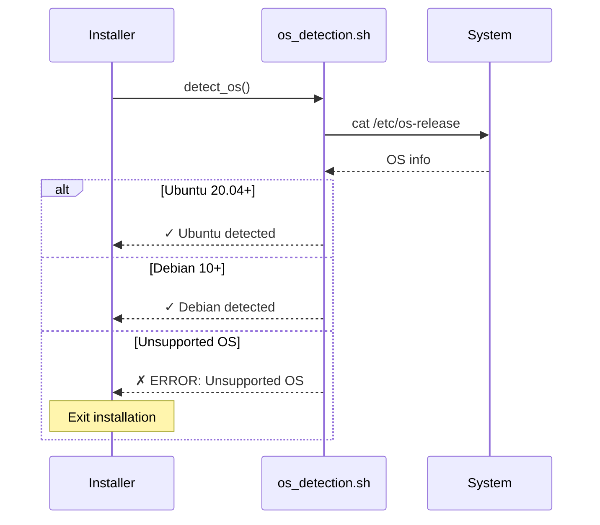

**Module:** `lib/os_detection.sh`

**Checks:**
- Operating system type (Ubuntu/Debian)
- OS version (Ubuntu 20.04+, Debian 10+)
- Architecture (x86_64/amd64)

**Output:**
```bash
OS_TYPE="ubuntu"
OS_VERSION="22.04"
OS_ARCH="x86_64"
```

---

### Step 2: Root Check (~1 second)

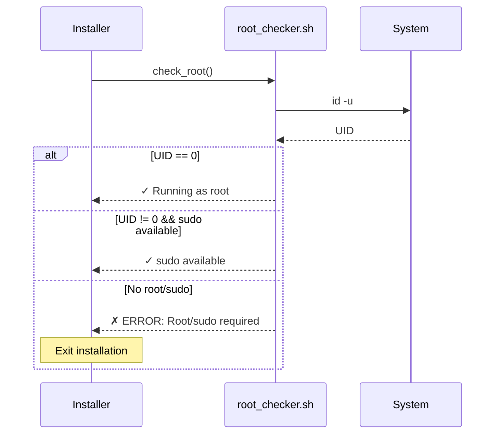

**Module:** `lib/prerequisite_checker.sh`

**Checks:**
- Current user is root (UID 0)
- OR sudo is available and configured
- sudoers file allows NOPASSWD (optional, improves UX)

---

### Step 3: Prerequisites Check (~5 seconds)

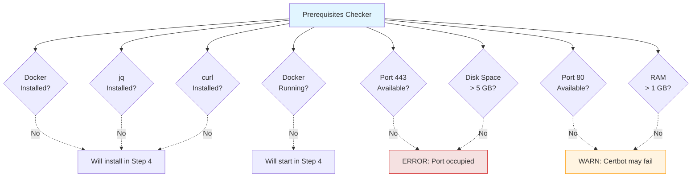

**Module:** `lib/prerequisite_checker.sh`

**Critical Checks (MUST pass):**
- Port 443 available (or custom port specified)
- Disk space > 5 GB free
- Internet connectivity (curl https://www.google.com)

**Warning Checks (can proceed with warnings):**
- Port 80 available (certbot needs it)
- RAM > 1 GB (recommended 2 GB+)
- Swap configured (recommended for low RAM)

---

### Step 4: Install Dependencies (~60-180 seconds)

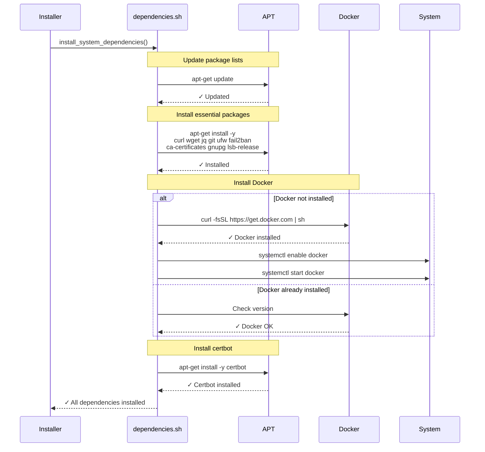

**Module:** `lib/dependencies.sh`

**Installed Packages:**
- **Core:** curl, wget, jq, git
- **Docker:** docker.io (or docker-ce from official repo)
- **Certificates:** certbot, ca-certificates
- **Security:** ufw, fail2ban
- **Utilities:** gnupg, lsb-release, openssl

**Duration:**
- Existing packages: ~30 seconds
- Fresh installation: ~120 seconds
- Slow network: up to 180 seconds

---

### Step 5: Collect Parameters (~30-60 seconds, interactive)

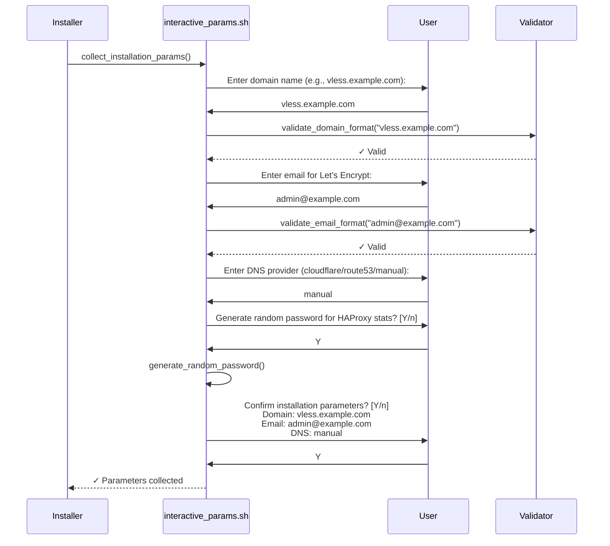

**Module:** `lib/interactive_params.sh`

**Collected Parameters:**
- **DOMAIN:** Primary domain (e.g., vless.example.com)
- **EMAIL:** Email for Let's Encrypt notifications
- **DNS_PROVIDER:** DNS provider for wildcard cert (optional)
- **HAPROXY_STATS_PASSWORD:** HAProxy stats authentication
- **TIMEZONE:** Server timezone (default: UTC)

**Saved to:** `/opt/familytraffic/config/installation_params.conf`

---

### Step 6: Validate DNS (~5-10 seconds)

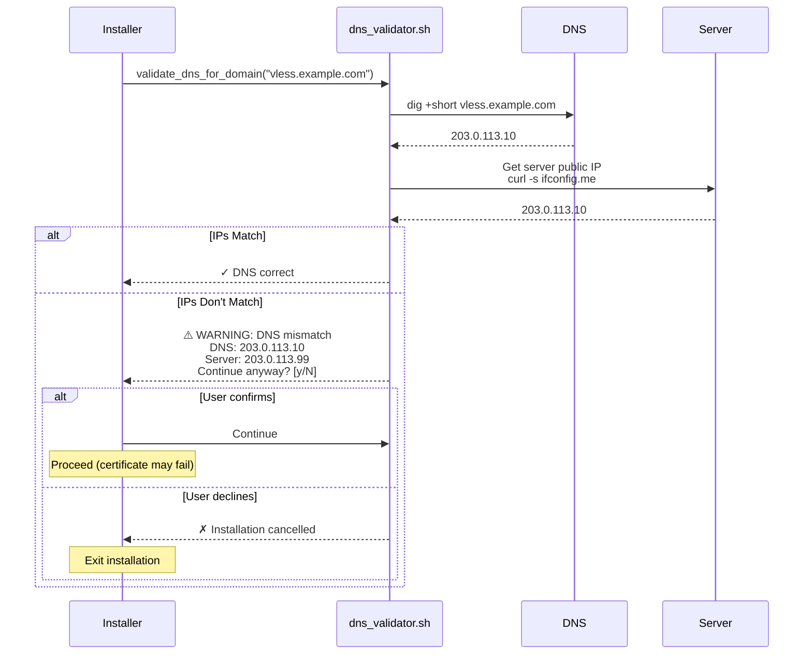

**Module:** `lib/dns_validator.sh`

**Validation Methods:**
1. `dig +short <domain>` (preferred)
2. `nslookup <domain>` (fallback)
3. `host <domain>` (fallback)

**Public IP Detection:**
1. `curl -s ifconfig.me` (preferred)
2. `curl -s ipinfo.io/ip` (fallback)
3. `wget -qO- ifconfig.me` (fallback)

---

### Step 7: Obtain Certificate (~30-60 seconds)

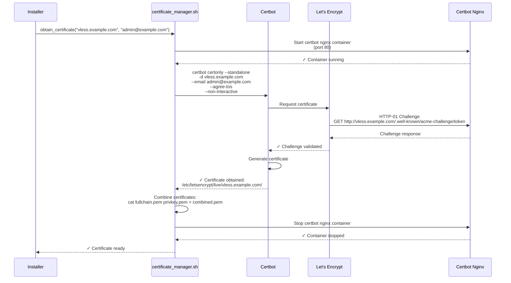

**Module:** `lib/certificate_manager.sh`, `lib/letsencrypt_integration.sh`

**Generated Files:**
- `/etc/letsencrypt/live/vless.example.com/cert.pem`
- `/etc/letsencrypt/live/vless.example.com/chain.pem`
- `/etc/letsencrypt/live/vless.example.com/fullchain.pem`
- `/etc/letsencrypt/live/vless.example.com/privkey.pem`
- `/etc/letsencrypt/live/vless.example.com/combined.pem` (HAProxy format)

**Duration:**
- Fast: ~20 seconds (good network + DNS)
- Typical: ~45 seconds
- Slow: up to 90 seconds (DNS propagation delay)

---

### Steps 8-10: Configuration Generation (~10-15 seconds)

```mermaid
graph TB
    Step8[Step 8: Docker Compose<br/>Generate docker-compose.yml]
    Step9[Step 9: HAProxy Config<br/>Generate haproxy.cfg]
    Step10[Step 10: Xray Config<br/>Generate xray_config.json]

    Step8 --> Docker[docker_compose_generator.sh]
    Step9 --> HAProxy[haproxy_config_manager.sh]
    Step10 --> Xray[xray_config_generator.sh]

    Docker --> DockerFile[/opt/familytraffic/docker-compose.yml]
    HAProxy --> HAProxyFile[/opt/familytraffic/config/haproxy.cfg]
    Xray --> XrayFile[/opt/familytraffic/config/xray_config.json]

    style Step8 fill:#e1f5ff
    style Step9 fill:#ffe1f5
    style Step10 fill:#fff9e1
```

**Generated Configurations:**

| Step | Module | Output File | Size | Duration |
|------|--------|-------------|------|----------|
| 8 | docker_compose_generator.sh | docker-compose.yml | ~200 lines | ~3s |
| 9 | haproxy_config_manager.sh | haproxy.cfg | ~150 lines | ~4s |
| 10 | xray_config_generator.sh | xray_config.json | ~100 lines | ~3s |

**Initial Configuration:**
- **No users** (empty inbounds[].clients[] array)
- **No reverse proxy domains** (only VLESS domain)
- **No external proxies** (only "direct" outbound)

---

### Step 11: Security Hardening (~20-40 seconds)

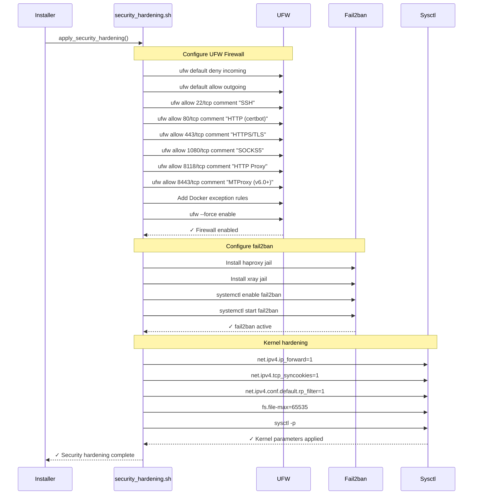

**Module:** `lib/security_hardening.sh`, `lib/firewall_manager.sh`, `lib/fail2ban_integration.sh`

**Applied Security Measures:**
1. **UFW Firewall:** Block all incoming except essential ports
2. **fail2ban:** Automatic IP banning for suspicious activity
3. **Kernel Parameters:** TCP optimizations and security settings
4. **SSH Hardening:** Disable root login, key-only authentication (optional)
5. **Docker Security:** UFW rules for Docker network

---

### Step 12: Launch Containers (~30-60 seconds)

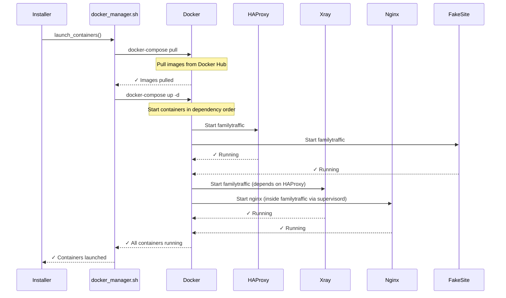

**Module:** `lib/docker_manager.sh`

**Startup Sequence:**
1. Pull images (~20-40s, depends on network)
   - haproxy:2.8-alpine (~8 MB)
   - teddysun/xray:24.11.30 (~15 MB)
   - nginx:alpine (~8 MB, multiple containers)
   - Custom MTProxy image (v6.0+, ~10 MB)

2. Start containers in dependency order:
   - **Independent:** HAProxy, Fake Site, MTProxy
   - **Depends on HAProxy:** Xray, Nginx Reverse Proxy

3. Verify all containers reach "healthy" status

---

### Step 13: Health Check (~10-20 seconds)

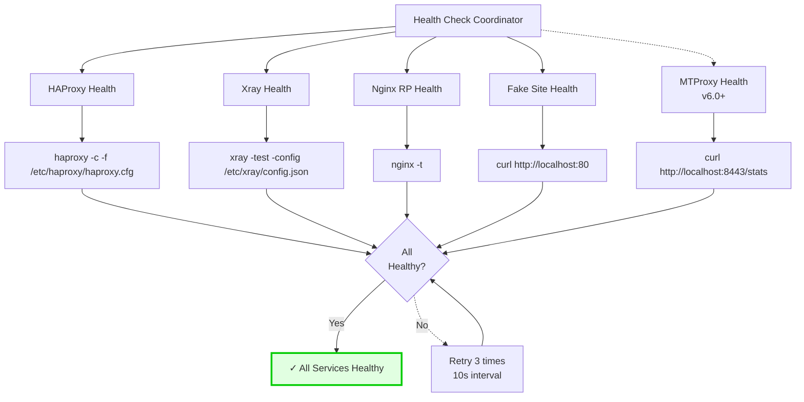

**Module:** `lib/health_checker.sh`

**Health Checks:**
1. **Docker Container Status:** All containers "running" or "healthy"
2. **Configuration Syntax:** haproxy -c, xray -test, nginx -t
3. **Port Binding:** netstat/ss check for open ports
4. **HTTP Endpoints:** curl tests for web interfaces

**Retry Logic:**
- Max attempts: 3
- Retry interval: 10 seconds
- Total timeout: 30 seconds
- On failure: Rollback installation

---

### Step 14: Post-Install Tasks (~5-10 seconds)

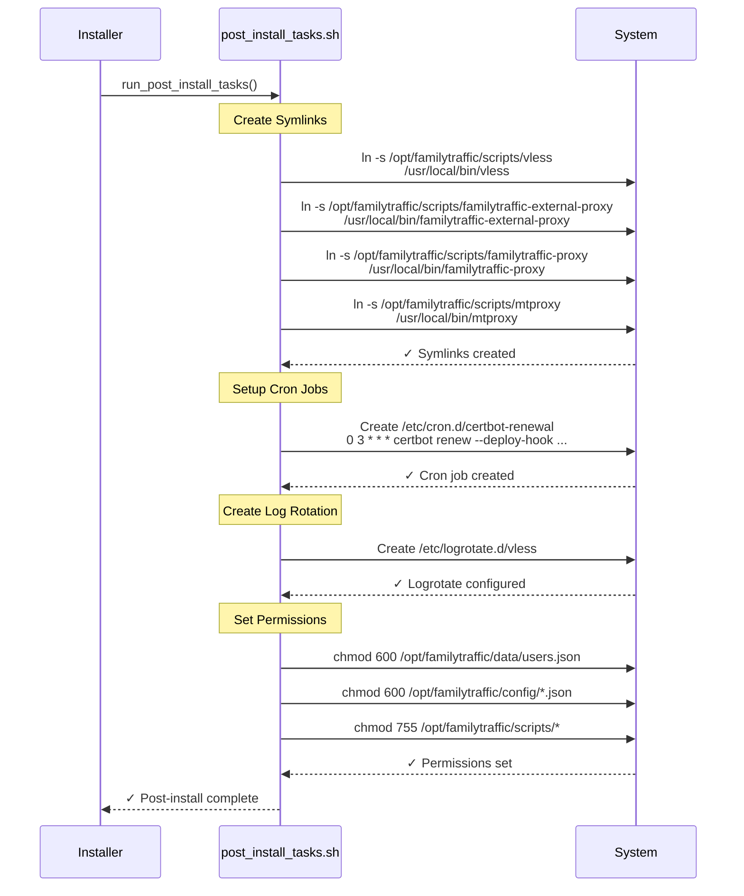

**Module:** `lib/post_install_tasks.sh`

**Tasks:**
1. Create symlinks for CLI tools in /usr/local/bin/
2. Setup certbot renewal cron job (daily at 3 AM)
3. Configure logrotate (7-day rotation)
4. Set correct file permissions
5. Create README in /opt/familytraffic/
6. Generate installation summary log

---

### Step 15: Display Summary (~2 seconds)

```bash
================================================================================
                    familyTraffic VPN Installation Complete!
================================================================================

Installation Time: 6 minutes 23 seconds

Server Information:
  - Domain: vless.example.com
  - Public IP: 203.0.113.10
  - Installation Path: /opt/familytraffic/

Services Status:
  ✓ HAProxy: Running (port 443, 1080, 8118)
  ✓ Xray: Running (VLESS Reality)
  ✓ Nginx Reverse Proxy: Running
  ✓ Fake Site: Running

Next Steps:
  1. Add your first user:
     sudo familytraffic add-user alice

  2. View system status:
     sudo familytraffic status

  3. Check logs:
     sudo familytraffic logs xray

Documentation: /opt/familytraffic/README.md
Support: https://github.com/username/vless-reality-vpn

================================================================================
```

---

## Initialization Timing Breakdown

### Duration Analysis (Fresh Ubuntu 22.04)

| Step | Description | Min | Typical | Max | Module |
|------|-------------|-----|---------|-----|--------|
| 1 | OS Detection | 1s | 2s | 3s | os_detection.sh |
| 2 | Root Check | 1s | 1s | 2s | prerequisite_checker.sh |
| 3 | Prerequisites | 3s | 5s | 10s | prerequisite_checker.sh |
| 4 | Install Dependencies | 60s | 120s | 180s | dependencies.sh |
| 5 | Collect Parameters | 20s | 40s | 120s | interactive_params.sh |
| 6 | Validate DNS | 3s | 7s | 15s | dns_validator.sh |
| 7 | Obtain Certificate | 20s | 45s | 90s | certificate_manager.sh |
| 8 | Docker Compose | 2s | 3s | 5s | docker_compose_generator.sh |
| 9 | HAProxy Config | 2s | 4s | 6s | haproxy_config_manager.sh |
| 10 | Xray Config | 2s | 3s | 5s | xray_config_generator.sh |
| 11 | Security Hardening | 15s | 25s | 40s | security_hardening.sh |
| 12 | Launch Containers | 25s | 45s | 70s | docker_manager.sh |
| 13 | Health Check | 5s | 12s | 30s | health_checker.sh |
| 14 | Post-Install | 4s | 7s | 12s | post_install_tasks.sh |
| 15 | Display Summary | 1s | 2s | 3s | orchestrator.sh |
| **TOTAL** | **Complete Installation** | **~3 min** | **~5-6 min** | **~10 min** | **orchestrator.sh** |

**Variables Affecting Duration:**
- Network speed (package downloads, Docker images)
- DNS propagation delay
- Let's Encrypt challenge response time
- System resources (CPU, RAM)
- Existing vs fresh installation

---

## Rollback Points

### Critical Checkpoints with Rollback Support

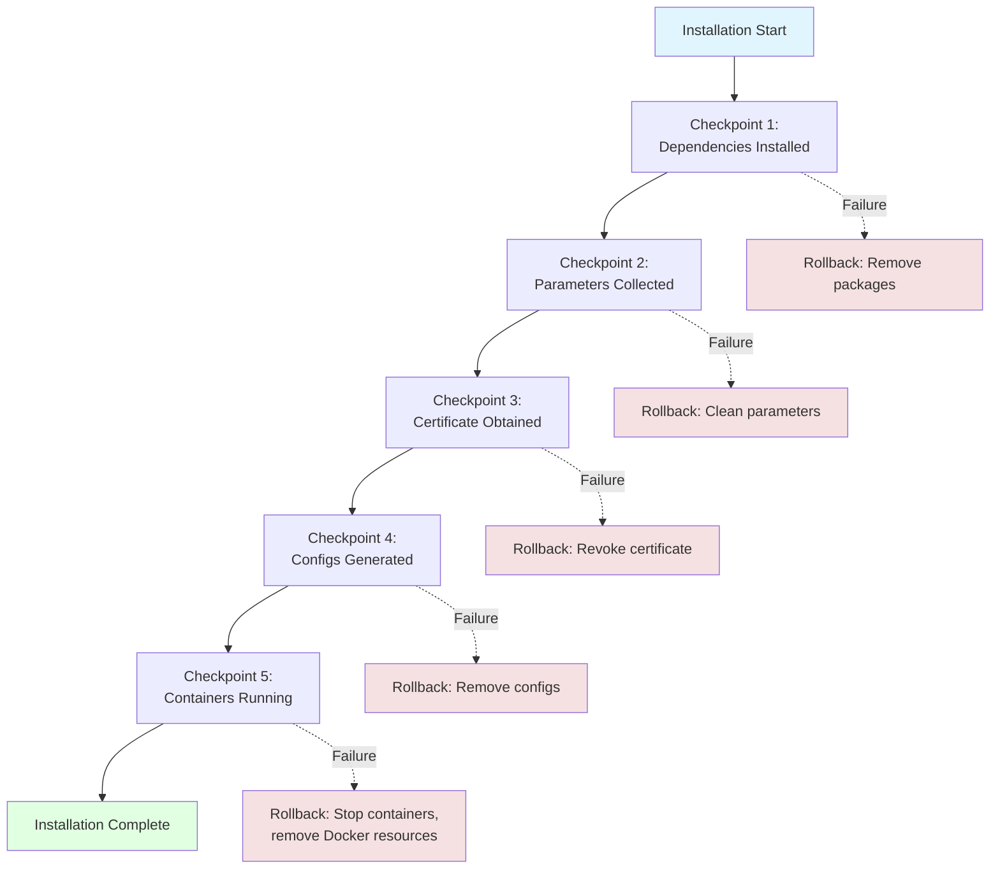

**Rollback Actions by Step:**

| Failure Point | Rollback Action | Data Loss | Recovery |
|---------------|----------------|-----------|----------|
| Step 1-3 | None needed (no changes) | None | Re-run installer |
| Step 4 | Uninstall packages | None | Re-run installer |
| Step 5-6 | Remove /opt/familytraffic/ | Parameters only | Re-run installer |
| Step 7 | Revoke certificate | Certificate | Re-run installer |
| Step 8-11 | Remove configs | Configs only | Re-run installer |
| Step 12-13 | Stop & remove containers | Container data | Re-run installer |
| Step 14-15 | Undo post-install | Symlinks only | Re-run installer |

---

## Related Documentation

- [dependencies.yaml](../../yaml/dependencies.yaml) - Complete dependency specifications
- [Module Dependencies](module-dependencies.md) - Module relationship graph
- [Runtime Call Chains](runtime-call-chains.md) - Function call graphs during runtime

---

**Created:** 2026-01-07
**Version:** v5.33
**Status:** ✅ CURRENT (15-step installation process)
