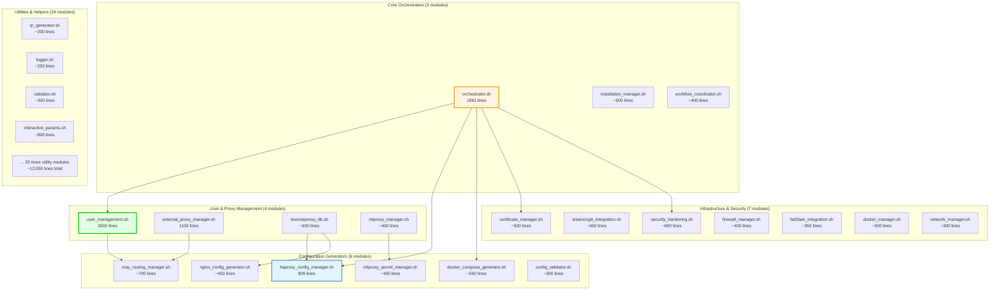
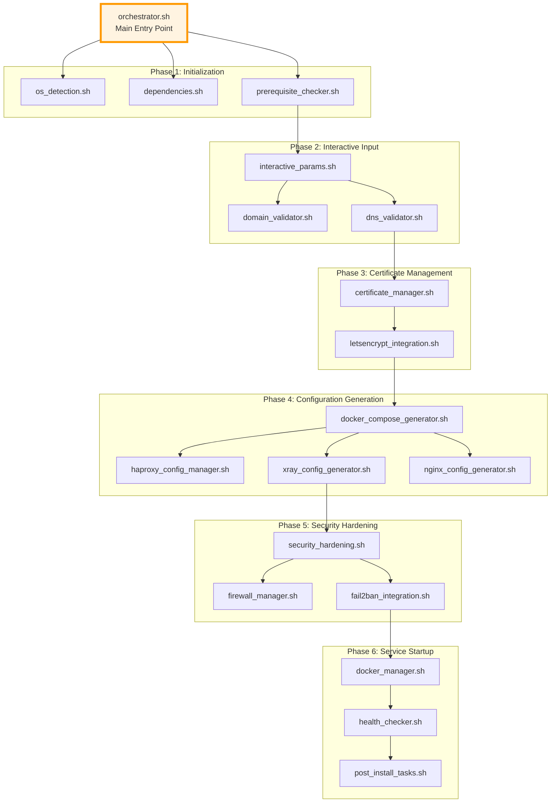
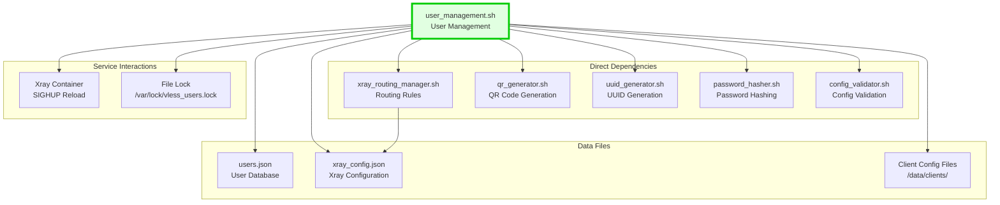
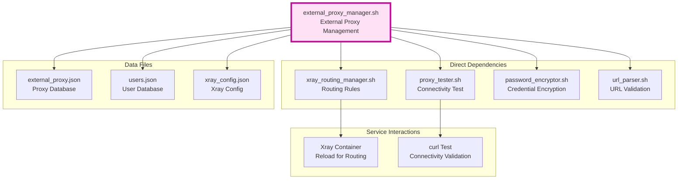
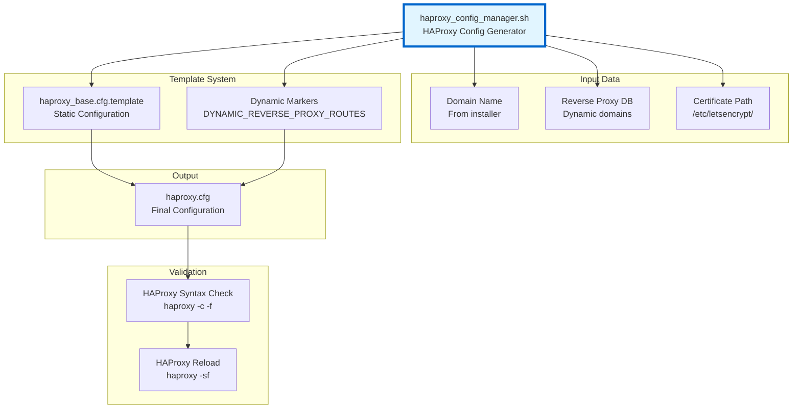
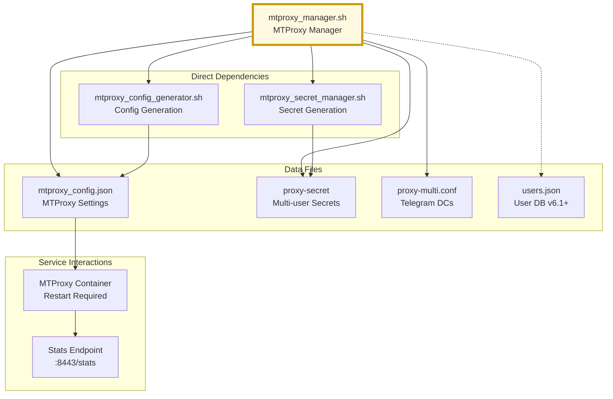
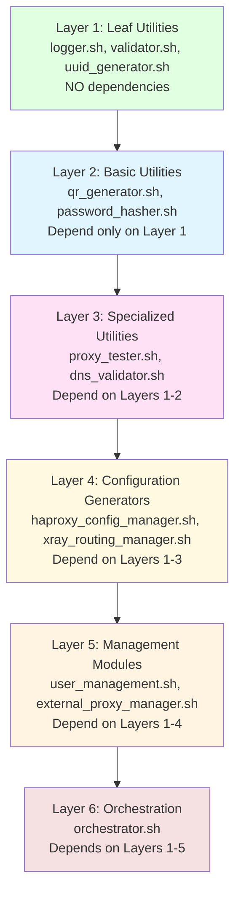

# Module Dependencies Graph

**Purpose:** Visualize the complete dependency graph for all 44 shell modules in lib/

**Scope:** Module-to-module dependencies, initialization order, call relationships

**Total Modules:** 44 modules, ~26,500 lines of shell code

---

## High-Level Module Categories

### Module Organization



---

## Core Module Dependencies

### orchestrator.sh - Main Installation Coordinator



---

## User Management Dependencies

### user_management.sh - User CRUD Operations



**Key Functions and Their Dependencies:**

| Function | Depends On | Purpose |
|----------|------------|---------|
| `cmd_add_user()` | uuid_generator.sh, password_hasher.sh | Generate credentials |
| `add_user_to_json()` | File locking, JSON validation | Atomic database update |
| `add_client_to_xray()` | xray_routing_manager.sh | Update Xray inbounds |
| `generate_client_configs()` | qr_generator.sh | Create client files |
| `reload_xray()` | Docker exec, health_checker.sh | Graceful reload |

---

## External Proxy Dependencies

### external_proxy_manager.sh - Upstream Proxy Management (v5.24+)



---

## Configuration Generator Dependencies

### haproxy_config_manager.sh - HAProxy Configuration



**Template Structure:**
```haproxy
# Static section (from template)
frontend https_sni_router
    bind *:443
    mode tcp

    # Static VLESS ACL
    acl is_vless req_ssl_sni -i ${VLESS_DOMAIN}
    use_backend xray_vless if is_vless

    # DYNAMIC_REVERSE_PROXY_ROUTES
    # (Dynamically injected ACLs)
    # END_DYNAMIC_REVERSE_PROXY_ROUTES

    default_backend fake_site_fallback
```

---

## Xray Routing Dependencies

### xray_routing_manager.sh - Per-User Routing Rules

```mermaid
graph TB
    XrayRouting[xray_routing_manager.sh<br/>Routing Manager]

    subgraph "Input Data"
        UsersJSON[users.json<br/>User Assignments]
        ProxyJSON[external_proxy.json<br/>Proxy Definitions]
    end

    subgraph "Routing Logic"
        UserMapping[User-to-Proxy Mapping<br/>external_proxy_id field]
        RuleGenerator[Routing Rule Generator<br/>Per-user rules]
        OutboundGenerator[Outbound Generator<br/>Proxy configurations]
    end

    subgraph "Output"
        XrayConfig[xray_config.json<br/>routing.rules[] section]
    end

    subgraph "Validation"
        JSONValidate[JSON Syntax Check<br/>jq validation]
        XrayTest[Xray Config Test<br/>xray -test]
        XrayReload[Xray Reload<br/>SIGHUP]
    end

    XrayRouting --> UsersJSON
    XrayRouting --> ProxyJSON

    UsersJSON --> UserMapping
    ProxyJSON --> UserMapping

    UserMapping --> RuleGenerator
    UserMapping --> OutboundGenerator

    RuleGenerator --> XrayConfig
    OutboundGenerator --> XrayConfig

    XrayConfig --> JSONValidate
    JSONValidate --> XrayTest
    XrayTest --> XrayReload

    style XrayRouting fill:#fff9e1,stroke:#cc9900,stroke-width:4px
```

**Routing Rule Generation Logic:**
```javascript
// For each user with external_proxy_id != null
for (user in users) {
    if (user.external_proxy_id) {
        routing.rules.push({
            type: "field",
            inboundTag: ["vless-in", "socks-in", "http-in"],
            user: [user.email],
            outboundTag: `external-proxy-${user.external_proxy_id}`
        });

        // Generate outbound if not exists
        if (!outboundExists(user.external_proxy_id)) {
            outbounds.push(generateProxyOutbound(user.external_proxy_id));
        }
    }
}

// Default rule (must be last)
routing.rules.push({
    type: "field",
    outboundTag: "direct"
});
```

---

## MTProxy Dependencies (v6.0+)

### mtproxy_manager.sh - MTProxy Management



**Note:** MTProxy v6.1 multi-user mode extends users.json with `mtproxy_secret` field

---

## Complete Dependency Matrix

### Module-to-Module Dependency Table

| Module | Direct Dependencies | Indirect Dependencies | Complexity |
|--------|-------------------|----------------------|------------|
| orchestrator.sh | 12 modules | 30+ modules | ★★★★★ |
| user_management.sh | 5 modules | 8 modules | ★★★★☆ |
| external_proxy_manager.sh | 4 modules | 6 modules | ★★★☆☆ |
| haproxy_config_manager.sh | 2 modules | 4 modules | ★★★☆☆ |
| xray_routing_manager.sh | 3 modules | 5 modules | ★★★☆☆ |
| certificate_manager.sh | 3 modules | 7 modules | ★★★☆☆ |
| docker_compose_generator.sh | 4 modules | 6 modules | ★★☆☆☆ |
| reverseproxy_db.sh | 3 modules | 5 modules | ★★☆☆☆ |
| mtproxy_manager.sh | 2 modules | 3 modules | ★★☆☆☆ |
| qr_generator.sh | 0 modules | 0 modules | ★☆☆☆☆ |
| logger.sh | 0 modules | 0 modules | ★☆☆☆☆ |
| validator.sh | 1 module | 1 module | ★☆☆☆☆ |

**Complexity Legend:**
- ★★★★★ Very High (orchestrator)
- ★★★★☆ High (user management)
- ★★★☆☆ Medium (config generators)
- ★★☆☆☆ Low (utilities)
- ★☆☆☆☆ Very Low (leaf modules)

---

## Circular Dependency Prevention

### No Circular Dependencies Detected



**Dependency Architecture:**
- **Layered Design:** Modules organized in 6 dependency layers
- **No Circular Dependencies:** Strict top-down dependency flow
- **Clear Separation:** Each layer has well-defined responsibilities
- **Testability:** Leaf modules can be tested independently

---

## Critical Path Analysis

### Installation Critical Path (Sequential Dependencies)


**Duration:** ~5-7 minutes on fresh Ubuntu 22.04
**Critical Modules:** orchestrator.sh → dependencies.sh → certificate_manager.sh → docker_compose_generator.sh

---

## Module Source Lines of Code (SLOC)

### Top 10 Largest Modules

| Rank | Module | Lines | Percentage | Category |
|------|--------|-------|------------|----------|
| 1 | user_management.sh | 3,000 | 11.3% | User Management |
| 2 | orchestrator.sh | 1,881 | 7.1% | Orchestration |
| 3 | external_proxy_manager.sh | 1,100 | 4.2% | Proxy Management |
| 4 | haproxy_config_manager.sh | 809 | 3.1% | Config Generator |
| 5 | interactive_params.sh | 800 | 3.0% | Utility |
| 6 | xray_routing_manager.sh | 700 | 2.6% | Config Generator |
| 7 | reverseproxy_db.sh | 600 | 2.3% | Proxy Management |
| 8 | security_hardening.sh | 600 | 2.3% | Security |
| 9 | docker_compose_generator.sh | 550 | 2.1% | Config Generator |
| 10 | certificate_manager.sh | 500 | 1.9% | Infrastructure |
| ... | 34 other modules | ~16,460 | 62.1% | Various |
| **Total** | **44 modules** | **~26,500** | **100%** | **All** |

---

## Related Documentation

- [dependencies.yaml](../../yaml/dependencies.yaml) - Complete dependency specifications
- [lib-modules.yaml](../../yaml/lib-modules.yaml) - Module function documentation
- [Initialization Order](initialization-order.md) - Installation sequence
- [Runtime Call Chains](runtime-call-chains.md) - Function call graphs

---

**Created:** 2026-01-07
**Version:** v5.26
**Status:** ✅ CURRENT (44 modules analyzed)
