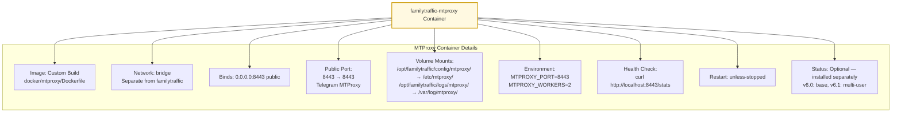
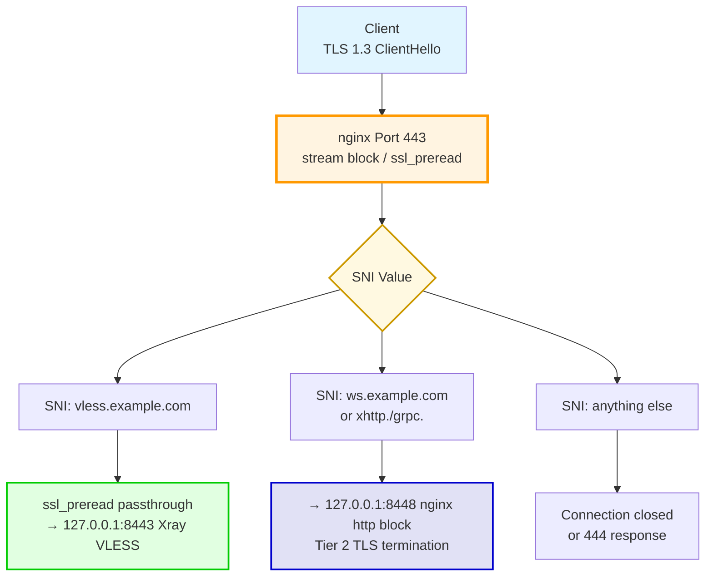
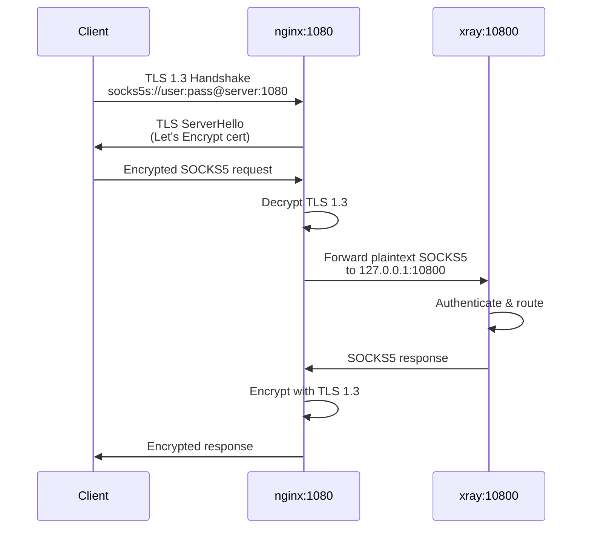
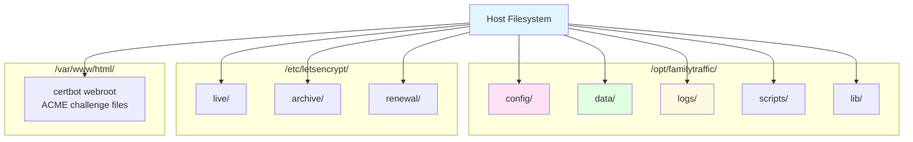

# Docker Network Topology Diagram

**Purpose:** Visualize the complete Docker container architecture, network layout, and volume mounts

**Components:** 1 main Docker container (single-container architecture, v5.33), optional MTProxy container

**Version:** v5.33 (single-container architecture)

> **Note:** In v5.33, the multi-container architecture (HAProxy + Xray + Nginx + Certbot + Fake Site) was replaced by a single `familytraffic` container running nginx + xray + certbot-cron + supervisord. The container uses `network_mode: host` to share the host network stack directly.

---

## Complete Docker Topology

### Full System Architecture (v5.33)

```mermaid
graph TB
    subgraph "Host Server (Ubuntu/Debian)"
        subgraph "familytraffic container (network_mode: host)"
            Supervisord[supervisord<br/>Process Manager]
            Nginx[nginx<br/>Port 80/443/1080/8118/8448]
            Xray[xray<br/>127.0.0.1:8443/10800/18118]
            CertbotCron[certbot-cron<br/>Runs twice daily]

            Supervisord --> Nginx
            Supervisord --> Xray
            Supervisord --> CertbotCron
        end

        MTProxy[familytraffic-mtproxy<br/>MTProxy Alpine<br/>Port 8443 public<br/>optional]

        subgraph "Host Filesystem (volumes)"
            NginxConf[/opt/familytraffic/config/nginx/nginx.conf]
            XrayConf[/opt/familytraffic/config/xray_config.json]
            UsersJSON[/opt/familytraffic/data/users.json]
            LetsEncrypt[/etc/letsencrypt/]
            Webroot[/var/www/html/]
        end

        subgraph "Host Ports (Public)"
            Port443[Port 443<br/>nginx ssl_preread SNI]
            Port1080[Port 1080<br/>nginx TLS termination SOCKS5]
            Port8118[Port 8118<br/>nginx TLS termination HTTP]
            Port80[Port 80<br/>nginx webroot certbot]
            Port8443MT[Port 8443<br/>MTProxy optional]
        end

        Internet[Internet]
    end

    Internet --> Port443
    Internet --> Port1080
    Internet --> Port8118
    Internet -.-> Port80
    Internet --> Port8443MT

    Port443 --> Nginx
    Port1080 --> Nginx
    Port8118 --> Nginx
    Port80 --> Nginx
    Port8443MT --> MTProxy

    Nginx -->|ssl_preread passthrough<br/>127.0.0.1:8443| Xray
    Nginx -->|ssl_preread Tier 2<br/>127.0.0.1:8448| Xray
    Nginx -->|TLS termination<br/>plaintext SOCKS5| Xray
    Nginx -->|TLS termination<br/>plaintext HTTP| Xray

    NginxConf --> Nginx
    XrayConf --> Xray
    LetsEncrypt --> Nginx
    Webroot --> Nginx
    UsersJSON --> Xray

    style Internet fill:#e1f5ff,stroke:#0066cc,stroke-width:3px
    style Nginx fill:#fff4e1,stroke:#ff9900,stroke-width:3px
    style Xray fill:#e1ffe1,stroke:#00cc00,stroke-width:3px
    style CertbotCron fill:#ffe1f5,stroke:#cc0099,stroke-width:2px
    style MTProxy fill:#fff9e1,stroke:#cc9900,stroke-width:2px
    style Supervisord fill:#e1e1f5,stroke:#0000cc,stroke-width:2px
```

---

## Detailed Container Specifications

### Container 1: familytraffic (Single Main Container)

```mermaid
graph TB
    FamilyTrafficContainer[familytraffic Container]

    subgraph "Container Details"
        Image[Image: custom build<br/>nginx + xray + certbot + supervisord]
        NetworkMode[Network: network_mode: host<br/>Shares host network stack]

        InternalProcesses[Internal Processes managed by supervisord:<br/>- nginx (stream block: port 443 SNI, port 80 webroot)<br/>- nginx (http block: port 1080/8118 TLS termination, port 8448 Tier 2)<br/>- xray (127.0.0.1:8443 VLESS, 127.0.0.1:10800 SOCKS5, 127.0.0.1:18118 HTTP)<br/>- certbot-cron (renewal twice daily)]

        Volumes[Volume Mounts:<br/>/opt/familytraffic/config/nginx/nginx.conf → /etc/nginx/nginx.conf<br/>/opt/familytraffic/config/xray_config.json → /etc/xray/config.json<br/>/opt/familytraffic/data/users.json → /opt/familytraffic/data/users.json<br/>/etc/letsencrypt/ → /etc/letsencrypt/ (ro)<br/>/var/www/html/ → /var/www/html/]

        HealthCheck[Health Check:<br/>supervisorctl status all]

        Restart[Restart: unless-stopped]
    end

    FamilyTrafficContainer --> Image
    FamilyTrafficContainer --> NetworkMode
    FamilyTrafficContainer --> InternalProcesses
    FamilyTrafficContainer --> Volumes
    FamilyTrafficContainer --> HealthCheck
    FamilyTrafficContainer --> Restart

    style FamilyTrafficContainer fill:#e1ffe1,stroke:#00cc00,stroke-width:3px
```

**Key Responsibilities:**
- nginx stream block: SNI routing on port 443 (ssl_preread) → 127.0.0.1:8443 (Xray VLESS) or 127.0.0.1:8448 (Tier 2)
- nginx http block: TLS termination on port 1080 → 127.0.0.1:10800 (SOCKS5 plaintext)
- nginx http block: TLS termination on port 8118 → 127.0.0.1:18118 (HTTP plaintext)
- nginx http block: port 8448 for Tier 2 (WS/XHTTP/gRPC) TLS termination → Xray
- nginx: serves /var/www/html on port 80 for certbot webroot HTTP-01 challenge
- xray: VLESS Reality handler (127.0.0.1:8443)
- xray: SOCKS5 handler (127.0.0.1:10800, plaintext)
- xray: HTTP proxy handler (127.0.0.1:18118, plaintext)
- xray: per-user routing to external proxies (v5.24+)
- certbot-cron: automatic certificate renewal with `--deploy-hook nginx -s reload`

---

### Container 2: familytraffic-mtproxy (Telegram MTProxy - Optional)



**Key Responsibilities:**
- Telegram MTProto proxy (optional service)
- Direct public port 8443 (separate Docker container, does not conflict with xray's 127.0.0.1:8443)
- Single-user mode (v6.0), multi-user mode (v6.1 future)
- Fake-TLS support for additional stealth

---

## Removed Containers (v5.33)

The following containers existed in pre-v5.33 architecture and are **no longer used**:

| Container | Was Responsible For | Now Handled By |
|-----------|--------------------|-|
| `familytraffic-haproxy` | SNI routing (port 443), TLS termination (1080/8118) | nginx inside `familytraffic` |
| `familytraffic-nginx` (separate) | Subdomain reverse proxy | Removed (reverse proxy feature removed in v5.33) |
| `familytraffic-certbot` (separate) | Certificate HTTP-01 challenge (port 80) | certbot-cron inside `familytraffic` + nginx webroot |
| `familytraffic-fake-site` | Fallback site for invalid SNI/UUID | Removed in v5.33 |

---

## Traffic Flow (v5.33)

### Port 443: SNI-Based Routing (nginx ssl_preread)



**nginx stream configuration (port 443):**
```nginx
stream {
    map $ssl_preread_server_name $backend {
        vless.example.com     127.0.0.1:8443;
        ws.example.com        127.0.0.1:8448;
        default               "";
    }

    server {
        listen 443;
        ssl_preread on;
        proxy_pass $backend;
    }
}
```

---

### Port 1080/8118: TLS Termination (nginx http block)



**nginx http block configuration (port 1080/8118):**
```nginx
http {
    server {
        listen 1080 ssl;
        ssl_certificate /etc/letsencrypt/live/example.com/fullchain.pem;
        ssl_certificate_key /etc/letsencrypt/live/example.com/privkey.pem;
        ssl_protocols TLSv1.3;

        location / {
            proxy_pass http://127.0.0.1:10800;
        }
    }

    server {
        listen 8118 ssl;
        ssl_certificate /etc/letsencrypt/live/example.com/fullchain.pem;
        ssl_certificate_key /etc/letsencrypt/live/example.com/privkey.pem;
        ssl_protocols TLSv1.3;

        location / {
            proxy_pass http://127.0.0.1:18118;
        }
    }
}
```

---

## Volume Mounts

### Persistent Storage Layout



**Detailed Volume Mappings (familytraffic container):**

| Host Path | Container Mount | Purpose |
|-----------|-----------------|---------|
| `/opt/familytraffic/config/nginx/nginx.conf` | `/etc/nginx/nginx.conf` | nginx configuration |
| `/opt/familytraffic/config/xray_config.json` | `/etc/xray/config.json` | Xray configuration |
| `/opt/familytraffic/data/users.json` | `/opt/familytraffic/data/users.json` | User database |
| `/etc/letsencrypt/` | `/etc/letsencrypt/` (ro) | TLS certificates |
| `/var/www/html/` | `/var/www/html/` | certbot webroot |
| `/opt/familytraffic/logs/xray/` | `/var/log/xray/` | Xray logs |
| `/opt/familytraffic/logs/nginx/` | `/var/log/nginx/` | nginx logs |

---

## Health Checks

| Container | Health Check Command | Interval | Timeout | Retries |
|-----------|---------------------|----------|---------|---------|
| familytraffic | `docker exec familytraffic supervisorctl status all` | 30s | 10s | 3 |
| familytraffic | nginx: `docker exec familytraffic nginx -t` | 30s | 10s | 3 |
| familytraffic | xray: `docker exec familytraffic xray -test -config /etc/xray/config.json` | 30s | 10s | 3 |
| familytraffic-mtproxy | `curl http://localhost:8443/stats` | 30s | 10s | 3 |

---

## Related Documentation

- [docker.yaml](../../yaml/docker.yaml) - Complete Docker specifications
- [Port Mapping Diagram](port-mapping.md) - Detailed port allocation
- [Filesystem Layout](filesystem-layout.md) - /opt/familytraffic/ structure
- [data-flows diagrams](../data-flows/) - Traffic flow through containers

---

**Created:** 2026-01-07
**Updated:** 2026-02-26
**Version:** v5.33
**Status:** UPDATED — reflects single-container architecture
