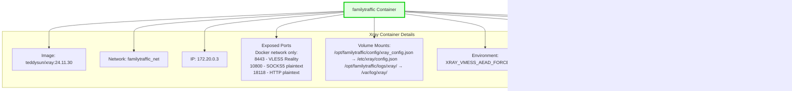

# Docker Network Topology Diagram

**Purpose:** Visualize the complete Docker container architecture, network layout, and volume mounts

**Components:** 6 Docker containers, 1 bridge network, multiple volumes

**Version:** v5.26 (includes MTProxy v6.0+ planned container)

---

## Complete Docker Topology

### Full System Architecture


---

## Detailed Container Specifications

### Container 1: familytraffic-haproxy (Unified TLS Termination & SNI Router)


**Key Responsibilities:**
- Unified TLS termination for ports 1080 (SOCKS5) and 8118 (HTTP)
- SNI-based routing for port 443 (VLESS and reverse proxy)
- TLS passthrough to Xray (no decryption for VLESS)
- TLS passthrough to Nginx reverse proxy backends
- HAProxy stats dashboard on localhost:9000

---

### Container 2: familytraffic (VLESS Reality + SOCKS5 + HTTP Handler)



**Key Responsibilities:**
- VLESS Reality protocol handler (port 8443, TLS passthrough from HAProxy)
- SOCKS5 handler (port 10800, plaintext from HAProxy TLS termination)
- HTTP proxy handler (port 18118, plaintext from HAProxy TLS termination)
- Per-user routing to external proxies (v5.24+)
- Fallback to fake site for invalid UUIDs

**Important:** Xray binds to `127.0.0.1:8443` (Docker network only), NOT public `0.0.0.0:8443`

---

### Container 3: familytraffic-nginx (Subdomain Reverse Proxy)


**Key Responsibilities:**
- Host subdomain-based reverse proxy server blocks
- TLS termination for reverse proxy domains
- Proxy requests to upstream application backends
- Support OAuth2, WebSocket, custom headers, rate limiting

---

### Container 4: familytraffic-certbot (Certificate Validation - On-Demand)


**Key Responsibilities:**
- Serve HTTP-01 challenge files for Let's Encrypt validation
- Only runs during certificate renewal (on-demand)
- Automatically started/stopped by certbot

---

### Container 5: familytraffic-fake-site (Camouflage/Anti-Detection)


**Key Responsibilities:**
- Serve generic website for unknown SNI (anti-probing)
- Serve generic website for invalid VLESS UUID (anti-probing)
- Make VPN server appear as normal website to scanners

---

### Container 6: familytraffic-mtproxy (Telegram MTProxy - v6.0+ Planned)


**Key Responsibilities:**
- Telegram MTProto proxy (v6.0+)
- Direct public port 8443 (separate from Xray)
- Single-user mode (v6.0), multi-user mode (v6.1 future)
- Fake-TLS support for additional stealth

**Important:** MTProxy and Xray both use port 8443 but with different binding interfaces:
- Xray: `127.0.0.1:8443` (Docker network only, accessed via HAProxy)
- MTProxy: `0.0.0.0:8443` (public, direct access)

---

## Docker Network Configuration

### familytraffic_net Bridge Network


**Network Configuration:**
```yaml
networks:
  familytraffic_net:
    driver: bridge
    ipam:
      driver: default
      config:
        - subnet: 172.20.0.0/16
          gateway: 172.20.0.1
```

**IP Allocation:**
| Container | IP Address | Purpose |
|-----------|------------|---------|
| Gateway | 172.20.0.1 | Docker bridge gateway |
| familytraffic-haproxy | 172.20.0.2 | HAProxy SNI router |
| familytraffic | 172.20.0.3 | Xray VLESS/SOCKS5/HTTP |
| familytraffic-nginx | 172.20.0.4 | Nginx reverse proxy |
| familytraffic-certbot | 172.20.0.5 | Certbot validation |
| familytraffic-fake-site | 172.20.0.6 | Fake site fallback |
| familytraffic-mtproxy | 172.20.0.7 | MTProxy (v6.0+) |

---

## Volume Mounts

### Persistent Storage Layout


**Detailed Volume Mappings:**

| Host Path | Container Mount | Container(s) | Purpose |
|-----------|-----------------|--------------|---------|
| `/opt/familytraffic/config/haproxy.cfg` | `/etc/haproxy/haproxy.cfg` | HAProxy | HAProxy configuration |
| `/opt/familytraffic/config/xray_config.json` | `/etc/xray/config.json` | Xray | Xray configuration |
| `/opt/familytraffic/config/reverse-proxy/` | `/etc/nginx/conf.d/` | Nginx RP | Nginx reverse proxy configs |
| `/opt/familytraffic/config/mtproxy/` | `/etc/mtproxy/` | MTProxy | MTProxy configuration (v6.0+) |
| `/opt/familytraffic/data/` | (not mounted) | None | User database, client configs |
| `/opt/familytraffic/logs/haproxy/` | `/var/log/haproxy/` | HAProxy | HAProxy logs |
| `/opt/familytraffic/logs/xray/` | `/var/log/xray/` | Xray | Xray logs |
| `/opt/familytraffic/logs/nginx-rp/` | `/var/log/nginx/` | Nginx RP | Nginx reverse proxy logs |
| `/opt/familytraffic/logs/mtproxy/` | `/var/log/mtproxy/` | MTProxy | MTProxy logs (v6.0+) |
| `/opt/familytraffic/certbot-webroot/` | `/var/www/html/` | Certbot | ACME challenge files |
| `/opt/familytraffic/fake-site/` | `/usr/share/nginx/html/` | Fake Site | Generic website HTML |
| `/etc/letsencrypt/` | `/etc/letsencrypt/` | HAProxy, Nginx RP | TLS certificates |

---

## Container Dependencies

### Startup Order and Dependencies


**Dependency Chain:**
1. **Independent:** HAProxy, Fake Site, MTProxy (can start in parallel)
2. **Depends on HAProxy:** Xray, Nginx Reverse Proxy
3. **On-Demand:** Certbot (only during certificate renewal)

---

## Health Checks

| Container | Health Check Command | Interval | Timeout | Retries |
|-----------|---------------------|----------|---------|---------|
| familytraffic-haproxy | `haproxy -c -f /etc/haproxy/haproxy.cfg` | 30s | 10s | 3 |
| familytraffic | `xray -test -config /etc/xray/config.json` | 30s | 10s | 3 |
| familytraffic-nginx | `nginx -t` | 30s | 10s | 3 |
| familytraffic-fake-site | `curl -f http://localhost` | 30s | 5s | 3 |
| familytraffic-mtproxy | `curl http://localhost:8443/stats` | 30s | 10s | 3 |

---

## Resource Limits (Recommended)

| Container | CPU Limit | Memory Limit | Notes |
|-----------|-----------|--------------|-------|
| familytraffic-haproxy | 1.0 | 512MB | High traffic handling |
| familytraffic | 2.0 | 1GB | Encryption/decryption intensive |
| familytraffic-nginx | 1.0 | 512MB | Moderate traffic |
| familytraffic-certbot | 0.5 | 256MB | On-demand only |
| familytraffic-fake-site | 0.5 | 256MB | Low traffic |
| familytraffic-mtproxy | 1.0 | 512MB | MTProto protocol handling (v6.0+) |

---

## Related Documentation

- [docker.yaml](../../yaml/docker.yaml) - Complete Docker specifications
- [Port Mapping Diagram](port-mapping.md) - Detailed port allocation
- [Filesystem Layout](filesystem-layout.md) - /opt/familytraffic/ structure
- [data-flows diagrams](../data-flows/) - Traffic flow through containers

---

**Created:** 2026-01-07
**Version:** v5.26
**Status:** ✅ CURRENT (includes MTProxy v6.0+ container)
