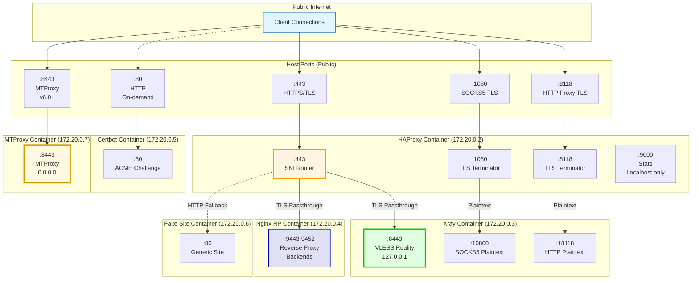
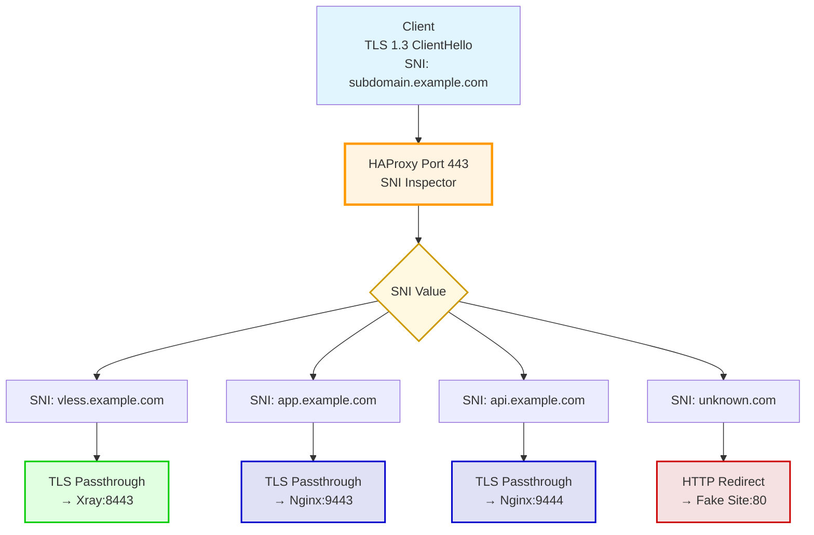
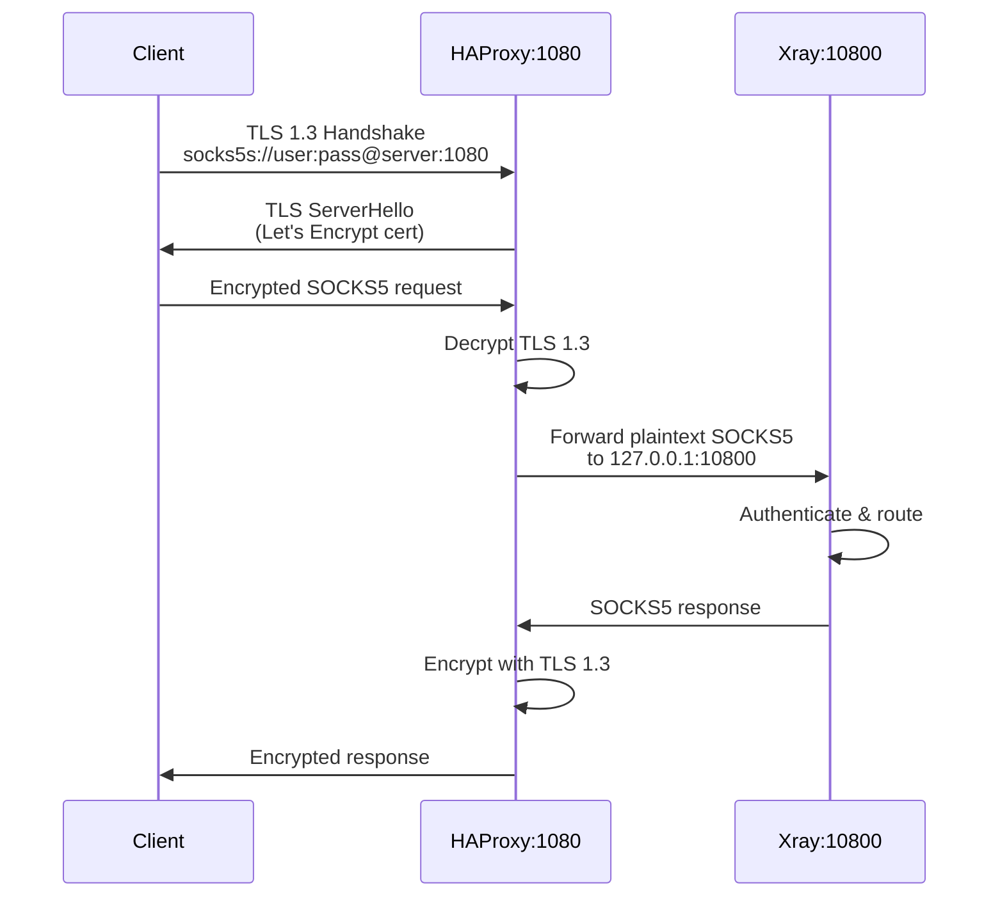
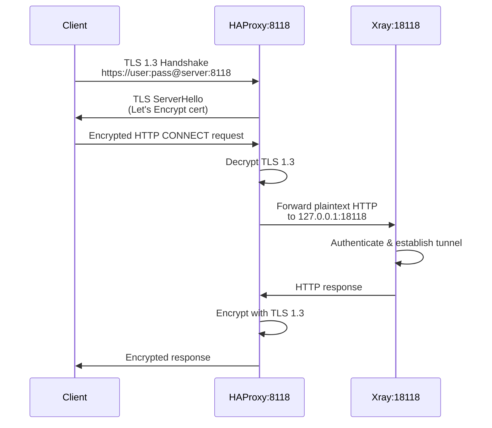
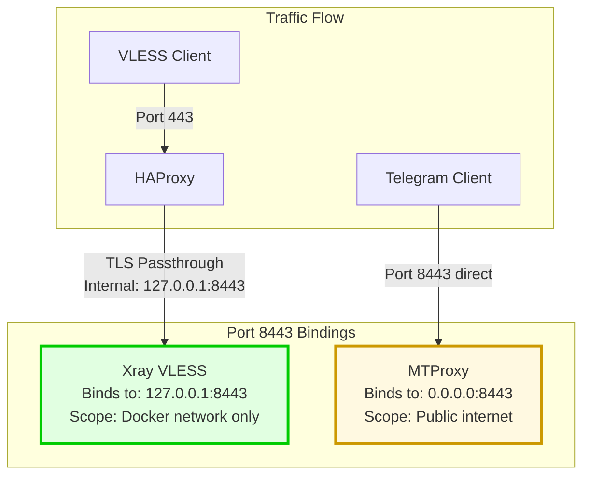

# Port Mapping and Allocation Diagram

**Purpose:** Visualize complete port allocation strategy across all services

**Scope:** Public ports, internal ports, port conflicts resolution

**Version:** v5.26 (includes MTProxy port 8443)

---

## Complete Port Mapping Overview

### Public to Internal Port Flow



---

## Detailed Port Allocation Table

### Public Ports (Exposed to Internet)

| Port | Protocol | Service | Container | Purpose | Status |
|------|----------|---------|-----------|---------|--------|
| **443** | TCP | HTTPS/TLS | familytraffic-haproxy | Unified TLS endpoint (VLESS + Reverse Proxy) | ✅ Active |
| **1080** | TCP | SOCKS5s | familytraffic-haproxy | SOCKS5 over TLS endpoint | ✅ Active |
| **8118** | TCP | HTTPS | familytraffic-haproxy | HTTP proxy over TLS endpoint | ✅ Active |
| **80** | TCP | HTTP | familytraffic-certbot | Certificate validation (on-demand) | ⏸️ On-demand |
| **8443** | TCP | MTProxy | familytraffic-mtproxy | Telegram MTProxy | 📝 v6.0+ |
| **9000** | TCP | HTTP | familytraffic-haproxy | HAProxy stats (localhost only) | ✅ Active |

---

### Internal Ports (Docker Network Only)

| Port | Protocol | Container | Binding | Purpose | Accessed By |
|------|----------|-----------|---------|---------|-------------|
| **8443** | TCP | familytraffic | 127.0.0.1:8443 | VLESS Reality inbound | HAProxy (TLS passthrough) |
| **10800** | TCP | familytraffic | 127.0.0.1:10800 | SOCKS5 plaintext inbound | HAProxy (after TLS termination) |
| **18118** | TCP | familytraffic | 127.0.0.1:18118 | HTTP plaintext inbound | HAProxy (after TLS termination) |
| **9443** | TCP | familytraffic-nginx | 127.0.0.1:9443 | Reverse proxy backend 1 | HAProxy (TLS passthrough) |
| **9444** | TCP | familytraffic-nginx | 127.0.0.1:9444 | Reverse proxy backend 2 | HAProxy (TLS passthrough) |
| **9445** | TCP | familytraffic-nginx | 127.0.0.1:9445 | Reverse proxy backend 3 | HAProxy (TLS passthrough) |
| **9446** | TCP | familytraffic-nginx | 127.0.0.1:9446 | Reverse proxy backend 4 | HAProxy (TLS passthrough) |
| **9447** | TCP | familytraffic-nginx | 127.0.0.1:9447 | Reverse proxy backend 5 | HAProxy (TLS passthrough) |
| **9448** | TCP | familytraffic-nginx | 127.0.0.1:9448 | Reverse proxy backend 6 | HAProxy (TLS passthrough) |
| **9449** | TCP | familytraffic-nginx | 127.0.0.1:9449 | Reverse proxy backend 7 | HAProxy (TLS passthrough) |
| **9450** | TCP | familytraffic-nginx | 127.0.0.1:9450 | Reverse proxy backend 8 | HAProxy (TLS passthrough) |
| **9451** | TCP | familytraffic-nginx | 127.0.0.1:9451 | Reverse proxy backend 9 | HAProxy (TLS passthrough) |
| **9452** | TCP | familytraffic-nginx | 127.0.0.1:9452 | Reverse proxy backend 10 | HAProxy (TLS passthrough) |
| **80** | TCP | familytraffic-fake-site | 127.0.0.1:80 | Generic website fallback | HAProxy (invalid SNI/UUID) |
| **8443** | TCP | familytraffic-mtproxy | 0.0.0.0:8443 | MTProxy public binding | Internet (direct) |

**Critical Note:** Port 8443 is used by BOTH Xray and MTProxy with different bindings:
- **Xray:** `127.0.0.1:8443` (Docker network only, NOT exposed to host)
- **MTProxy:** `0.0.0.0:8443` (public, exposed to host as `8443:8443`)
- **No conflict:** Different network interfaces

---

## Port Binding Strategy

### Port 443: SNI-Based Routing (NO TLS Decryption)



**HAProxy Backend Configuration:**
```haproxy
frontend https_sni_router
    bind *:443
    mode tcp
    tcp-request inspect-delay 5s
    tcp-request content accept if { req_ssl_hello_type 1 }

    # Static ACL for VLESS
    acl is_vless req_ssl_sni -i vless.example.com
    use_backend xray_vless if is_vless

    # Dynamic ACLs for reverse proxy
    # DYNAMIC_REVERSE_PROXY_ROUTES
    acl is_app req_ssl_sni -i app.example.com
    use_backend nginx_app if is_app

    acl is_api req_ssl_sni -i api.example.com
    use_backend nginx_api if is_api
    # END_DYNAMIC_REVERSE_PROXY_ROUTES

    default_backend fake_site_fallback

backend xray_vless
    mode tcp
    server xray 127.0.0.1:8443 check

backend nginx_app
    mode tcp
    server nginx 127.0.0.1:9443 check

backend nginx_api
    mode tcp
    server nginx 127.0.0.1:9444 check
```

---

### Port 1080: SOCKS5 TLS Termination



**HAProxy Configuration:**
```haproxy
frontend socks5_tls_frontend
    bind *:1080 ssl crt /etc/letsencrypt/live/example.com/combined.pem alpn h2,http/1.1
    mode tcp
    default_backend xray_socks5_plaintext

backend xray_socks5_plaintext
    mode tcp
    server xray 127.0.0.1:10800 check
```

---

### Port 8118: HTTP Proxy TLS Termination



**HAProxy Configuration:**
```haproxy
frontend http_proxy_tls_frontend
    bind *:8118 ssl crt /etc/letsencrypt/live/example.com/combined.pem alpn h2,http/1.1
    mode tcp
    default_backend xray_http_plaintext

backend xray_http_plaintext
    mode tcp
    server xray 127.0.0.1:18118 check
```

---

## Port Conflict Resolution

### Critical: Port 8443 Dual Usage

**Problem:** Both Xray and MTProxy need port 8443

**Solution:** Different binding interfaces



**Docker Compose Configuration:**
```yaml
services:
  xray:
    image: teddysun/xray:24.11.30
    expose:
      - "8443"  # Exposed to Docker network only (NOT to host)
    # NO ports mapping for 8443
    # Xray binds internally to 127.0.0.1:8443

  mtproxy:
    image: custom-mtproxy:latest
    ports:
      - "8443:8443"  # Maps host 8443 to container 8443
    # MTProxy binds to 0.0.0.0:8443 inside container
    # Docker exposes this as host 0.0.0.0:8443
```

**Verification:**
```bash
# On host: Check port 8443 bindings
sudo ss -tulnp | grep :8443

# Expected output:
# tcp   LISTEN 0      128    0.0.0.0:8443   0.0.0.0:*    users:(("docker-proxy",pid=12345))

# Inside Xray container:
docker exec familytraffic ss -tulnp | grep :8443

# Expected output:
# tcp   LISTEN 0      128    127.0.0.1:8443   0.0.0.0:*    users:(("xray",pid=1))

# Inside MTProxy container:
docker exec familytraffic-mtproxy ss -tulnp | grep :8443

# Expected output:
# tcp   LISTEN 0      128    0.0.0.0:8443   0.0.0.0:*    users:(("mtproxy",pid=1))
```

---

## Firewall Rules (UFW)

### Required Port Openings

```bash
# Essential ports
sudo ufw allow 443/tcp comment "HTTPS/TLS (VLESS + Reverse Proxy)"
sudo ufw allow 1080/tcp comment "SOCKS5 over TLS"
sudo ufw allow 8118/tcp comment "HTTP Proxy over TLS"

# Certificate validation (on-demand)
sudo ufw allow 80/tcp comment "HTTP (Let's Encrypt validation)"

# MTProxy (v6.0+)
sudo ufw allow 8443/tcp comment "Telegram MTProxy"

# HAProxy stats (localhost only - NO firewall rule needed)
# Port 9000 is NOT exposed to public

# Docker network ports (internal - NO firewall rules needed)
# Ports 8443 (Xray), 10800 (Xray), 18118 (Xray), 9443-9452 (Nginx)
# are internal to Docker network, not exposed to host
```

**Verification:**
```bash
sudo ufw status numbered

# Expected output:
# Status: active
#
#      To                         Action      From
#      --                         ------      ----
# [ 1] 22/tcp                     ALLOW IN    Anywhere
# [ 2] 80/tcp                     ALLOW IN    Anywhere (Let's Encrypt)
# [ 3] 443/tcp                    ALLOW IN    Anywhere (HTTPS)
# [ 4] 1080/tcp                   ALLOW IN    Anywhere (SOCKS5)
# [ 5] 8118/tcp                   ALLOW IN    Anywhere (HTTP Proxy)
# [ 6] 8443/tcp                   ALLOW IN    Anywhere (MTProxy)
```

---

## Port Usage Matrix

### Summary Table

| Port | Public? | Container | Binding | Protocol | TLS | Purpose |
|------|---------|-----------|---------|----------|-----|---------|
| 443 | ✅ | HAProxy | 0.0.0.0:443 | TCP | Passthrough | VLESS + Reverse Proxy (SNI routing) |
| 1080 | ✅ | HAProxy | 0.0.0.0:1080 | TCP | Termination | SOCKS5 over TLS |
| 8118 | ✅ | HAProxy | 0.0.0.0:8118 | TCP | Termination | HTTP Proxy over TLS |
| 80 | ⏸️ | Certbot | 0.0.0.0:80 | HTTP | None | ACME HTTP-01 challenge (on-demand) |
| 8443 | ✅ | MTProxy | 0.0.0.0:8443 | TCP | Fake-TLS | Telegram MTProxy (v6.0+) |
| 9000 | 🔒 | HAProxy | 127.0.0.1:9000 | HTTP | None | HAProxy stats (localhost only) |
| 8443 | ❌ | Xray | 127.0.0.1:8443 | TCP | Passthrough | VLESS Reality (internal only) |
| 10800 | ❌ | Xray | 127.0.0.1:10800 | TCP | None | SOCKS5 plaintext (internal only) |
| 18118 | ❌ | Xray | 127.0.0.1:18118 | TCP | None | HTTP plaintext (internal only) |
| 9443-9452 | ❌ | Nginx RP | 127.0.0.1:9443-9452 | TCP | Termination | Reverse proxy backends (internal only) |
| 80 | ❌ | Fake Site | 127.0.0.1:80 | HTTP | None | Fallback site (internal only) |

**Legend:**
- ✅ Public: Exposed to internet
- ⏸️ On-demand: Only when needed (certbot)
- 🔒 Localhost: Only accessible from host
- ❌ Internal: Docker network only

---

## Related Documentation

- [Docker Topology](docker-topology.md) - Complete container architecture
- [docker.yaml](../../yaml/docker.yaml) - Full port specifications
- [data-flows diagrams](../data-flows/) - Traffic flow through ports
- [Filesystem Layout](filesystem-layout.md) - Configuration file locations

---

**Created:** 2026-01-07
**Version:** v5.26
**Status:** ✅ CURRENT (includes MTProxy port 8443 conflict resolution)
