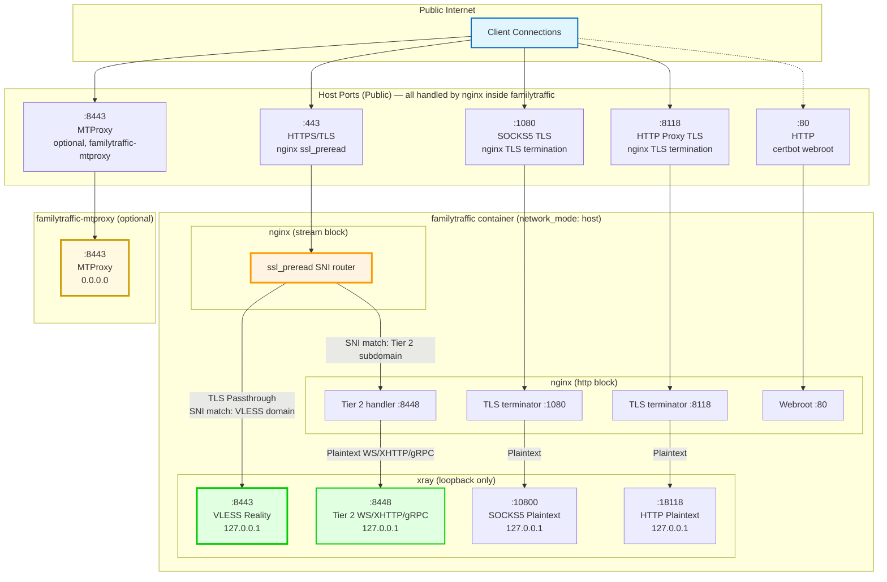
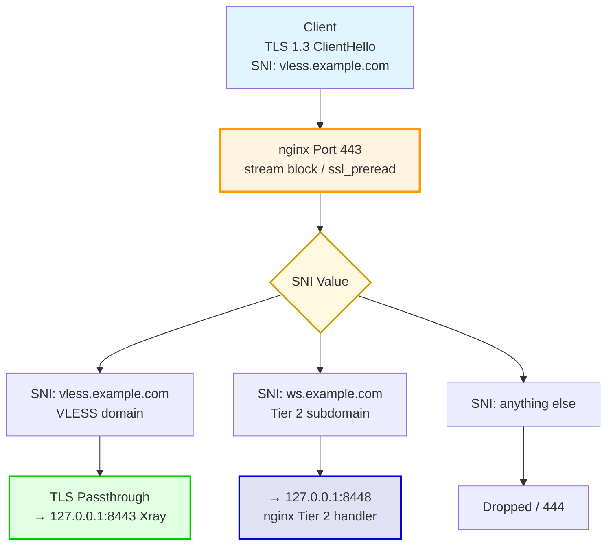
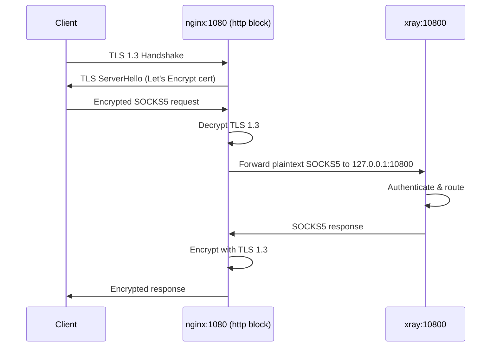
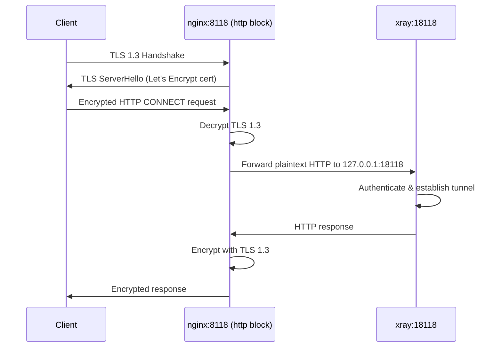
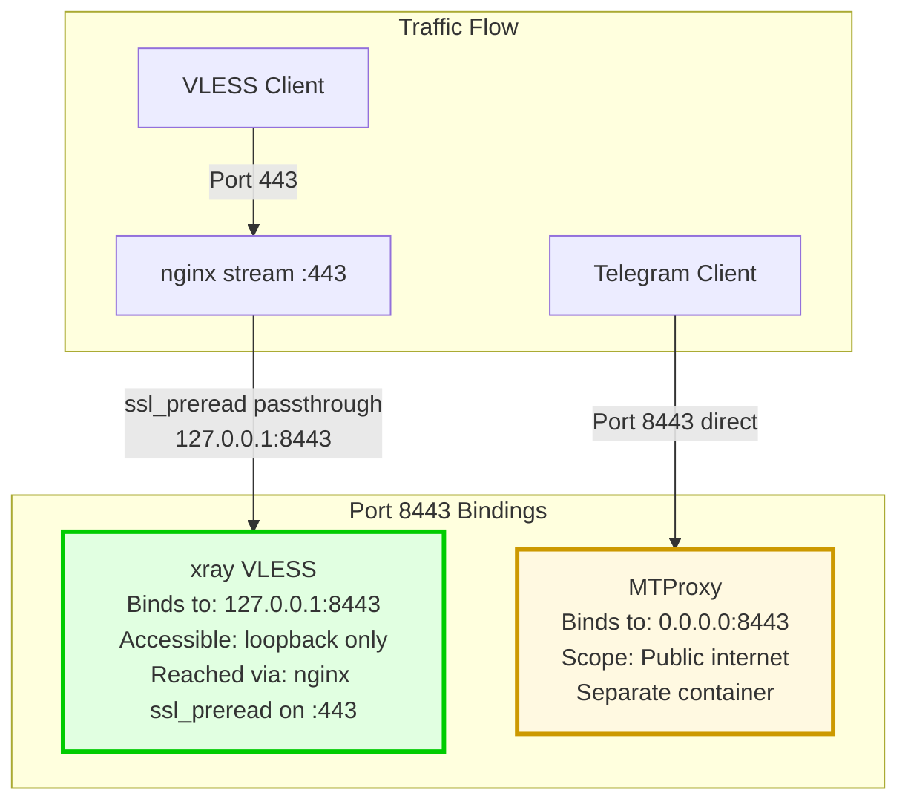

# Port Mapping and Allocation Diagram

**Purpose:** Visualize complete port allocation strategy across all services

**Scope:** Public ports, internal ports

**Version:** v5.33 (single-container architecture)

> **Note:** In v5.33, HAProxy was removed. nginx (inside the `familytraffic` container with `network_mode: host`) handles all port binding. Ports 9000 (HAProxy stats), 9443-9452 (HAProxy/Nginx RP backends) no longer exist.

---

## Complete Port Mapping Overview

### Public to Internal Port Flow



---

## Detailed Port Allocation Table

### Public Ports (Exposed to Internet)

| Port | Protocol | Service | Handler | Purpose | Status |
|------|----------|---------|---------|---------|--------|
| **443** | TCP | HTTPS/TLS | nginx (stream block, inside `familytraffic`) | SNI routing: VLESS Reality + Tier 2 transports | Active |
| **1080** | TCP | SOCKS5s | nginx (http block, inside `familytraffic`) | SOCKS5 over TLS endpoint | Active |
| **8118** | TCP | HTTPS | nginx (http block, inside `familytraffic`) | HTTP proxy over TLS endpoint | Active |
| **80** | TCP | HTTP | nginx (http block, inside `familytraffic`) | certbot webroot for HTTP-01 ACME challenge | Active |
| **8443** | TCP | MTProxy | `familytraffic-mtproxy` container | Telegram MTProxy | Optional (v6.0+) |

**Removed ports (no longer exist in v5.33):**
- ~~Port 9000~~ — HAProxy stats, removed with HAProxy
- ~~Ports 9443-9452~~ — Nginx reverse proxy backends, removed with reverse proxy feature

---

### Internal Ports (loopback only, inside familytraffic container)

| Port | Protocol | Process | Binding | Purpose | Accessed By |
|------|----------|---------|---------|---------|-------------|
| **8443** | TCP | xray | 127.0.0.1:8443 | VLESS Reality inbound | nginx ssl_preread passthrough |
| **8448** | TCP | xray | 127.0.0.1:8448 | Tier 2 (WS/XHTTP/gRPC) inbound | nginx http block (port 443 → 8448) |
| **10800** | TCP | xray | 127.0.0.1:10800 | SOCKS5 plaintext inbound | nginx after TLS termination on :1080 |
| **18118** | TCP | xray | 127.0.0.1:18118 | HTTP plaintext inbound | nginx after TLS termination on :8118 |

---

## Port Binding Strategy

### Port 443: SNI-Based Routing (nginx ssl_preread, NO TLS Decryption)



**nginx stream configuration (ssl_preread map):**
```nginx
stream {
    map $ssl_preread_server_name $backend {
        vless.example.com     127.0.0.1:8443;
        ws.example.com        127.0.0.1:8448;
        xhttp.example.com     127.0.0.1:8448;
        grpc.example.com      127.0.0.1:8448;
        default               "";
    }

    server {
        listen 443;
        ssl_preread on;
        proxy_pass $backend;
    }
}
```

---

### Port 1080: SOCKS5 TLS Termination



**nginx configuration (port 1080):**
```nginx
server {
    listen 1080 ssl;
    ssl_certificate /etc/letsencrypt/live/example.com/fullchain.pem;
    ssl_certificate_key /etc/letsencrypt/live/example.com/privkey.pem;
    ssl_protocols TLSv1.3;

    location / {
        proxy_pass http://127.0.0.1:10800;
    }
}
```

---

### Port 8118: HTTP Proxy TLS Termination



**nginx configuration (port 8118):**
```nginx
server {
    listen 8118 ssl;
    ssl_certificate /etc/letsencrypt/live/example.com/fullchain.pem;
    ssl_certificate_key /etc/letsencrypt/live/example.com/privkey.pem;
    ssl_protocols TLSv1.3;

    location / {
        proxy_pass http://127.0.0.1:18118;
    }
}
```

---

## Port Conflict: xray :8443 vs MTProxy :8443

**No conflict** — different binding interfaces:
- xray: `127.0.0.1:8443` (loopback only, inside `familytraffic` container which uses `network_mode: host`)
- MTProxy: `0.0.0.0:8443` (public, in separate `familytraffic-mtproxy` container)



---

## Firewall Rules (UFW)

### Required Port Openings

```bash
# Essential ports
sudo ufw allow 443/tcp comment "HTTPS/TLS (VLESS + Tier 2 transports)"
sudo ufw allow 1080/tcp comment "SOCKS5 over TLS"
sudo ufw allow 8118/tcp comment "HTTP Proxy over TLS"

# Certificate validation (webroot — nginx always running on port 80)
sudo ufw allow 80/tcp comment "HTTP (Let's Encrypt webroot)"

# MTProxy (optional v6.0+)
sudo ufw allow 8443/tcp comment "Telegram MTProxy"

# No firewall rules needed for internal loopback ports:
# 8443 (xray VLESS), 8448 (xray Tier 2), 10800 (xray SOCKS5), 18118 (xray HTTP)
# These are on 127.0.0.1 only and are NOT exposed to the network.
```

---

## Port Usage Matrix

### Summary Table

| Port | Public? | Handler | Binding | Protocol | TLS | Purpose |
|------|---------|---------|---------|----------|-----|---------|
| 443 | Yes | nginx stream (inside `familytraffic`) | 0.0.0.0:443 | TCP | Passthrough (ssl_preread) | VLESS + Tier 2 SNI routing |
| 1080 | Yes | nginx http (inside `familytraffic`) | 0.0.0.0:1080 | TCP | Termination | SOCKS5 over TLS |
| 8118 | Yes | nginx http (inside `familytraffic`) | 0.0.0.0:8118 | TCP | Termination | HTTP Proxy over TLS |
| 80 | Yes | nginx http (inside `familytraffic`) | 0.0.0.0:80 | HTTP | None | certbot webroot ACME |
| 8443 | Yes (optional) | `familytraffic-mtproxy` | 0.0.0.0:8443 | TCP | Fake-TLS | Telegram MTProxy |
| 8443 | No | xray (inside `familytraffic`) | 127.0.0.1:8443 | TCP | Passthrough | VLESS Reality (loopback) |
| 8448 | No | xray (inside `familytraffic`) | 127.0.0.1:8448 | TCP | None | Tier 2 WS/XHTTP/gRPC (loopback) |
| 10800 | No | xray (inside `familytraffic`) | 127.0.0.1:10800 | TCP | None | SOCKS5 plaintext (loopback) |
| 18118 | No | xray (inside `familytraffic`) | 127.0.0.1:18118 | TCP | None | HTTP plaintext (loopback) |

**Removed (no longer exist in v5.33):**
- ~~9000~~ — HAProxy stats
- ~~9443-9452~~ — Nginx reverse proxy backends

---

## Related Documentation

- [Docker Topology](docker-topology.md) - Complete container architecture
- [docker.yaml](../../yaml/docker.yaml) - Full port specifications
- [data-flows diagrams](../data-flows/) - Traffic flow through ports
- [Filesystem Layout](filesystem-layout.md) - Configuration file locations

---

**Created:** 2026-01-07
**Updated:** 2026-02-26
**Version:** v5.33
**Status:** UPDATED — reflects single-container architecture, HAProxy removed
