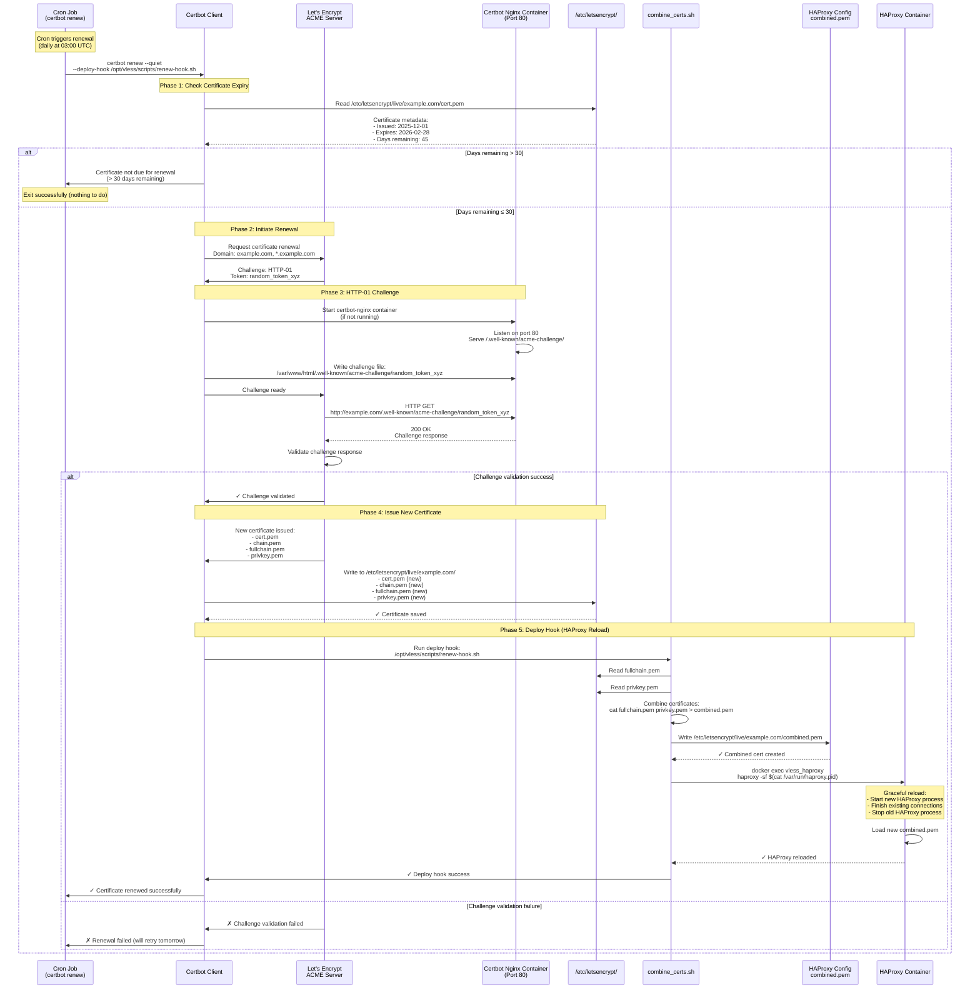
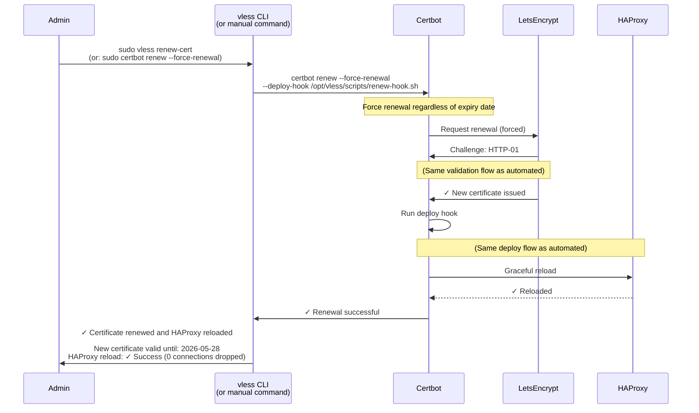
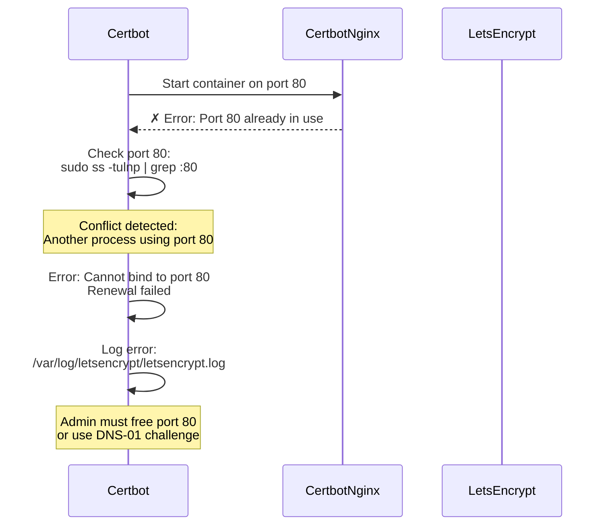
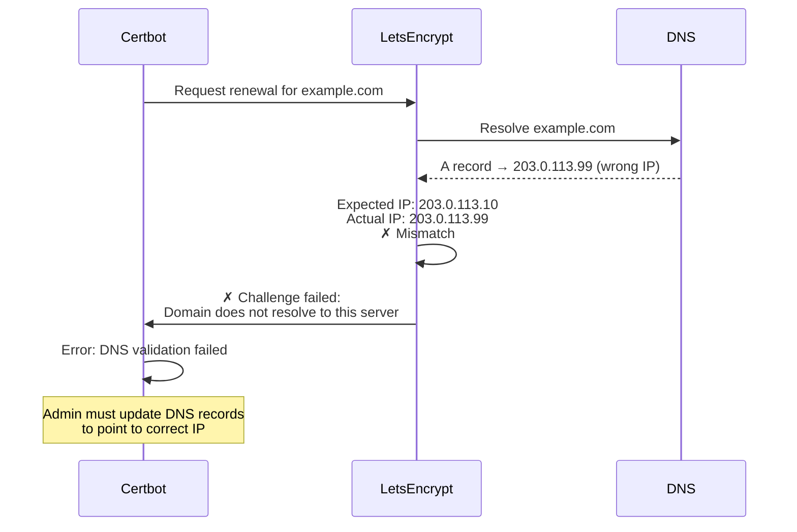
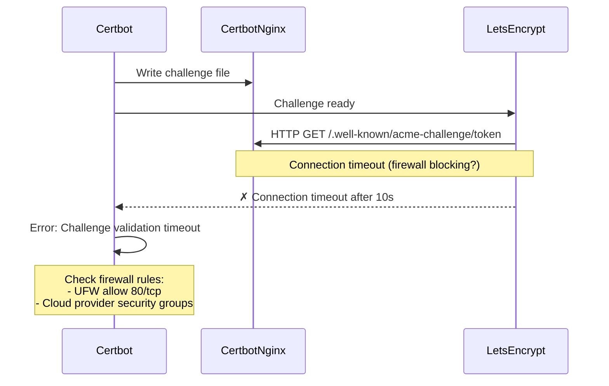
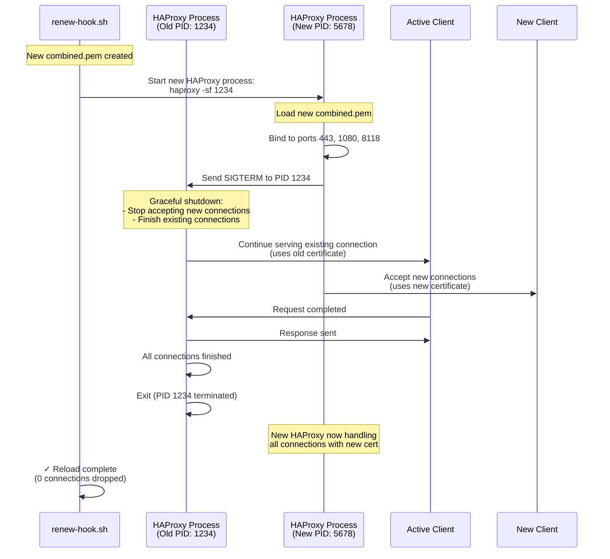
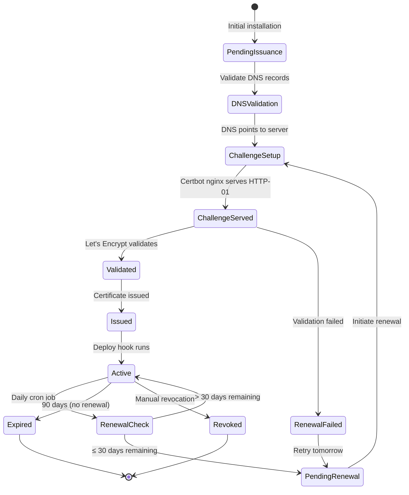

# Certificate Renewal Sequence Diagram

**Purpose:** Visualize the automated Let's Encrypt certificate renewal workflow

**Features:**
- Automated renewal via certbot
- Certificate validation (HTTP-01 challenge)
- HAProxy graceful reload
- Zero-downtime certificate update
- Cron job automation

---

## Automated Certificate Renewal Flow

### Complete Renewal Sequence (Cron Job)



---

## Manual Certificate Renewal Flow

### Manual Renewal Trigger



---

## Certificate Renewal Error Scenarios

### Scenario 1: Port 80 Blocked



### Scenario 2: DNS Not Pointing to Server



### Scenario 3: Challenge Response Timeout



---

## HAProxy Graceful Reload Mechanism

### Zero-Downtime Certificate Update



---

## Cron Job Configuration

### Automated Renewal Schedule

```mermaid
graph TB
    Cron[Cron Daemon]
    CronTab[Crontab Entry<br/>0 3 * * *]
    CertbotRenew[certbot renew<br/>--quiet<br/>--deploy-hook]
    Success{Renewal<br/>Needed?}
    Deploy[Deploy Hook<br/>combine_certs.sh<br/>+ HAProxy reload]
    Log[Log to<br/>/var/log/letsencrypt/]

    Cron --> CronTab
    CronTab -->|Daily at 03:00 UTC| CertbotRenew
    CertbotRenew --> Success

    Success -->|Yes<br/>(≤ 30 days)| Deploy
    Success -.->|No<br/>(> 30 days)| Log

    Deploy --> Log

    style Cron fill:#e1f5ff
    style CertbotRenew fill:#e1ffe1
    style Deploy fill:#ffe1f5
    style Success fill:#fff9e1
```

**Crontab Entry:**
```bash
# /etc/cron.d/certbot-renewal
0 3 * * * root certbot renew --quiet --deploy-hook /opt/vless/scripts/renew-hook.sh
```

**renew-hook.sh Script:**
```bash
#!/bin/bash
# /opt/vless/scripts/renew-hook.sh

DOMAIN="example.com"
CERT_PATH="/etc/letsencrypt/live/$DOMAIN"
COMBINED_CERT="$CERT_PATH/combined.pem"

# Combine fullchain and privkey
cat "$CERT_PATH/fullchain.pem" "$CERT_PATH/privkey.pem" > "$COMBINED_CERT"

# Reload HAProxy
docker exec vless_haproxy haproxy -sf $(docker exec vless_haproxy cat /var/run/haproxy.pid)

# Log success
echo "[$(date)] Certificate renewed and HAProxy reloaded" >> /var/log/vless/cert-renewal.log
```

---

## Certificate Lifecycle

### Certificate State Diagram



---

## Monitoring and Alerts

### Certificate Expiry Monitoring

```bash
# Check certificate expiry date
openssl x509 -in /etc/letsencrypt/live/example.com/cert.pem -noout -enddate

# Output: notAfter=Feb 28 12:00:00 2026 GMT

# Check days until expiry
cert_expiry=$(date -d "$(openssl x509 -in /etc/letsencrypt/live/example.com/cert.pem -noout -enddate | cut -d= -f2)" +%s)
current_time=$(date +%s)
days_remaining=$(( ($cert_expiry - $current_time) / 86400 ))

echo "Days until expiry: $days_remaining"

# Alert if < 7 days
if [ $days_remaining -lt 7 ]; then
    echo "WARNING: Certificate expires in $days_remaining days!"
    # Send alert (email, Slack, etc.)
fi
```

### Renewal Log Monitoring

```bash
# Check recent renewal attempts
tail -50 /var/log/letsencrypt/letsencrypt.log

# Check for failures
grep "FAILED" /var/log/letsencrypt/letsencrypt.log

# Check last successful renewal
grep "Certificate not yet due for renewal" /var/log/letsencrypt/letsencrypt.log | tail -1
```

---

## Performance Metrics

**Renewal Process:**
- **DNS Validation:** ~1-2 seconds
- **HTTP-01 Challenge:** ~5-10 seconds
- **Certificate Issuance:** ~10-20 seconds
- **Deploy Hook Execution:** ~2-3 seconds
- **HAProxy Graceful Reload:** < 1 second (no dropped connections)
- **Total Duration:** ~20-40 seconds

**HAProxy Reload Impact:**
- **Downtime:** 0 seconds (graceful reload)
- **Dropped Connections:** 0 (existing connections finish on old process)
- **Memory Usage:** Brief spike (+50MB for ~1-2 seconds during overlap)
- **CPU Usage:** Brief spike (+20% for ~1-2 seconds)

---

## Troubleshooting

### Common Issues

**Issue 1: Renewal fails with "Port 80 already in use"**
- **Cause:** Another service binding to port 80
- **Fix:**
  ```bash
  # Find process on port 80
  sudo ss -tulnp | grep :80

  # Stop conflicting service
  sudo systemctl stop <service>

  # Retry renewal
  sudo certbot renew --force-renewal
  ```

**Issue 2: HAProxy reload fails after renewal**
- **Cause:** Invalid combined.pem or HAProxy configuration error
- **Debug:**
  ```bash
  # Check combined.pem format
  openssl x509 -in /etc/letsencrypt/live/example.com/combined.pem -noout -text

  # Test HAProxy config
  docker exec vless_haproxy haproxy -c -f /etc/haproxy/haproxy.cfg
  ```

**Issue 3: Certificate not renewed despite < 30 days**
- **Cause:** Cron job not running or certbot timer disabled
- **Fix:**
  ```bash
  # Check cron job exists
  cat /etc/cron.d/certbot-renewal

  # Check certbot timer (if using systemd)
  systemctl status certbot.timer

  # Manual renewal
  sudo certbot renew --force-renewal
  ```

---

## Related Documentation

- [docker.yaml](../../yaml/docker.yaml) - Certbot nginx container configuration
- [config.yaml](../../yaml/config.yaml) - Certificate file paths and HAProxy integration
- [dependencies.yaml](../../yaml/dependencies.yaml) - Certificate renewal dependencies
- [lib-modules.yaml](../../yaml/lib-modules.yaml) - certificate_manager.sh functions

---

**Created:** 2026-01-07
**Version:** v5.26
**Status:** ✅ CURRENT (Automated renewal fully implemented)
