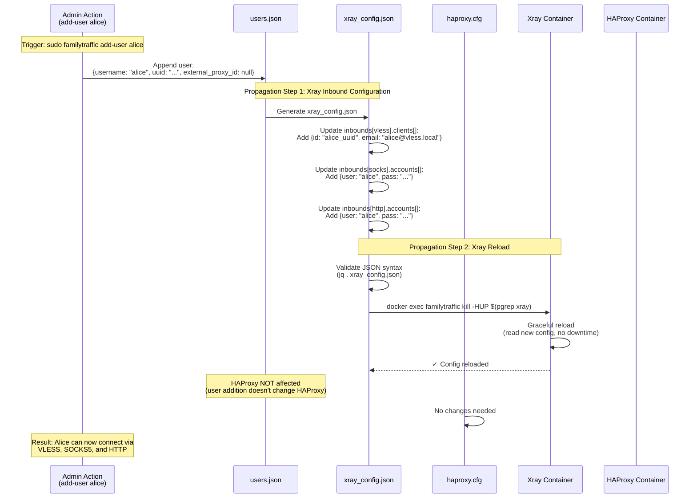
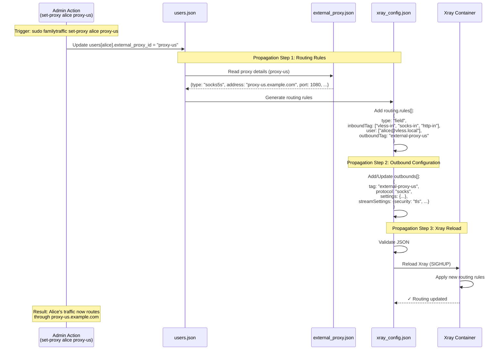
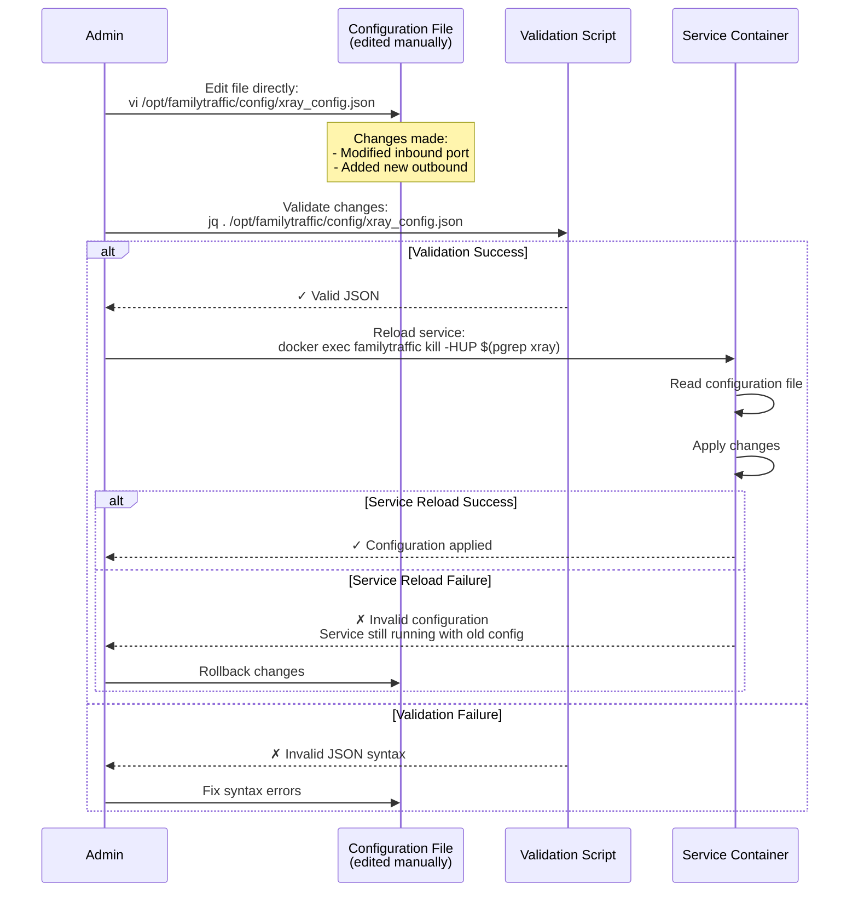
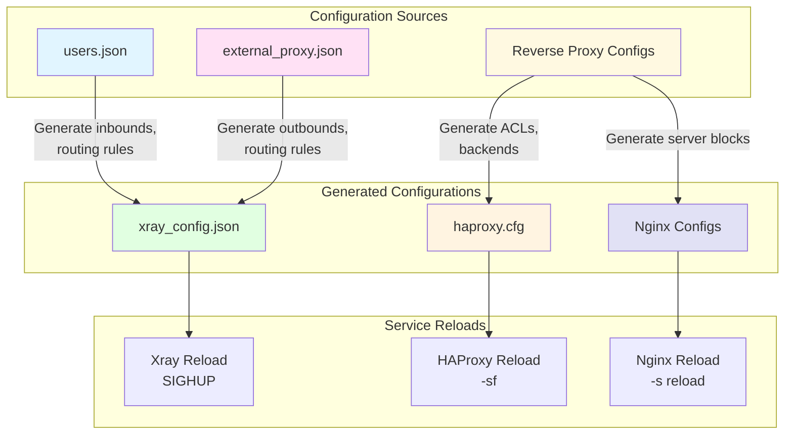
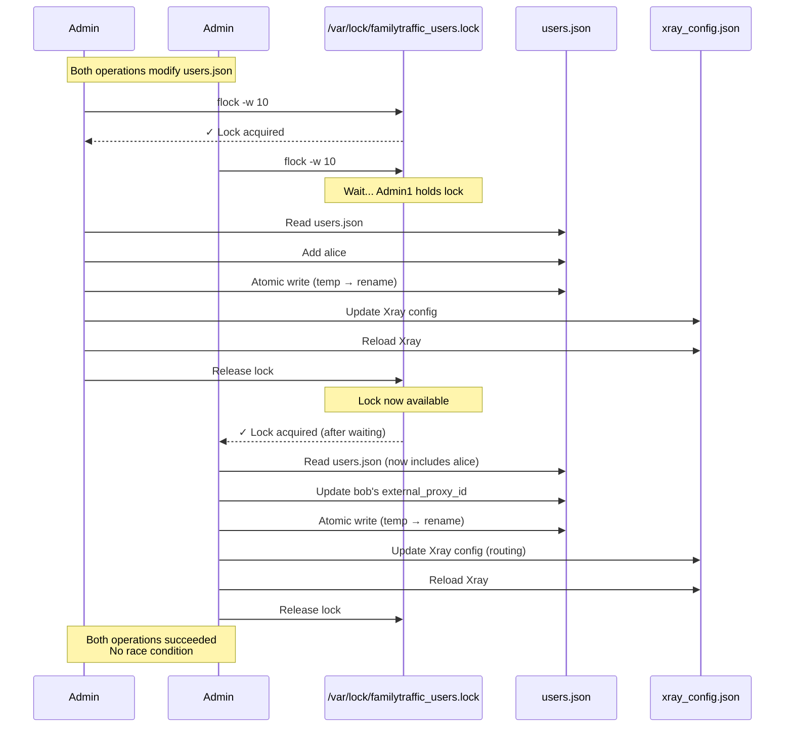
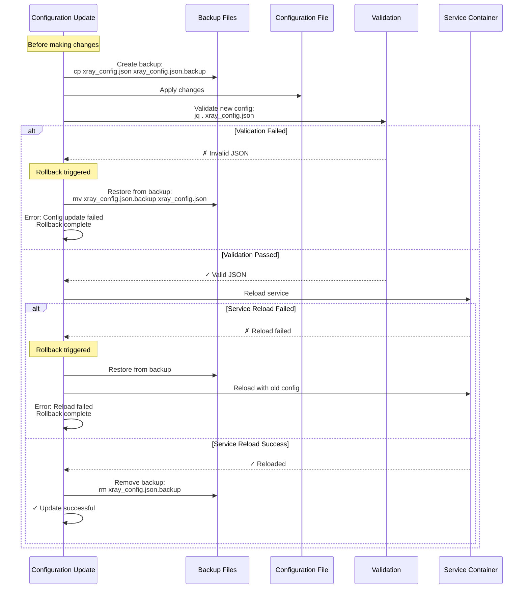

# Configuration Update Propagation Sequence Diagram

**Purpose:** Visualize how configuration changes propagate through the system

**Scope:** Configuration update flows for major operations

**Operations Covered:**
- User database changes → Xray configuration
- External proxy changes → Xray configuration
- Reverse proxy domain addition → HAProxy + Nginx configuration
- Direct configuration file edits → Service reloads

---

## User Change Propagation Flow

### User Added → Full Configuration Update



---

## External Proxy Change Propagation

### Set Proxy → Routing Rule Update



---

## Reverse Proxy Domain Addition Propagation

### Add Domain → Multi-Service Configuration Update

```mermaid
sequenceDiagram
    participant UserAction as Admin Action<br/>(familytraffic-proxy add)
    participant ReverseProxyDB as Reverse Proxy Database<br/>(in-memory)
    participant NginxConfig as Nginx Config<br/>app.example.com.conf
    participant HTTPContext as http_context.conf
    participant HAProxyConfig as haproxy.cfg
    participant Nginx as Nginx Container
    participant HAProxy as HAProxy Container

    Note over UserAction: Trigger: sudo familytraffic-proxy add

    UserAction->>UserAction: Interactive wizard:<br/>- Domain: app.example.com<br/>- Target: https://backend:8443<br/>- OAuth2: No<br/>- WebSocket: No

    Note over ReverseProxyDB,NginxConfig: Propagation Step 1: Nginx Configuration

    UserAction->>ReverseProxyDB: Allocate port: 9443
    ReverseProxyDB->>NginxConfig: Generate app.example.com.conf:<br/>server {<br/> listen 9443 ssl http2;<br/> server_name app.example.com;<br/> ssl_certificate ...;<br/> ssl_certificate_key ...;<br/> location / {<br/>   proxy_pass https://backend:8443;<br/>   ...<br/> }<br/>}

    ReverseProxyDB->>HTTPContext: Add rate limit zone:<br/>limit_req_zone $binary_remote_addr<br/> zone=reverseproxy_app_example_com:10m<br/> rate=100r/s;

    Note over NginxConfig,Nginx: Propagation Step 2: Nginx Reload

    NginxConfig->>Nginx: docker exec familytraffic-nginx nginx -t
    Nginx->>Nginx: Test configuration syntax
    Nginx-->>NginxConfig: ✓ Syntax OK

    NginxConfig->>Nginx: docker exec familytraffic-nginx nginx -s reload
    Nginx->>Nginx: Graceful reload<br/>(load new server block)
    Nginx-->>NginxConfig: ✓ Config reloaded

    Note over HAProxyConfig,HAProxy: Propagation Step 3: HAProxy ACL Update

    UserAction->>HAProxyConfig: Update dynamic ACL section:<br/>Add between markers:<br/># DYNAMIC_REVERSE_PROXY_ROUTES<br/>acl is_app req_ssl_sni -i app.example.com<br/>use_backend nginx_app if is_app<br/># END_DYNAMIC_REVERSE_PROXY_ROUTES

    HAProxyConfig->>HAProxyConfig: Add backend:<br/>backend nginx_app<br/> mode tcp<br/> server nginx 127.0.0.1:9443 check

    HAProxyConfig->>HAProxy: Validate config:<br/>haproxy -c -f /etc/haproxy/haproxy.cfg
    HAProxy-->>HAProxyConfig: ✓ Config valid

    HAProxyConfig->>HAProxy: Graceful reload:<br/>haproxy -sf $(cat /var/run/haproxy.pid)
    HAProxy->>HAProxy: Start new process<br/>Stop old process
    HAProxy-->>HAProxyConfig: ✓ Reloaded

    Note over UserAction: Result: https://app.example.com<br/>now routes to backend:8443
```

---

## Direct Configuration File Edit Propagation

### Manual Edit → Service Reload



---

## Configuration Propagation Matrix

### Which Changes Affect Which Services



| Change Type | Affects | Service Reload Required |
|-------------|---------|-------------------------|
| Add user | `xray_config.json` | Xray (SIGHUP) |
| Remove user | `xray_config.json` | Xray (SIGHUP) |
| Set user proxy | `xray_config.json` (routing) | Xray (SIGHUP) |
| Add external proxy | `external_proxy.json` | None (until assigned to user) |
| Assign proxy to user | `xray_config.json` (outbounds + routing) | Xray (SIGHUP) |
| Add reverse proxy domain | `haproxy.cfg` + Nginx `*.conf` | HAProxy (-sf) + Nginx (-s reload) |
| Remove reverse proxy domain | `haproxy.cfg` + Nginx `*.conf` | HAProxy (-sf) + Nginx (-s reload) |
| Edit HAProxy config | `haproxy.cfg` | HAProxy (-sf) |
| Edit Nginx config | Nginx `*.conf` | Nginx (-s reload) |
| Edit Xray config | `xray_config.json` | Xray (SIGHUP) |

---

## Configuration Atomicity and Locking

### File Lock Mechanism for Concurrent Updates



---

## Configuration Rollback on Error

### Error Handling with Backup Restoration



---

## Configuration Dependencies

### Dependency Graph for Configuration Files

```mermaid
graph TB
    subgraph "Source Data"
        UsersJSON[users.json]
        ProxyJSON[external_proxy.json]
        ReverseProxyDB[(Reverse Proxy<br/>Database)]
    end

    subgraph "Generated Configs"
        XrayInbounds[Xray Inbounds<br/>clients[] sections]
        XrayRouting[Xray Routing<br/>rules[] sections]
        XrayOutbounds[Xray Outbounds<br/>external proxies]
        XrayFull[xray_config.json<br/>Complete]

        HAProxyACLs[HAProxy ACLs<br/>Dynamic section]
        HAProxyBackends[HAProxy Backends<br/>Nginx backends]
        HAProxyFull[haproxy.cfg<br/>Complete]

        NginxServers[Nginx Server Blocks<br/>domain.conf files]
        NginxHTTPContext[http_context.conf<br/>Rate limit zones]
    end

    UsersJSON --> XrayInbounds
    UsersJSON --> XrayRouting
    ProxyJSON --> XrayOutbounds
    ProxyJSON --> XrayRouting

    XrayInbounds --> XrayFull
    XrayRouting --> XrayFull
    XrayOutbounds --> XrayFull

    ReverseProxyDB --> HAProxyACLs
    ReverseProxyDB --> HAProxyBackends
    ReverseProxyDB --> NginxServers
    ReverseProxyDB --> NginxHTTPContext

    HAProxyACLs --> HAProxyFull
    HAProxyBackends --> HAProxyFull

    style UsersJSON fill:#e1f5ff
    style ProxyJSON fill:#ffe1f5
    style ReverseProxyDB fill:#fff9e1
    style XrayFull fill:#e1ffe1
    style HAProxyFull fill:#fff4e1
    style NginxServers fill:#e1e1f5
```

---

## Performance Metrics

**Configuration Update Operations:**
- **File Lock Acquisition:** < 10ms (or wait up to 10s)
- **JSON Validation:** < 10ms
- **File Write (atomic):** < 10ms
- **Xray Reload (SIGHUP):** ~100-200ms
- **HAProxy Reload (-sf):** ~50-100ms
- **Nginx Reload (-s reload):** ~50-100ms

**Typical Update Durations:**
- **Add User:** ~300ms total (mostly Xray reload)
- **Set Proxy:** ~300ms total (Xray reload + routing update)
- **Add Reverse Proxy:** ~200ms total (HAProxy + Nginx reload)
- **Direct Config Edit:** Depends on validation + reload (~100-500ms)

**Downtime:**
- **Xray Reload:** 0 seconds (graceful)
- **HAProxy Reload:** 0 seconds (graceful)
- **Nginx Reload:** 0 seconds (graceful)

---

## Troubleshooting

### Common Issues

**Issue 1: Configuration update fails with "Lock timeout"**
- **Cause:** Another process holds the lock for > 10 seconds
- **Fix:**
  ```bash
  # Check if lock file exists
  ls -l /var/lock/familytraffic_users.lock

  # Check which process holds lock (if any)
  lsof /var/lock/familytraffic_users.lock

  # Force remove lock (use with caution!)
  rm -f /var/lock/familytraffic_users.lock
  ```

**Issue 2: Service fails to reload after config update**
- **Cause:** Invalid configuration or syntax error
- **Debug:**
  ```bash
  # Xray
  docker exec familytraffic xray -test -config /etc/xray/config.json

  # HAProxy
  docker exec familytraffic-haproxy haproxy -c -f /etc/haproxy/haproxy.cfg

  # Nginx
  docker exec familytraffic-nginx nginx -t
  ```

**Issue 3: Changes not taking effect after reload**
- **Cause:** Wrong config file edited, or cache issue
- **Debug:**
  ```bash
  # Verify config file timestamp
  ls -l /opt/familytraffic/config/xray_config.json

  # Check if service read new config
  docker logs familytraffic --tail 20 | grep "config"

  # Force restart instead of reload
  docker restart familytraffic
  ```

---

## Related Documentation

- [config.yaml](../../yaml/config.yaml) - Complete configuration relationships
- [dependencies.yaml](../../yaml/dependencies.yaml) - Configuration update dependencies
- [lib-modules.yaml](../../yaml/lib-modules.yaml) - Configuration generation functions
- [User Management Sequence](user-management.md) - User-specific config updates
- [Proxy Assignment Sequence](proxy-assignment.md) - Proxy-specific config updates
- [Reverse Proxy Setup](reverse-proxy-setup.md) - Reverse proxy config updates

---

**Created:** 2026-01-07
**Version:** v5.26
**Status:** ✅ CURRENT
