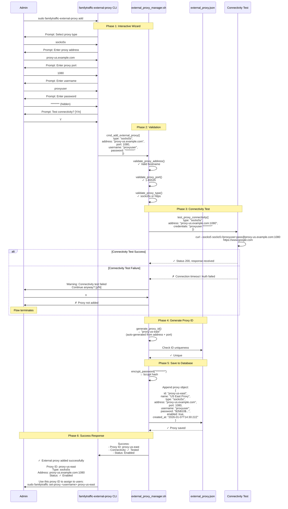
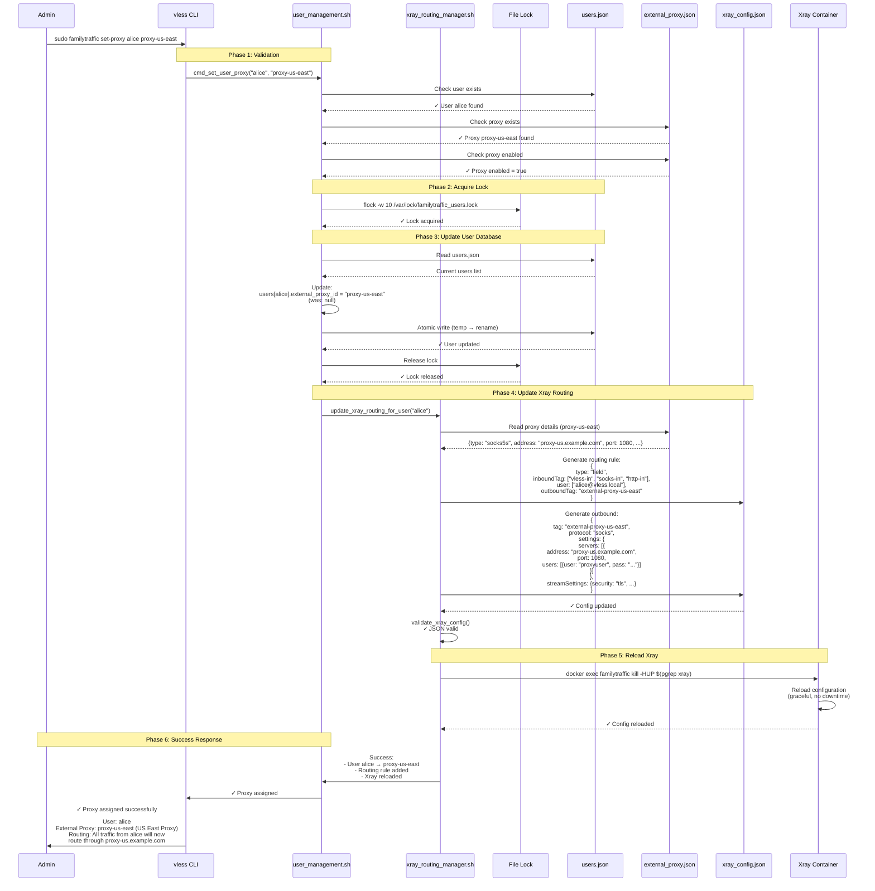
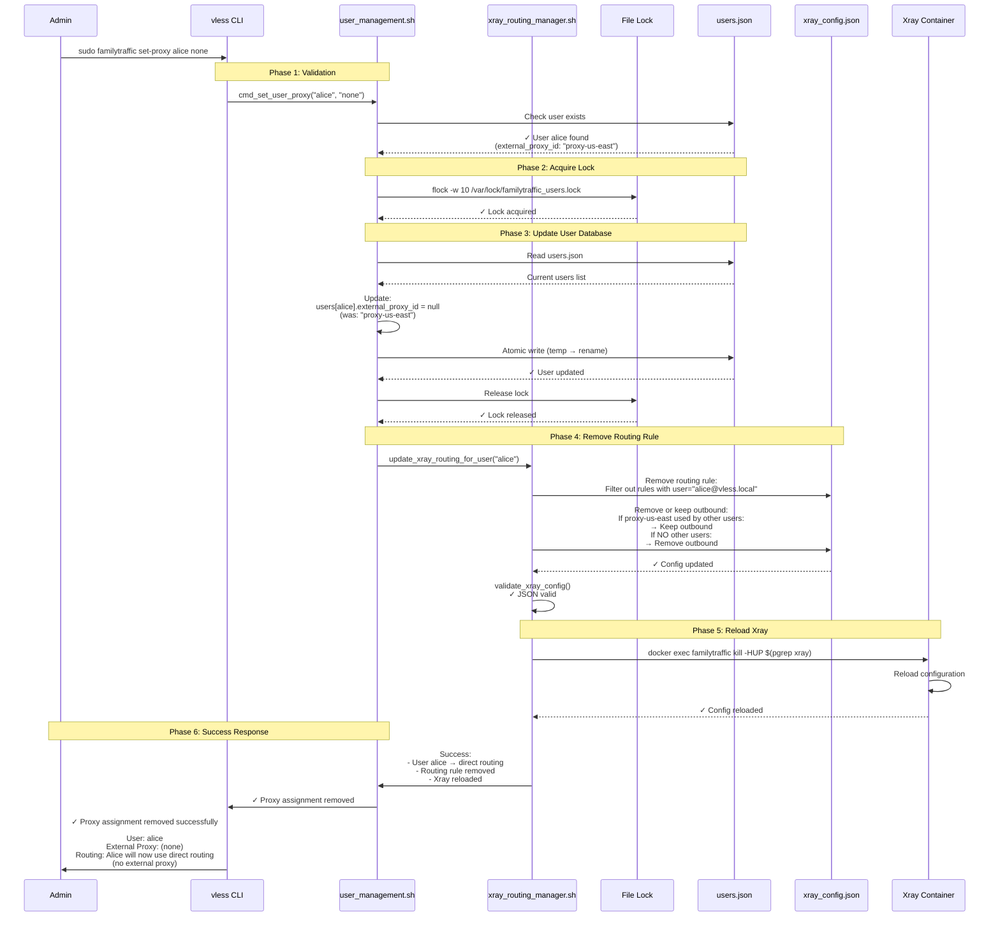
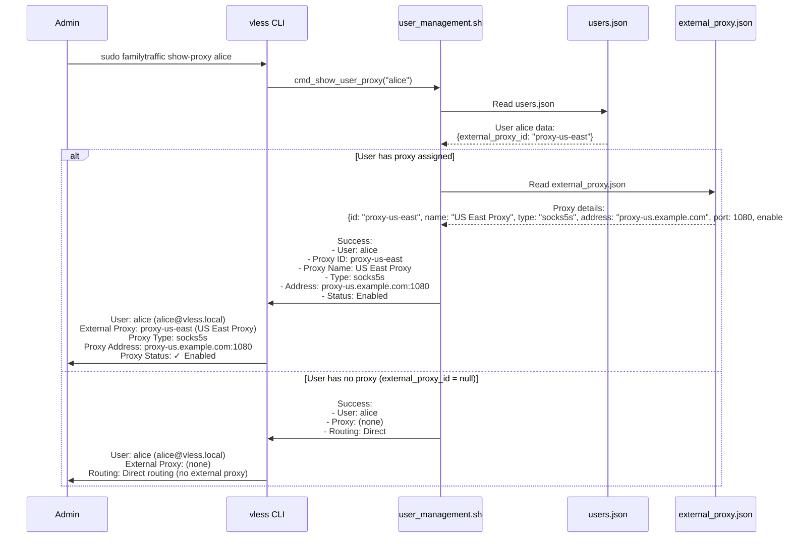
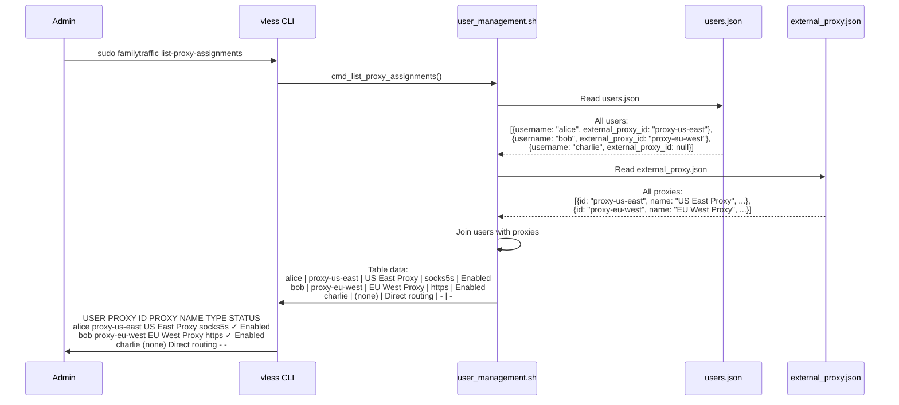
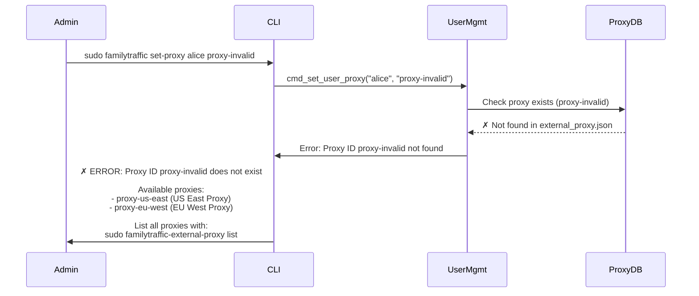
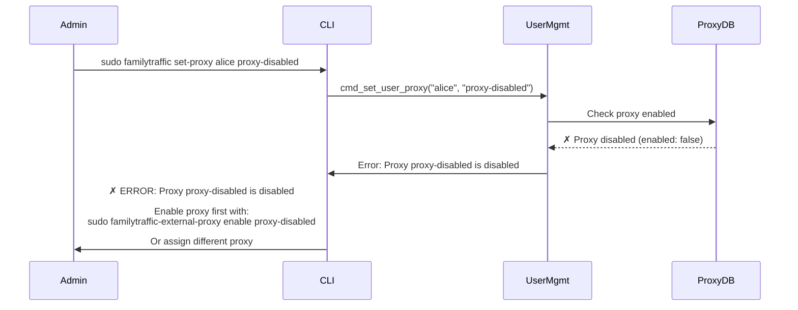
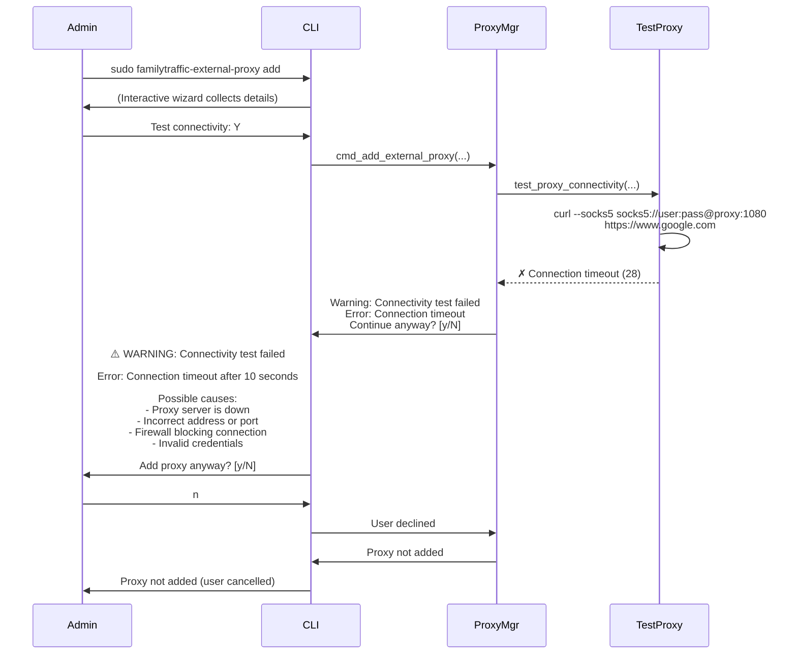
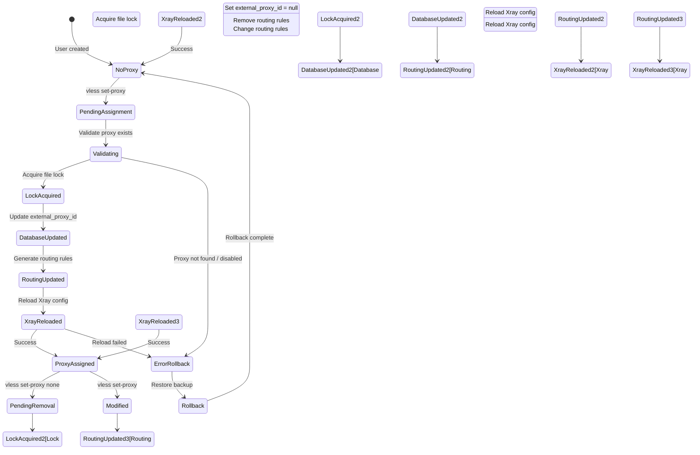

# Per-User Proxy Assignment Sequence Diagram (v5.24+)

**Purpose:** Visualize the workflow for assigning external proxies to individual users

**Feature:** v5.24+ Per-User External Proxy Support

**Operations Covered:**
- Add external proxy to database
- Assign proxy to user
- Remove proxy assignment
- Proxy connectivity testing
- Routing rule generation

---

## Add External Proxy Sequence

### Complete Add External Proxy Flow

---

## Assign Proxy to User Sequence

### Complete Proxy Assignment Flow

---

## Remove Proxy Assignment Sequence

### Complete Proxy Removal Flow

---

## View User Proxy Assignments

### Show Single User Proxy

### List All Proxy Assignments

---

## Error Handling Scenarios

### Scenario 1: Proxy ID Not Found

### Scenario 2: Proxy Disabled

### Scenario 3: Connectivity Test Failed

---

## State Transitions

### Proxy Assignment State Diagram

---

## Performance Metrics

**Assign Proxy Operation:**
- **Validation:** < 10ms
- **Lock Acquisition:** < 10ms (or wait up to 10s)
- **Database Update:** < 10ms
- **Routing Rule Generation:** ~20-30ms
- **Xray Config Update:** < 20ms
- **Xray Reload:** ~100-200ms
- **Total Duration:** ~200-300ms

**Remove Proxy Assignment:**
- **Validation:** < 10ms
- **Lock Acquisition:** < 10ms
- **Database Update:** < 10ms
- **Routing Rule Removal:** ~20-30ms
- **Xray Config Update:** < 20ms
- **Xray Reload:** ~100-200ms
- **Total Duration:** ~200-300ms

**Connectivity Test:**
- **SOCKS5s Test:** ~100-500ms (depends on proxy latency)
- **HTTPS Test:** ~100-500ms
- **Timeout:** 10 seconds (configurable)

---

## Related Documentation

- [dependencies.yaml](../../yaml/dependencies.yaml) - Runtime dependencies for proxy assignment
- [lib-modules.yaml](../../yaml/lib-modules.yaml) - external_proxy_manager.sh and xray_routing_manager.sh functions
- [cli.yaml](../../yaml/cli.yaml) - CLI command specifications (vless set-proxy, familytraffic-external-proxy add)
- [config.yaml](../../yaml/config.yaml) - users.json and external_proxy.json relationships
- [data-flows.yaml](../../yaml/data-flows.yaml) - External proxy routing flow
- [External Proxy Flow](../data-flows/external-proxy-flow.md) - Visual traffic flow diagram
- [User Management Sequence](user-management.md) - User add/remove operations

---

**Created:** 2026-01-07
**Version:** v5.26
**Status:** ✅ CURRENT (v5.24+ per-user external proxy support)
