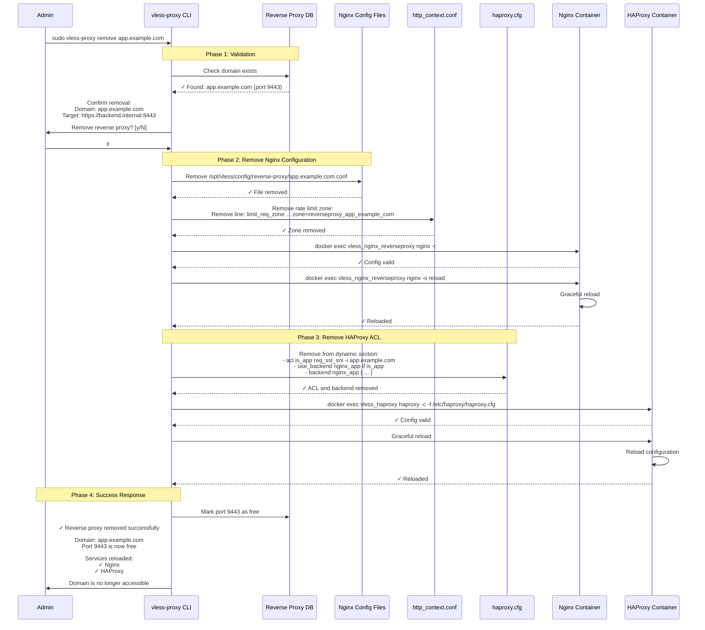
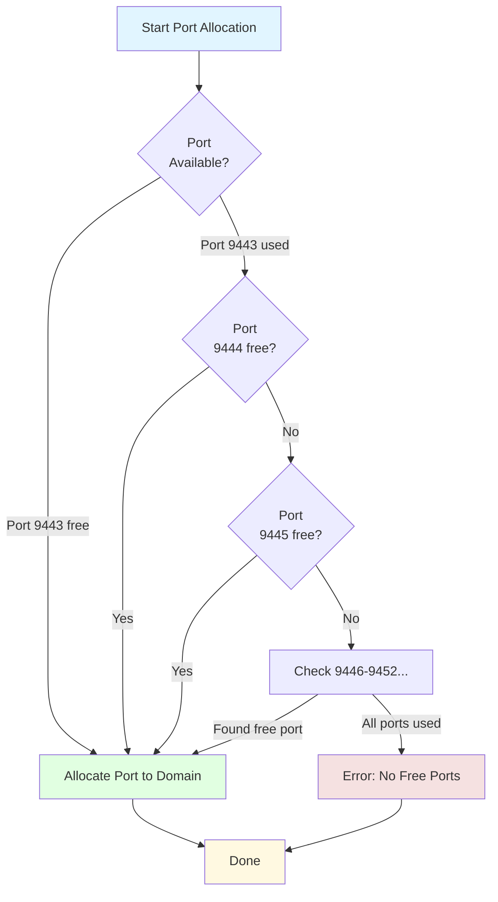
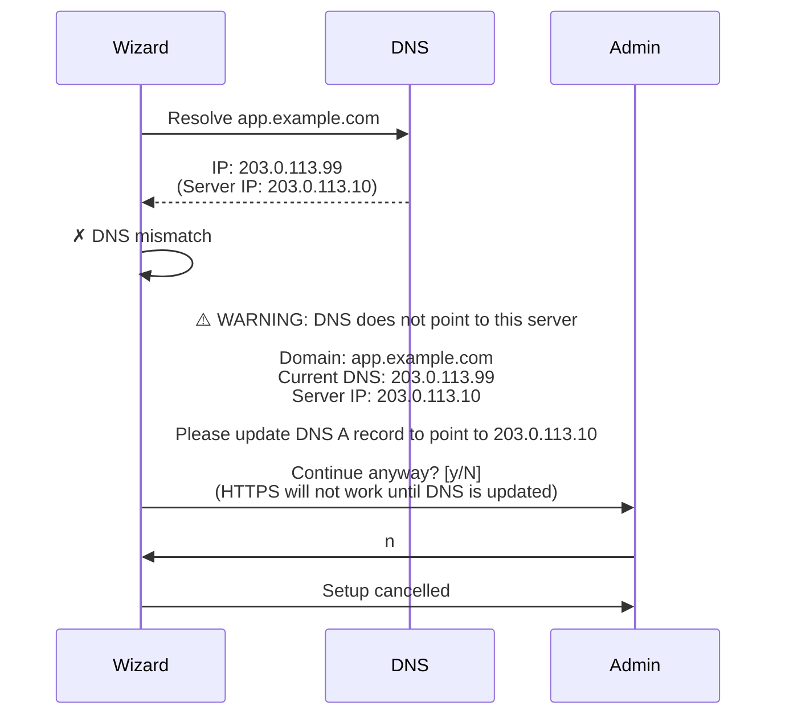
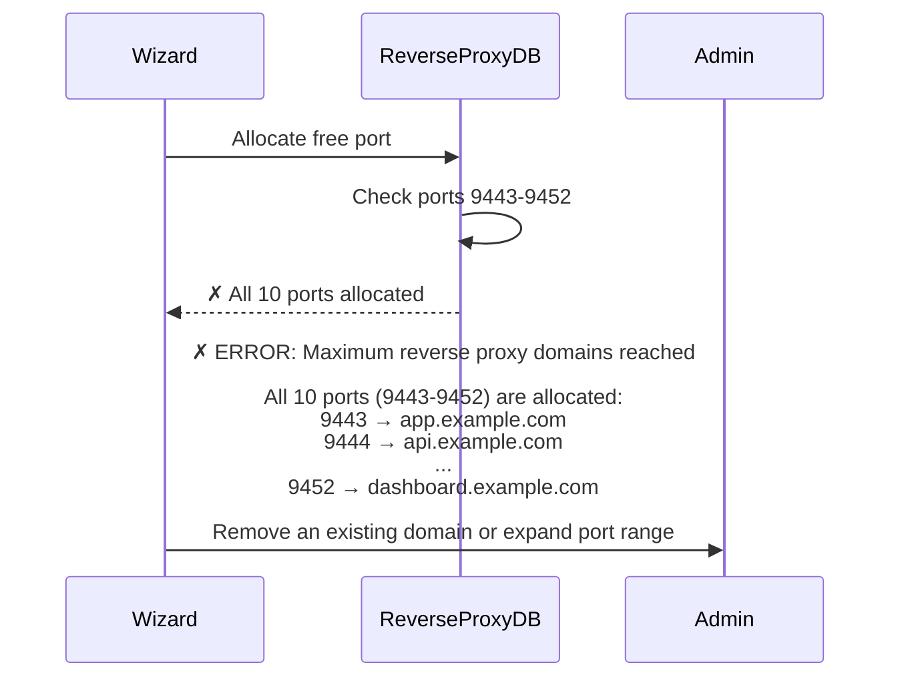
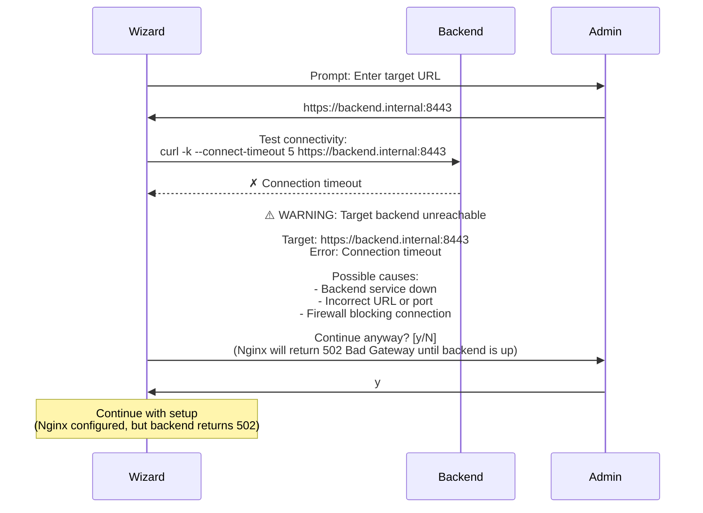
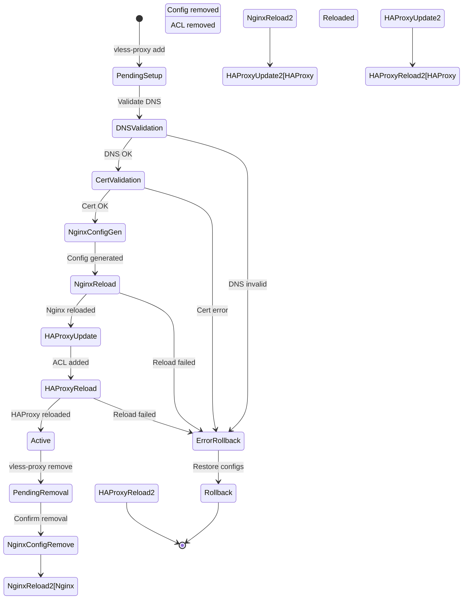

# Reverse Proxy Domain Setup Sequence Diagram

**Purpose:** Visualize the complete workflow for adding subdomain-based reverse proxy

**Feature:** Subdomain-based HTTPS reverse proxy without port numbers (v4.3+)

**Operations Covered:**
- Interactive domain setup wizard
- DNS validation
- Nginx configuration generation
- HAProxy dynamic ACL update
- SSL certificate integration
- Service reloads

---

## Complete Reverse Proxy Setup Flow

### Interactive Setup Wizard

```mermaid
sequenceDiagram
    participant Admin
    participant CLI as vless-proxy CLI
    participant Wizard as Interactive Wizard
    participant DNS as DNS Validator
    participant CertManager as Certificate Manager
    participant NginxGen as Nginx Config Generator
    participant HAProxyGen as HAProxy Config Generator
    participant Nginx as Nginx Container
    participant HAProxy as HAProxy Container

    Admin->>CLI: sudo vless-proxy add

    Note over CLI,Wizard: Phase 1: Interactive Input Collection

    CLI->>Wizard: Start interactive mode

    Wizard->>Admin: Prompt: Enter domain name
    Admin->>Wizard: app.example.com

    Wizard->>Wizard: validate_domain_format()<br/>✓ Valid: app.example.com

    Wizard->>Admin: Prompt: Enter target URL
    Admin->>Wizard: https://backend.internal:8443

    Wizard->>Wizard: validate_target_url()<br/>✓ Valid HTTPS URL

    Wizard->>Admin: Prompt: Enable OAuth2 authentication? [y/N]
    Admin->>Wizard: n

    Wizard->>Admin: Prompt: Enable WebSocket support? [y/N]
    Admin->>Wizard: y

    Wizard->>Admin: Prompt: Custom CSP header? [y/N]
    Admin->>Wizard: n

    Wizard->>Admin: Prompt: Custom rate limit (default 100r/s)? [Enter to skip]
    Admin->>Wizard: <Enter>

    Note over Wizard,DNS: Phase 2: DNS Validation

    Wizard->>DNS: validate_dns_for_domain("app.example.com")

    DNS->>DNS: Resolve app.example.com<br/>(dig +short app.example.com)

    alt DNS points to this server
        DNS-->>Wizard: ✓ IP: 203.0.113.10 (matches server IP)
    else DNS points elsewhere
        DNS-->>Wizard: ✗ IP: 203.0.113.99 (does NOT match)
        Wizard->>Admin: ⚠️ WARNING: DNS does not point to this server<br/><br/>Current DNS: 203.0.113.99<br/>Server IP: 203.0.113.10<br/><br/>Continue anyway? [y/N]
        Admin->>Wizard: n
        Wizard->>Admin: Setup cancelled
        Note over Admin: Flow terminates
    end

    Note over Wizard,CertManager: Phase 3: Certificate Validation

    Wizard->>CertManager: check_certificate_coverage("app.example.com")

    CertManager->>CertManager: Read /etc/letsencrypt/live/example.com/cert.pem

    alt Certificate covers subdomain (wildcard)
        CertManager-->>Wizard: ✓ Wildcard cert (*.example.com) covers app.example.com
    else Certificate does NOT cover subdomain
        CertManager-->>Wizard: ✗ No wildcard cert, individual cert required

        Wizard->>Admin: ⚠️ Certificate does not cover app.example.com<br/><br/>Options:<br/> 1. Obtain new certificate (certbot certonly -d app.example.com)<br/> 2. Continue with existing cert (will cause browser errors)<br/><br/>Choice [1/2]:
        Admin->>Wizard: 1

        Wizard->>CertManager: Obtain certificate for app.example.com
        Note over CertManager: (See cert-renewal.md for details)
        CertManager-->>Wizard: ✓ Certificate obtained
    end

    Note over Wizard,NginxGen: Phase 4: Nginx Configuration Generation

    Wizard->>NginxGen: generate_nginx_config({<br/> domain: "app.example.com",<br/> target: "https://backend.internal:8443",<br/> oauth2: false,<br/> websocket: true,<br/> csp: default,<br/> rate_limit: 100<br/>})

    NginxGen->>NginxGen: Allocate free port (check 9443-9452)
    NginxGen->>NginxGen: Port 9443 available

    NginxGen->>NginxGen: Generate server block:<br/>server {<br/> listen 9443 ssl http2;<br/> server_name app.example.com;<br/> ssl_certificate /etc/letsencrypt/live/example.com/fullchain.pem;<br/> ssl_certificate_key /etc/letsencrypt/live/example.com/privkey.pem;<br/> <br/> # WebSocket support<br/> proxy_http_version 1.1;<br/> proxy_set_header Upgrade $http_upgrade;<br/> proxy_set_header Connection $connection_upgrade;<br/> <br/> location / {<br/>   proxy_pass https://backend.internal:8443;<br/>   ...<br/> }<br/>}

    NginxGen->>NginxGen: Write /opt/vless/config/reverse-proxy/app.example.com.conf

    NginxGen->>NginxGen: Update http_context.conf:<br/>Add rate limit zone:<br/>limit_req_zone $binary_remote_addr<br/> zone=reverseproxy_app_example_com:10m<br/> rate=100r/s;

    NginxGen-->>Wizard: ✓ Nginx config generated (port 9443)

    Note over Wizard,Nginx: Phase 5: Nginx Configuration Test & Reload

    Wizard->>Nginx: docker exec vless_nginx_reverseproxy nginx -t

    alt Nginx config valid
        Nginx-->>Wizard: ✓ Syntax OK

        Wizard->>Nginx: docker exec vless_nginx_reverseproxy nginx -s reload
        Nginx->>Nginx: Graceful reload<br/>(load new server block)
        Nginx-->>Wizard: ✓ Reloaded
    else Nginx config invalid
        Nginx-->>Wizard: ✗ Syntax error in config

        Wizard->>NginxGen: Rollback: Remove app.example.com.conf
        Wizard->>Admin: ✗ ERROR: Nginx configuration invalid<br/>Setup cancelled
        Note over Admin: Flow terminates
    end

    Note over Wizard,HAProxyGen: Phase 6: HAProxy Dynamic ACL Update

    Wizard->>HAProxyGen: update_haproxy_dynamic_acl({<br/> domain: "app.example.com",<br/> backend_port: 9443<br/>})

    HAProxyGen->>HAProxyGen: Read haproxy.cfg

    HAProxyGen->>HAProxyGen: Find dynamic section:<br/># DYNAMIC_REVERSE_PROXY_ROUTES<br/>...<br/># END_DYNAMIC_REVERSE_PROXY_ROUTES

    HAProxyGen->>HAProxyGen: Insert ACL:<br/>acl is_app req_ssl_sni -i app.example.com<br/>use_backend nginx_app if is_app

    HAProxyGen->>HAProxyGen: Add backend:<br/>backend nginx_app<br/> mode tcp<br/> server nginx 127.0.0.1:9443 check

    HAProxyGen->>HAProxyGen: Write updated haproxy.cfg

    HAProxyGen-->>Wizard: ✓ HAProxy ACL added

    Note over Wizard,HAProxy: Phase 7: HAProxy Configuration Test & Reload

    Wizard->>HAProxy: docker exec vless_haproxy haproxy -c -f /etc/haproxy/haproxy.cfg

    alt HAProxy config valid
        HAProxy-->>Wizard: ✓ Configuration valid

        Wizard->>HAProxy: docker exec vless_haproxy<br/>haproxy -sf $(cat /var/run/haproxy.pid)
        HAProxy->>HAProxy: Graceful reload<br/>(start new process, stop old)
        HAProxy-->>Wizard: ✓ Reloaded
    else HAProxy config invalid
        HAProxy-->>Wizard: ✗ Configuration error

        Wizard->>HAProxyGen: Rollback: Remove ACL and backend
        Wizard->>NginxGen: Rollback: Remove Nginx config
        Wizard->>Admin: ✗ ERROR: HAProxy configuration invalid<br/>Setup cancelled (rolled back)
        Note over Admin: Flow terminates
    end

    Note over Wizard,Admin: Phase 8: Success Response

    Wizard->>CLI: Success:<br/>- Domain: app.example.com<br/>- Backend: https://backend.internal:8443<br/>- Nginx port: 9443<br/>- HAProxy ACL: added<br/>- Status: Active

    CLI->>Admin: ✓ Reverse proxy added successfully<br/><br/>Domain: app.example.com<br/>Target: https://backend.internal:8443<br/>Access URL: https://app.example.com<br/>(NO port number needed!)<br/><br/>Services reloaded:<br/> ✓ Nginx<br/> ✓ HAProxy<br/><br/>Test with:<br/> curl -v https://app.example.com
```

---

## Remove Reverse Proxy Domain Flow

### Complete Domain Removal Sequence



---

## Advanced Setup Options

### OAuth2 Integration Setup

```mermaid
sequenceDiagram
    participant Wizard
    participant Admin
    participant NginxGen
    participant OAuth2Proxy as OAuth2 Proxy<br/>(External Service)

    Wizard->>Admin: Enable OAuth2? [y/N]
    Admin->>Wizard: y

    Wizard->>Admin: OAuth2 provider:<br/> 1. Google<br/> 2. GitHub<br/> 3. Azure AD<br/> 4. Custom<br/>Choice [1-4]:
    Admin->>Wizard: 1 (Google)

    Wizard->>Admin: OAuth2 proxy URL:<br/>(e.g., https://oauth2-proxy.internal:4180)
    Admin->>Wizard: https://oauth2-proxy.internal:4180

    Wizard->>Admin: Allowed email domains (comma-separated):<br/>(e.g., example.com, company.com)
    Admin->>Wizard: example.com

    Wizard->>OAuth2Proxy: Test connectivity:<br/>curl https://oauth2-proxy.internal:4180/ping

    alt OAuth2 proxy reachable
        OAuth2Proxy-->>Wizard: ✓ pong

        Wizard->>NginxGen: Generate config with OAuth2:<br/>server {<br/> ...<br/> location / {<br/>   auth_request /oauth2/auth;<br/>   auth_request_set $user $upstream_http_x_auth_request_user;<br/>   auth_request_set $email $upstream_http_x_auth_request_email;<br/>   proxy_pass https://backend:8443;<br/>   proxy_set_header X-User $user;<br/>   proxy_set_header X-Email $email;<br/> }<br/> <br/> location = /oauth2/auth {<br/>   internal;<br/>   proxy_pass https://oauth2-proxy.internal:4180/oauth2/auth;<br/> }<br/> <br/> location /oauth2/callback {<br/>   proxy_pass https://oauth2-proxy.internal:4180/oauth2/callback;<br/> }<br/>}

        NginxGen-->>Wizard: ✓ OAuth2 config generated

    else OAuth2 proxy unreachable
        OAuth2Proxy-->>Wizard: ✗ Connection timeout

        Wizard->>Admin: ⚠️ WARNING: OAuth2 proxy unreachable<br/><br/>Continue without OAuth2? [y/N]
        Admin->>Wizard: n
        Note over Wizard: Setup cancelled
    end
```

---

## Port Allocation Strategy

### Dynamic Port Assignment



**Port Allocation Table:**

| Port | Domain | Status |
|------|--------|--------|
| 9443 | app.example.com | ✓ Allocated |
| 9444 | api.example.com | ✓ Allocated |
| 9445 | chat.example.com | ✓ Allocated |
| 9446 | (free) | Available |
| 9447 | (free) | Available |
| ... | ... | ... |
| 9452 | (free) | Available |

**Maximum Subdomains:** 10 (ports 9443-9452)

---

## Error Handling Scenarios

### Scenario 1: DNS Does Not Point to Server



### Scenario 2: All Ports Allocated



### Scenario 3: Target Backend Unreachable



---

## State Transitions

### Reverse Proxy Domain Lifecycle



---

## Performance Metrics

**Setup Operation:**
- **DNS Validation:** ~1-2 seconds
- **Certificate Check:** < 100ms
- **Nginx Config Generation:** ~50ms
- **HAProxy Config Update:** ~50ms
- **Nginx Reload:** ~50-100ms
- **HAProxy Reload:** ~50-100ms
- **Total Duration:** ~2-4 seconds

**Remove Operation:**
- **File Removal:** < 50ms
- **Nginx Reload:** ~50-100ms
- **HAProxy Reload:** ~50-100ms
- **Total Duration:** ~200-300ms

**Zero Downtime:**
- Both Nginx and HAProxy use graceful reloads
- Active connections continue on old configuration
- New connections use new configuration
- No dropped connections

---

## Troubleshooting

### Common Issues

**Issue 1: 503 Service Unavailable after setup**
- **Cause:** Backend not responding or Nginx cannot reach backend
- **Debug:**
  ```bash
  # Check Nginx logs
  docker logs vless_nginx_reverseproxy --tail 50 | grep "app.example.com"

  # Test backend connectivity from Nginx container
  docker exec vless_nginx_reverseproxy curl -k https://backend.internal:8443

  # Check Nginx upstream status
  docker exec vless_nginx_reverseproxy nginx -T | grep "proxy_pass"
  ```

**Issue 2: Certificate errors (NET::ERR_CERT_COMMON_NAME_INVALID)**
- **Cause:** Certificate does not cover subdomain
- **Fix:**
  ```bash
  # Check certificate SANs
  openssl x509 -in /etc/letsencrypt/live/example.com/cert.pem -noout -text | grep "Subject Alternative Name" -A 1

  # Obtain wildcard or individual cert
  sudo certbot certonly --dns-<provider> -d *.example.com
  ```

**Issue 3: HAProxy not routing to Nginx backend**
- **Cause:** Dynamic ACL section corrupted or missing
- **Debug:**
  ```bash
  # Check HAProxy ACL section
  grep -A 20 "DYNAMIC_REVERSE_PROXY_ROUTES" /opt/vless/config/haproxy.cfg

  # Check HAProxy backend
  curl http://127.0.0.1:9000/stats | grep nginx_app

  # Test HAProxy config
  docker exec vless_haproxy haproxy -c -f /etc/haproxy/haproxy.cfg
  ```

---

## Related Documentation

- [reverse-proxy-flow.md](../data-flows/reverse-proxy-flow.md) - Visual traffic flow diagram
- [config-update.md](config-update.md) - Configuration propagation flow
- [cli.yaml](../../yaml/cli.yaml) - vless-proxy CLI commands
- [config.yaml](../../yaml/config.yaml) - HAProxy and Nginx configuration relationships
- [docker.yaml](../../yaml/docker.yaml) - Nginx and HAProxy container specifications

---

**Created:** 2026-01-07
**Version:** v5.26
**Status:** ✅ CURRENT (v4.3+ HAProxy unified architecture)
