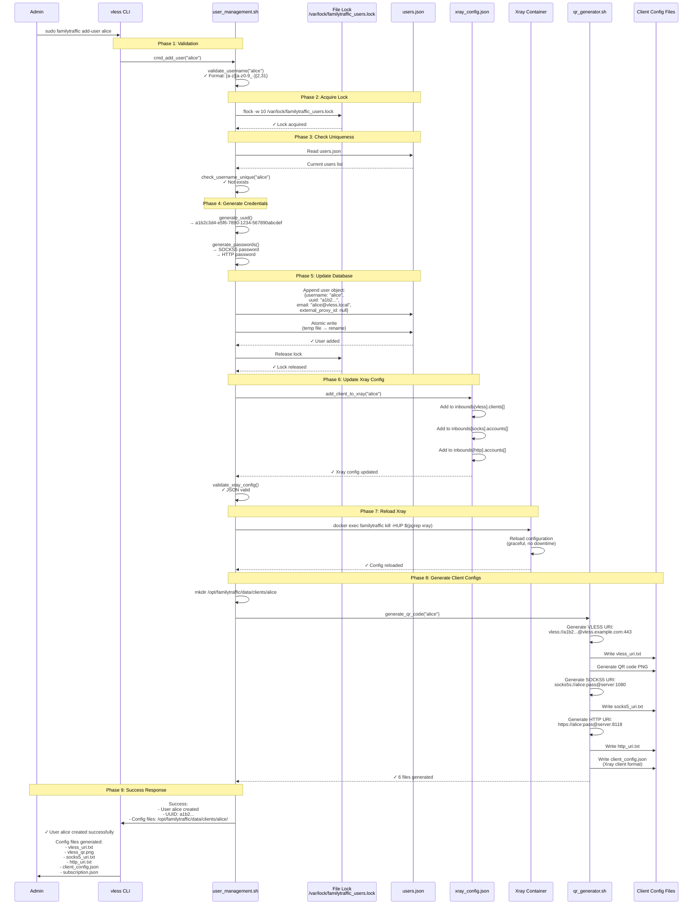
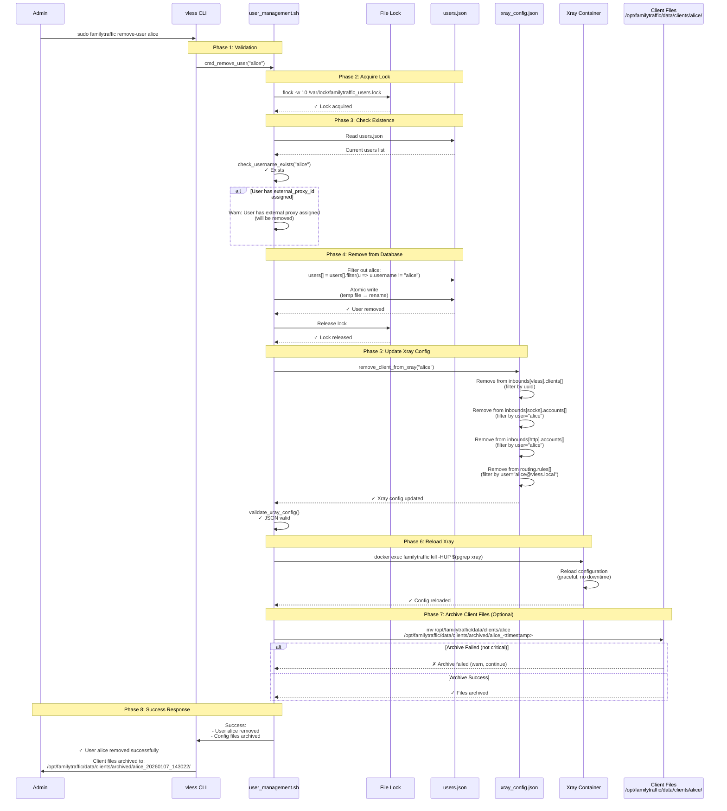
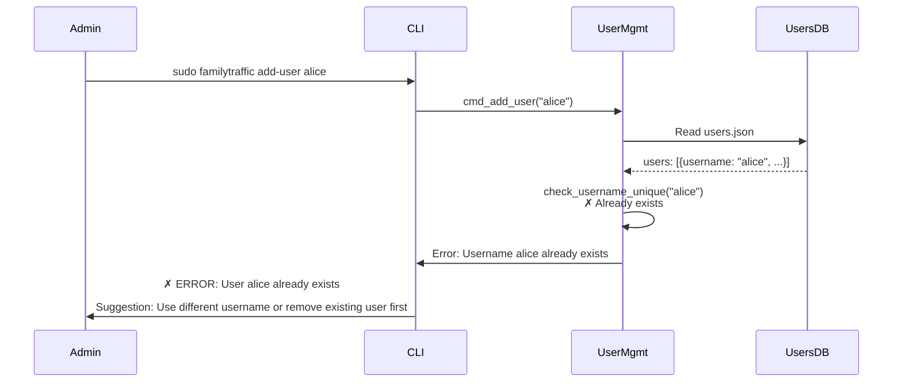
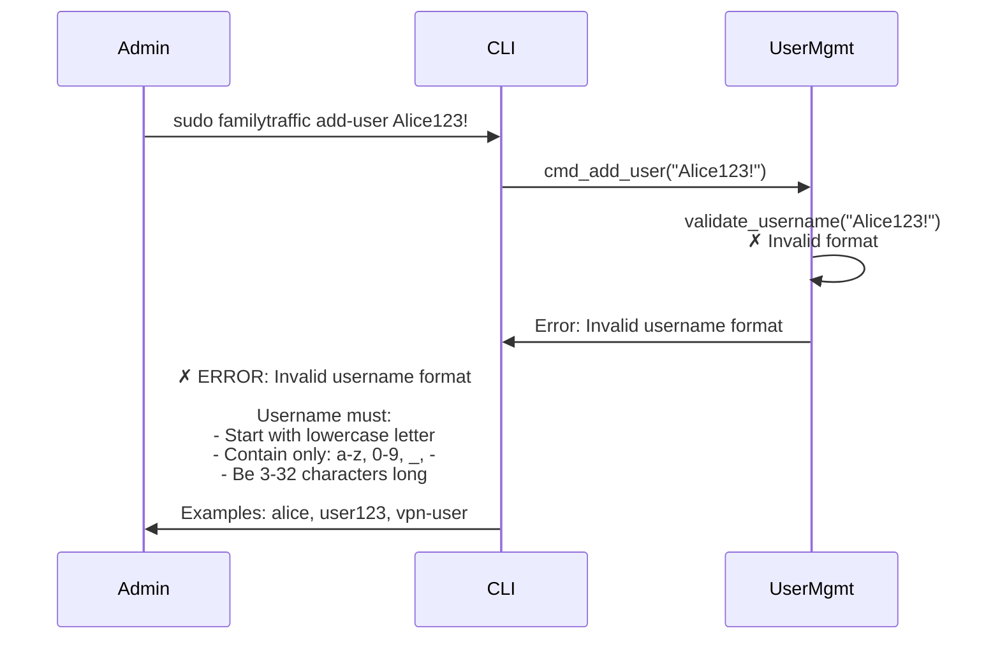
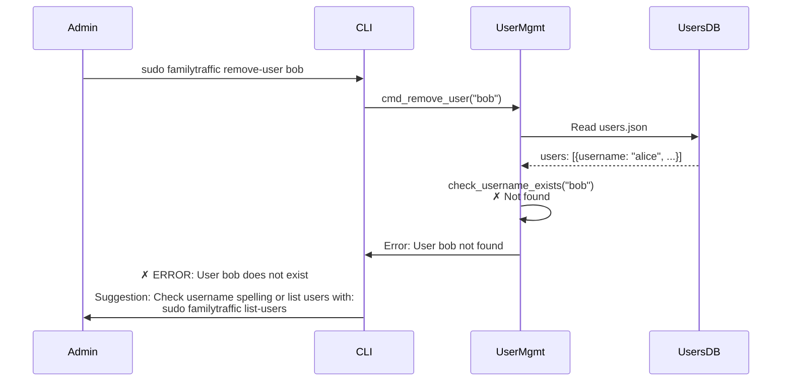
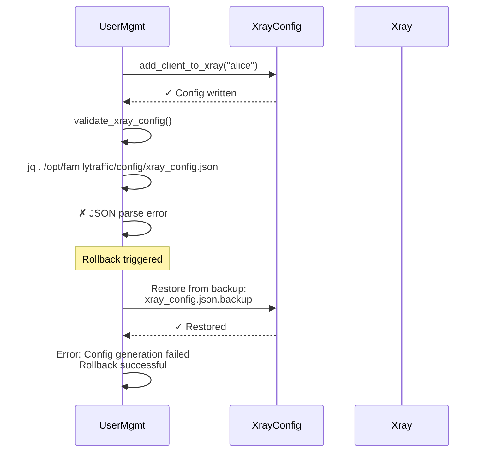
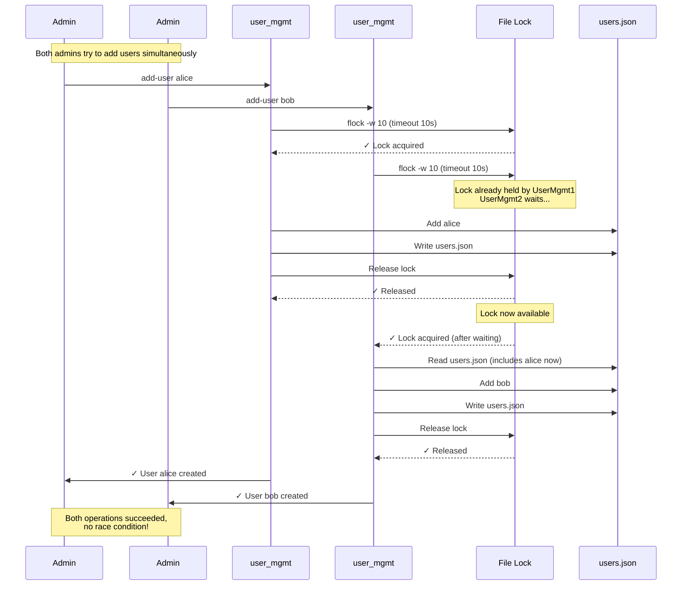
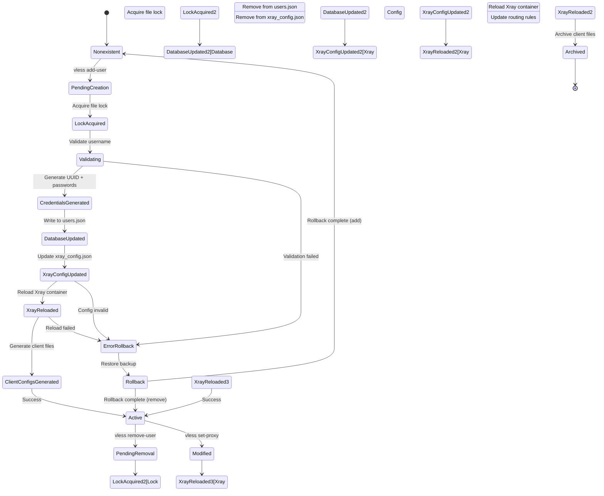

# User Management Sequence Diagram

**Purpose:** Visualize the complete workflow for adding and removing users in the VLESS VPN system

**Operations Covered:**
- Add new user
- Remove existing user
- User configuration generation
- Xray configuration update
- Client configuration generation

---

## Add User Sequence

### Complete Add User Flow

---

## Remove User Sequence

### Complete Remove User Flow

---

## Error Handling Scenarios

### Scenario 1: Username Already Exists

### Scenario 2: Invalid Username Format

### Scenario 3: Remove Non-Existent User

### Scenario 4: Xray Config Invalid After Update

---

## Concurrent Access Handling

### File Locking Mechanism

---

## State Transitions

### User Lifecycle State Diagram

---

## Key Files Modified

### Add User Operation

| File | Modification | Atomicity |
|------|-------------|-----------|
| `/opt/familytraffic/data/users.json` | Append user object | ✓ Atomic write (temp → rename) |
| `/opt/familytraffic/config/xray_config.json` | Add to `inbounds[].clients[]` | ✓ Atomic write |
| `/opt/familytraffic/data/clients/<username>/vless_uri.txt` | Write VLESS URI | ✓ New file |
| `/opt/familytraffic/data/clients/<username>/vless_qr.png` | Write QR code | ✓ New file |
| `/opt/familytraffic/data/clients/<username>/socks5_uri.txt` | Write SOCKS5 URI | ✓ New file |
| `/opt/familytraffic/data/clients/<username>/http_uri.txt` | Write HTTP URI | ✓ New file |
| `/opt/familytraffic/data/clients/<username>/client_config.json` | Write Xray client config | ✓ New file |
| `/opt/familytraffic/data/clients/<username>/subscription.json` | Write subscription URL | ✓ New file |

### Remove User Operation

| File | Modification | Atomicity |
|------|-------------|-----------|
| `/opt/familytraffic/data/users.json` | Filter out user | ✓ Atomic write (temp → rename) |
| `/opt/familytraffic/config/xray_config.json` | Remove from `inbounds[].clients[]` | ✓ Atomic write |
| `/opt/familytraffic/data/clients/<username>/` | Move to archived/ | ⚠️ Non-atomic (not critical) |

---

## Performance Metrics

**Add User Operation:**
- **Lock Acquisition:** < 10ms (or wait up to 10s if locked)
- **UUID Generation:** < 1ms
- **Database Write:** < 10ms
- **Xray Config Update:** < 20ms
- **Xray Reload:** ~100-200ms (graceful reload)
- **QR Code Generation:** ~50-100ms
- **Total Duration:** ~300-500ms

**Remove User Operation:**
- **Lock Acquisition:** < 10ms (or wait up to 10s)
- **Database Write:** < 10ms
- **Xray Config Update:** < 20ms
- **Xray Reload:** ~100-200ms
- **Archive Files:** < 50ms (optional)
- **Total Duration:** ~200-300ms

---

## Related Documentation

- [dependencies.yaml](../../yaml/dependencies.yaml) - Initialization order and runtime dependencies
- [lib-modules.yaml](../../yaml/lib-modules.yaml) - user_management.sh function details
- [cli.yaml](../../yaml/cli.yaml) - CLI command specifications
- [config.yaml](../../yaml/config.yaml) - Configuration file relationships
- [Proxy Assignment Sequence](proxy-assignment.md) - Per-user proxy assignment flow (v5.24+)

---

**Created:** 2026-01-07
**Version:** v5.26
**Status:** ✅ CURRENT
